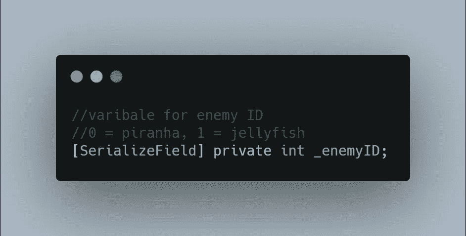

# 如何将不同类型的敌人编入一个职业

> 原文：<https://medium.com/geekculture/how-to-incorporate-different-enemy-types-into-one-class-2eea84e71dc7?source=collection_archive---------24----------------------->

在我的上两篇文章中，我在我的游戏中添加了一个新的敌人水母。水母是第二个加入的敌人，还会有更多。我在这篇文章中的**目标**是让我的**敌人职业**准备好接受一个**种类**的敌人**类型**，而不是为各种敌人制作多个脚本。

在**敌人类**中，我做了一个新变量来存储一个整数*(integer*……