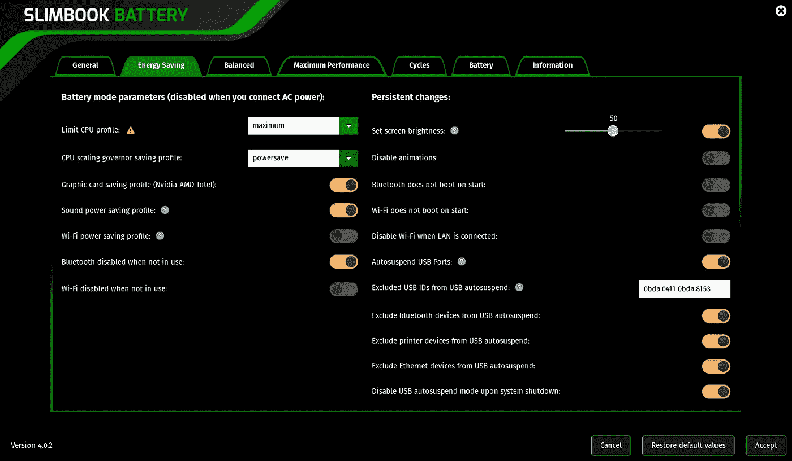

# 如何延长 Linux 笔记本电脑的电池寿命

> 原文：<https://medium.com/geekculture/how-to-increase-battery-life-time-on-linux-laptops-7c15383a19a5?source=collection_archive---------2----------------------->

## …使用超薄电池 4。

Slimboook Battery 4 “Energy Saving” energy mode settings tab.

# 问题是

运行 Linux 操作系统的笔记本电脑的电池寿命无疑是 Linux 操作系统最严重的缺点之一。这适用于**单个负载的电池寿命(电池负载寿命)和电池总寿命**。不理想的原因…