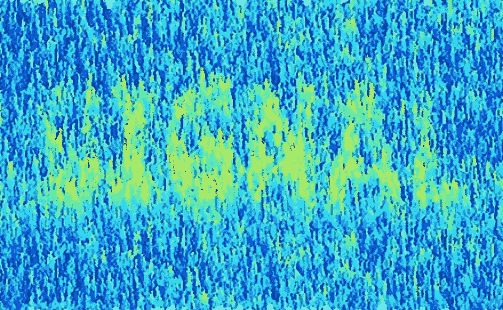

# 超越统计上的无能

> 原文：<https://medium.com/geekculture/how-to-increase-signal-and-reduce-noise-in-research-5964adb34441?source=collection_archive---------15----------------------->

> “你永远不会允许你的耳科医生给你的眼睛做手术。同样，你不应该让非统计学家做你的统计分析”

格尔德·吉杰伦泽、纳西姆·尼古拉斯·塔勒布和其他目光敏锐的社会和行为科学观察家长期以来一直认为，统计能力不足是人类事务研究中的一个问题。*由于统计能力不足，此类研究经常产生虚假结果，有时会对政策和实践产生负面影响。对于任何研究领域来说，根除似是而非的发现都是至关重要的。如果做不到这一点，在研究中区分信号和噪音将变得越来越困难，这将破坏对研究的信任及其对社会的价值。

最近，我和我的同事们惊恐地发现，统计噪音已经开始潜入我们的一个研究领域，即资本投资规划和管理研究。这影响了对人类一些最大和最重要投资的规划和管理的了解，如主要交通基础设施、能源系统、整个城市、水、信息技术系统、国防、石油和天然气、航空航天等。如果这种投资的知识基础被错误的研究结果污染了，一个可能的后果是对社会的巨大浪费，或者更糟。

在一篇名为“[关于成本超支你应该知道的五件事](https://bit.ly/3zLXuUr)”的论文中，我们列举了这类研究的例子以及由此引发的具体问题。但是统计能力不足的问题是普遍的。这里建议的克服无能影响的简单方法也是如此。它们适用于任何类型的研究。

关键的挑战是确保统计误导性的结果首先不会被公布。经验表明，误导性的结果一旦出现，就很难再摆脱。它们被引用，成为其他研究的一部分，并被纳入荟萃分析，污染了它们的结果，导致错误的结论。

> "关于统计分析，研究人员最重要的技能是认识到他们不是统计学家."

研究人员、期刊编辑和期刊审稿人都在防止统计误导结果发表方面发挥着关键作用。我和我的同事建议，作为提高已发表研究的统计质量的第一步，可以采用以下简单的启发式方法:

1.  如果你不是统计学家，或者没有很强的统计分析背景，不要做统计分析。或者如果你自己做分析，确保获得统计员的质量保证。上过一些统计学课程并知道如何在你的计算机上运行统计软件包是不够的。你绝不会允许你的耳科医生给你的眼睛做手术。同样，你不应该让非统计学家，包括你自己，来做你的统计分析。关于统计分析，研究人员最重要的技能是认识到他们不是统计学家。如果你是老师，帮你的学生一个忙，给他们灌输这种态度。
2.  *如果你是期刊的推荐人，向编辑清楚地陈述你的统计水平*。如果你没有统计学的专业知识来评论一篇论文，让编辑知道，这样他们就能确保你的一个同行能做到。不要在假设其他裁判之一会做这项工作的情况下，对统计分析的审查掉以轻心(除非你确实知道是这样)。不要假设统计分析可能是好的，因为它们通常是不好的。幸运的是，一些期刊已经应用了这种启发法，询问审稿人他们在多大程度上拥有相关的统计专业知识，例如*管理杂志* ( *JOM* )，其中规定:“并非所有的审稿人都对提交给 *JOM* 的研究中使用的各种统计方法有深入的专业知识。为了确保所有论文至少有一名对所用方法有深入了解的评审员，鉴于您在本文所用统计方法方面的专业知识，请表明您对自己严格评估所报告结果的能力是否满意/有信心。”所有发表定量分析的期刊都应该像 JOM 那样做。
3.  *如果你是期刊编辑，确保至少有一位推荐人有能力审查论文的统计和方法方面*。如果你的杂志还没有像上面的*管理杂志*一样，定期明确地询问审稿人关于他们特定的统计专业知识，以确保每篇论文的相关专业知识都存在于审稿人团队中，那么现在是你通过实施这一措施为提高杂志质量做出贡献的好时机。

社会科学家和其他研究人类行为的学生可以通过观察这些简单的启发来更好地发表文章，整个社会也是如此。遵循这种简单的经验法则将有助于开发可以信任的知识体系，并有效和可靠地形成政策和实践的基础——或者只是更好地理解世界。

> "不要假设统计分析可能是好的，因为事实往往并非如此."

— — — — — -

*)有关完整参考资料，请参见此处的。