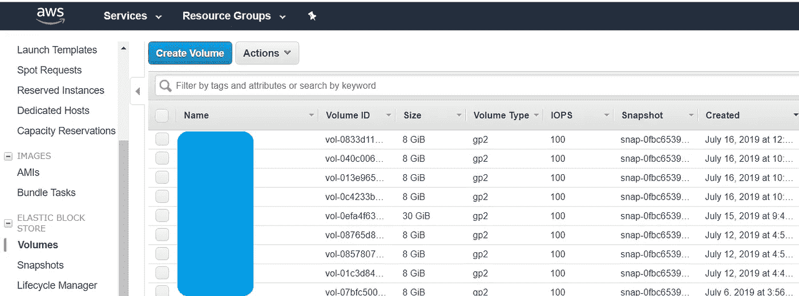
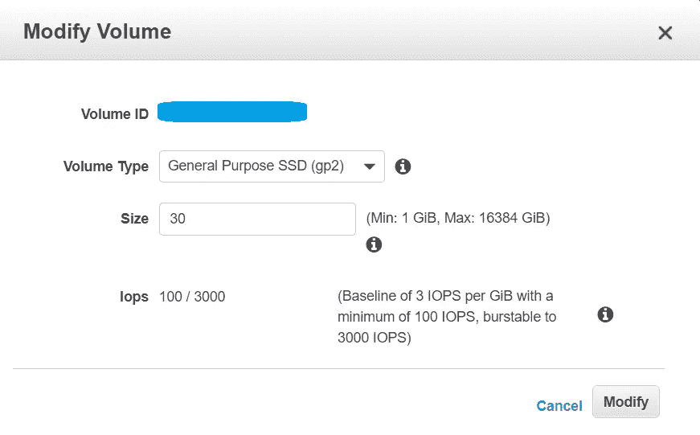
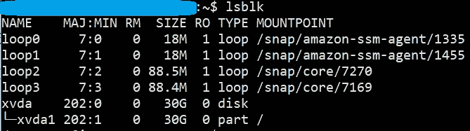
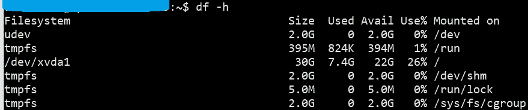

# 如何用简单的步骤为 Ubuntu 增加 EC2 上的 AWS 磁盘卷(EBS)？

> 原文：<https://medium.com/geekculture/how-to-increase-the-aws-disk-volume-ebs-on-ec2-in-simple-steps-for-ubuntu-7c3759468b38?source=collection_archive---------2----------------------->

如果您的 AWS 卷磁盘空间不足，请尝试以下简单步骤:

**步骤 1** :使用 https://aws.amazon.com/[登录 AWS 控制台](https://aws.amazon.com/)。

**第二步**:访问 EC2 - >弹性存储块- >卷。

**第三步**:选择要调整大小的卷。

**第四步**:鼠标右键- >选择**修改音量。**

**步骤 5** :输入卷的新大小(例如:30)并点击**修改**按钮。

**步骤 6** :在上面的步骤中，我们增加了卷，但是在我们扩展分区之前它不可用。要扩展分区，请使用 SSH 客户端访问实例。

**第七步**:运行 **df -h** 检查空闲磁盘空间。它没有显示任何可用磁盘空间的增加。

*如果您完全用完了磁盘空间，那么* ***您运行的任何命令都会导致奇怪的错误*** *这些错误完全不相关，命令甚至可能会失败。所以，* ***删除一些不需要的文件，腾出一些空闲空间来继续*** *。*

**步骤 8** :运行 **lsblk** 命令，该命令列出了所有可用块设备的信息。从输出中，找出要增加的磁盘(例如:xvda1)

**第 9 步**:运行 **sudo growpart /dev/xvda 1** 增加分区容量。注意*xvda 和 1 之间有一个空格*。

**步骤 10** :运行**sudo resize 2 fs/dev/xvda 1**扩展文件系统。注意 xvda 和 1 之间没有*空格*。

**步骤 11** :再次运行 **lsblk** 命令。您将看到类似如下的内容:

**第 12 步**:再次运行 **df -h** 命令。您将看到类似如下的内容:

您已经通过简单的步骤成功增加了磁盘空间！无需装载、卸载、连接、分离、创建快照、恢复快照等。

**感谢**阅读！请👏如果你喜欢这篇文章，请跟我来，因为它**鼓励我**写更多！