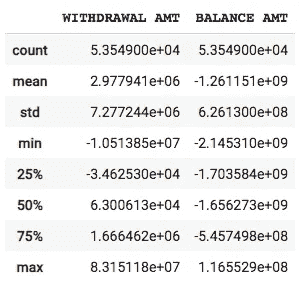
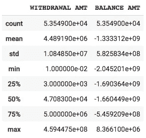
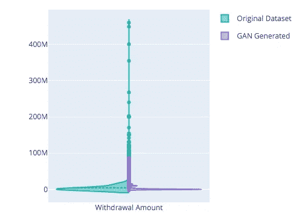
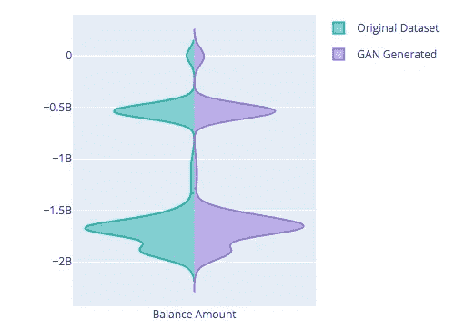
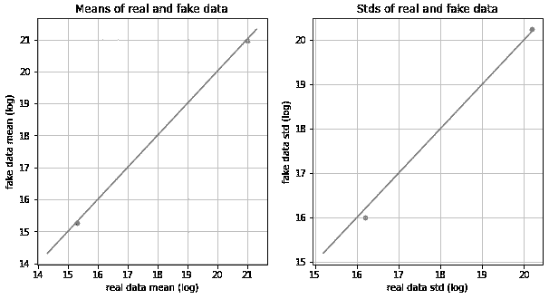
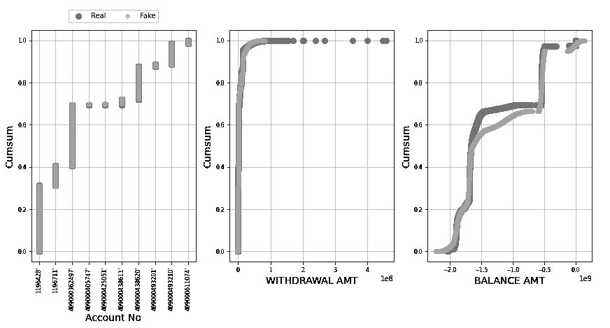
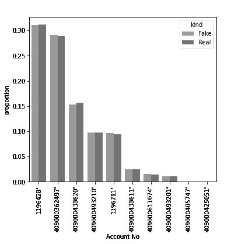

# 如何在保护用户数据的同时，进行数据产品的创新？

> 原文：<https://medium.com/geekculture/how-to-innovate-with-data-products-while-protecting-peoples-privacy-and-sensitive-information-3f910a349b6a?source=collection_archive---------11----------------------->

## 使用有条件的 GANs 生成新数据。


Photo by [David Jorre](https://unsplash.com/@davidjorre?utm_source=unsplash&utm_medium=referral&utm_content=creditCopyText) on [Unsplash](https://unsplash.com/@davidjorre?utm_source=unsplash&utm_medium=referral&utm_content=creditCopyText)

**生成对抗网络** (GAN)是一种概念上相当令人兴奋的深度学习方法，它让我们能够跨各种形式(如图像、视频、文本、声音或结构化表格数据)产生新的数据样本。

就其目前产生的全球商业价值而言(与监督学习解决方案相比)，GANs 提供了一种手段，人们或许可以称之为**，以及生成令人惊叹的、 ***近乎真实的*** 视觉输出(在面部成像方面做了大量工作)。**

**生成网络有一种魔力，看到它们的应用程序年复一年地在质量上进化，同时全新的用例不断涌现。**

**鉴于这些华而不实的应用程序，生成人工表格数据初看起来似乎不是一个令人印象深刻的目标。然而，这与事实相去甚远。就机器学习而言，数据是最重要的东西。我们合成能够很好地反映原始属性的人工分布的能力可以证明是非常有价值的。
不是目的，而是创新的催化剂和早期数据驱动解决方案原型的推动者。**

# **目标**

**生成新合成数据的一些主要目标是数据集**保护、增强、**和**不平衡的解决**。**

> ****某些类型的数据极其敏感，理应受到保护。在设计源于用户银行交易数据分析的产品功能时，我亲身经历了这一点。即使只是用来制作原型的样本数据也很难获得。****

**在这种情况下，生成的数据可以发挥作用，有效地匿名记录，同时准确地保留原始数据集的形式和属性。拥有的数据作为一种资产的潜力可以通过这种方式释放出来，而不会引起隐私问题，并反过来刺激基于分析、洞察收集和机器学习解决方案的创新努力。除了上述金融行业之外，这还会极大地影响我们处理敏感信息的其他领域(例如，医疗保健、安全和政府)。**

# **履行**

**我们将综合基于[该银行交易数据集](https://www.kaggle.com/apoorvwatsky/bank-transaction-data)的数据，该数据集包含 10 个不同账户的 116000 笔交易，为了突出我们的范围，我们特别关注资金提取交易。在这里，我们对原始数据集本身的有效性和评估并不特别感兴趣，所以当账户余额和以印度卢比(INR)表示的数值看起来有点奇怪时，请耐心等待。**

**我们的目标是简单地生成新数据，并通过与原始数据的直接比较来分析其属性。**

**我们首先从 Kaggle 下载数据集(我们的 Kaggle API 密钥位于连接的 Google Drive 文件夹中)并提取文件。**

**通过 Pandas 库，我们为原始数据创建了一个数据框，并删除了不需要的列和不包含取款金额值的样本(这些是存款)。**

**我们安装 [CTGAN 库](https://sdv.dev/SDV/)并导入其合成器，同时将‘账号’列标记为离散。**

**用我们的原始数据集实例化和拟合模型，标记离散列，并运行 20 个时期。**

**现在一切准备就绪，我们可以绘制与原始数据集相等的样本数，并将所有内容合并到一个新的数据框中。**

**如果你想详细了解 CTGAN，可以查看介绍该架构的[原始论文](https://arxiv.org/abs/1907.00503)。**

# **比较原始数据集和 GAN 生成的数据集**

**作为对我们生成的数据集与原始数据集对比的初步观察，我们使用 Pandas data frame *打印出基本的统计摘要。描述()*函数并做比较。**

```
**df.describe()
samples.describe()**
```

****

**Fig. 1— Basic statistical data summary of the **original dataset** (by Author).**

****

**Fig. 2— Basic statistical data summary of the **GAN** **generated dataset** (by Author).**

**除了取款金额异常值的一些缺点之外，生成的数据集似乎做得很好！**

**下面的 violin 图(比较两个数据集的提款和余额特征分布)支持了这些发现。**

**您可以使用[这款 Jupyter 笔记本](https://colab.research.google.com/drive/1X67maZlhCfaNVTNHHmjpT9ecE3jKJ2nR?usp=sharing)以互动形式查看图表。**

****

**Fig. 3— Violin plot comparing the continuous feature distribution (‘Withdrawal Amount’) of the original dataset to the GAN-generated one (by the author with [Plotly](https://plotly.com/)).**

****

**Fig. 4— Violin plot comparing the continuous feature distribution (‘Balance Amount’) of the original dataset to the GAN-generated one (by the author with [Plotly](https://plotly.com/)).**

**最后，我们采用了一个令人惊叹的库[表评估器](https://pypi.org/project/table-evaluator/)，它是专门为评估人工表格数据集而设计的。我们需要做的就是输入我们的两个数据帧:**

****

**Fig. 5— **Absolute Log Mean** and **STDs** of numerical data (by the author with [Table Evaluator](https://pypi.org/project/table-evaluator/)).**

****

**Fig. 6— **Cumulative Sums** per feature (by the author with [Table Evaluator](https://pypi.org/project/table-evaluator/)).**

****

**Fig. 7— **Proportional distribution** of the categorical feature ‘Account No’ (by the author with [Table Evaluator](https://pypi.org/project/table-evaluator/)).**

# **轮到你了**

**结果再次令人印象深刻！此外，考虑到监督学习任务，表评估器可以进一步帮助评估预测性能(使用给定的目标变量)。**

**你曾经处理过这种方法有用的问题吗？您认为 GAN 生成的数据(表格或非表格)在哪些方面可以带来实质性的价值？**

**感谢阅读！🙏**

> **我对我们如何使用机器学习来解决使用其他方法无法解决的问题感到兴奋。*💭⚙️***
> 
> ***查看*[***deep innovation***](http://www.deepinnovation.co.uk)*获取更多来自设计、创新和新颖深度学习的交集用例！***

**[](https://www.deepinnovation.co.uk/) [## 深度学习创新卡

### 数字卡片——设计技巧——创新人工智能用例——深度学习概念。面向设计师和……

www.deepinnovation.co.uk](https://www.deepinnovation.co.uk/)** **[](/geekculture/visualizing-machine-learning-tasks-with-word-embeddings-c044fa5bb5aa) [## 用单词嵌入可视化机器学习任务

### 根据语义相似性组织空间中的 400 多个概念(使用预先训练了 20 亿个概念的手套模型…

medium.com](/geekculture/visualizing-machine-learning-tasks-with-word-embeddings-c044fa5bb5aa) [](/geekculture/how-can-deep-learning-transformer-models-amplify-positive-impacts-of-journaling-8ad28517ccc5) [## 深度学习变压器模型如何放大日志的积极影响？

### 使用具有拥抱面部变形器的零镜头分类🤗在日记中支持情商…

medium.com](/geekculture/how-can-deep-learning-transformer-models-amplify-positive-impacts-of-journaling-8ad28517ccc5)**