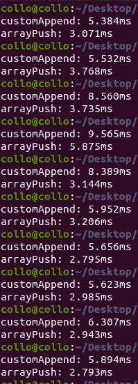

# 如何在 JavaScript 中使用自定义方法将项目插入数组。

> 原文：<https://medium.com/geekculture/how-to-insert-an-item-into-an-array-using-a-custom-method-in-javascript-664575afe0f9?source=collection_archive---------19----------------------->

JavaScript 中的数组列表是可调整大小的，这在很多情况下很方便。JavaScript 提供了向数组 Array.push()插入/追加元素的方法，但是我们将实现一个自定义的 append 方法，在数组的末尾插入新元素。

我们将从创建一个新的类 ArrayList 开始，这个类有一个接受一个参数的构造函数，这个参数可以是一个空数组。

```
class ArrayList(){
    constructor(items){
        this.items=items;
        this.size=items.length;
    }
}
```

下一步是创建一个 **getItem，**方法来访问数组**中的项目。**

```
class ArrayList(){
    constructor(items){
        this.items=items;
        this.size=items.length;
    } //get method
    getItem(index){
        //first check if index is not out of bounds
        if (index < 0 || index >= this.size) {
            throw new RangeError('Array index out of bounds');
        }
        return this.items[index];
    }}
```

下一步是创建一个 **setMethod** ，一个在特定索引处赋值的方法。

```
class ArrayList(){
    constructor(items){
        this.items=items;
        this.size=items.length;
    } //get method
    getItem(index){
        //first check if index is not out of bounds
        if (index < 0 || index >= this.size) {
            throw new RangeError('Array index out of bounds');
        }
        return this.items[index];
    } //set method
    setItem(index,item){
        //first check if index is not out of bounds
        if (index < 0 || index >= this.size) {
            throw new RangeError('Array index out of bounds');
        }
        this.items[index]=item;
    }}
```

现在我们要创建我们的**自定义追加方法**，在数组列表的末尾插入新的条目。

```
class ArrayList(){
    constructor(items){
        this.items=items;
        this.size=items.length;
    } //get method
    getItem(index){
        //first check if index is not out of bounds
        if (index < 0 || index >= this.size) {
            throw new RangeError('Array index out of bounds');
        }
        return this.items[index];
    } //set method
    setItem(index,item){
        //first check if index is not out of bounds
        if (index < 0 || index >= this.size) {
            throw new RangeError('Array index out of bounds');
        }
        this.items[index]=item;
    } //append method
    appendItem(item) {
        this.items[this.size] = item;
        this.size += 1;//increment the size after every append
    }}
```

我们的最后一个方法是 **getItems** ，它返回数组的新长度。

```
class ArrayList(){
    constructor(items){
        this.items=items;
        this.size=items.length;
    } //get method
    getItem(index){
        //first check if index is not out of bounds
        if (index < 0 || index >= this.size) {
            throw new RangeError('Array index out of bounds');
        }
        return this.items[index];
    } //set method
    setItem(index,item){
        //first check if index is not out of bounds
        if (index < 0 || index >= this.size) {
            throw new RangeError('Array index out of bounds');
        }
        this.items[index]=item;
    } //append method
    appendItem(item) {
        this.items[this.size] = item;
        this.size += 1;//increment the size after every append
    } //get items
    getItems(){
        return this.items;
    }}
```

在**动作中**

```
let array=[10,20];
let arrayList=new ArrayList(array);
for(let i=0; i<5; i++){
    arrayList.appendItem(i);
}
console.log(arrayList.getItems());
//log [10,20,0,1,2,3,4]
```

你可能会问自己，它真的够快吗？下面是 Array.push()和我们的自定义方法在插入 100，000 个项目时的执行时间的比较。



不太远。