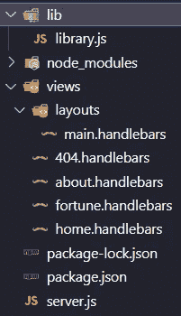
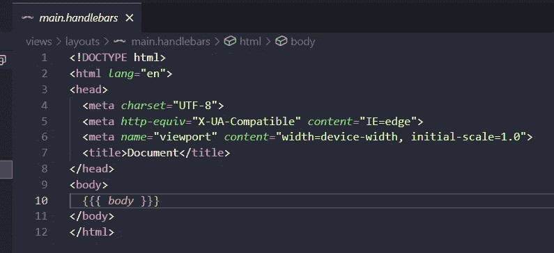
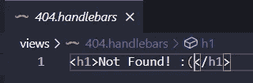
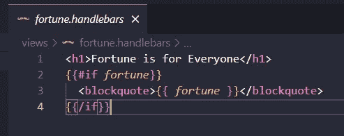
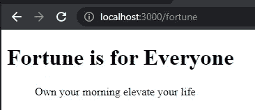

# 如何使用 Express.js 和 Handlebars 插入动态数据

> 原文：<https://medium.com/geekculture/how-to-insert-dynamic-data-using-express-js-and-handlebars-8b82461d0c7?source=collection_archive---------11----------------------->


这是 Express.js 和把手的另一次旅程，我们将学习对我上一篇文章的一个重要改进。动态数据！！而我们需要的只是 Node.js，Express.js 和手柄！！！我正在一步一步地学习，所以在我的旅程中一起来。

重要！因为 Express-handlebar 更新了它的库，所以您需要更改导入

```
import { engine } from 'express-handlebars';
```

并为此更改 handleExp

```
app.engine( 'handlebars', engine({
defaultLayout: 'main'
}))
```

你也可以看

# 启动 NPM 并安装依赖项

首先调用命令来创建我们的 package.json

```
$ npm init -y
```

然后安装快速和快速把手

```
$ npm i express express-handlebars
```

# 目录

之后，我们需要创建一个这样的目录



Example Directory

添加数据并插入保留字“body”以将数据添加到我们的主页



Example main layout

向我们的渲染页面添加数据



404 adding data

# Express.js 服务器

然后，我们需要创建我们的服务器，并创建我们的动态信息，将数据添加到 fortune 页面，但在此之前，我们需要在 library.js 文件上创建动态数据，并使用 exports 保留字将我们的函数导出到服务器。

```
const fortunes = ['Who sweats in training bleeds less in war','Own your morning elevate your life','Meditate and will bring you peace','Is everything is ok keep going','Refresh'
]
*exports*.fortune = () => fortunes[
Math.floor( ( Math.random() * fortunes.length ) + 0 )
]
```

然后，我们需要调用它，并在 fortune 上创建我们的服务器。第二个参数将是作为对象的数据，我们需要在 fortune 页面上使用它。

```
const express     = require( 'express' )
const app         = express()
const handleF     = require( 'express-handlebars' )
const port        = process.env.PORT || 3000
const { fortune } = require('./lib/library')
app.engine( 'handlebars', handleF({
defaultLayout: 'main'
}))
app.set('view engine', 'handlebars' )
app.get( '', ( *req*, *res* ) => *res*.render( 'home' ))
app.get( '/about', ( *req*, *res* ) => *res*.render( 'about' ))
app.get( '/fortune', ( *req*, *res* ) => *res*.render(
'fortune', { fortune } )
)
app.use( ( *req*, *res* ) => {
*res*.status( 404 )
*res*.render( '404' )
})
app.listen( port, console.log( `Server is on ${port}` ))
```



Fortune dynamic data

```
<h1>Fortune is for Everyone</h1>{{#if *fortune*}}<blockquote>{{ *fortune* }}</blockquote>{{/if}}
```

像手柄文档解释的那样添加条件，这样我们就可以创建我们想要的动态数据

```
$ node server.js
```

[http://localhost:3000/财富](http://localhost:3000/fortune)

我们会看到这样的东西



Example dynamic data on fortune

它真的很棒，每次我们刷新页面，它都会改变命运。

# 结论

我们重新培训如何使用 Express.js 和 handlebar 创建服务器，以及如何使用它处理动态数据和 handlebar 文档的条件，有趣的是，每一小步都令人惊讶地学到了一些伟大的东西。

# 来源

[](https://code-maven.com/handlebars-conditionals) [## 条件把手

### if name}}..{{/if}}但是您不能写{{#if name == 'Foo'}}..{{/if}}在创建助手之前，让我们看看…

code-maven.com](https://code-maven.com/handlebars-conditionals) [](http://expressjs.com/) [## Express - Node.js web 应用程序框架

### Express 是一个最小且灵活的 Node.js web 应用程序框架，它为 web 和…

expressjs.com](http://expressjs.com/) [](https://www.amazon.com.mx/Web-Development-Node-Express-Leveraging/dp/1492053511/ref=sr_1_1?__mk_es_MX=%C3%85M%C3%85%C5%BD%C3%95%C3%91&dchild=1&keywords=ethan+brown&qid=1633287426&sr=8-1) [## 使用 Node 和 Express 进行 Web 开发:利用 JavaScript 堆栈

### 使用 Node 和 Express 进行 Web 开发:利用 JavaScript 堆栈

www.amazon.com.mx](https://www.amazon.com.mx/Web-Development-Node-Express-Leveraging/dp/1492053511/ref=sr_1_1?__mk_es_MX=%C3%85M%C3%85%C5%BD%C3%95%C3%91&dchild=1&keywords=ethan+brown&qid=1633287426&sr=8-1)