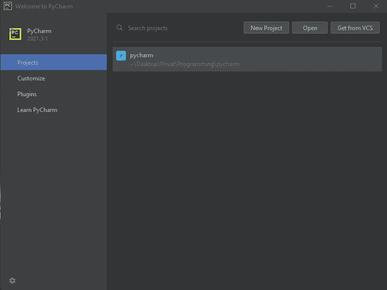
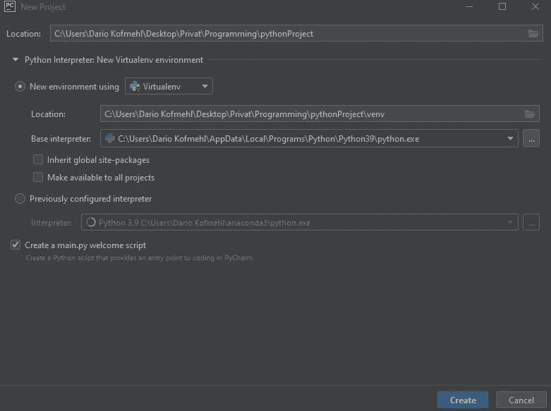
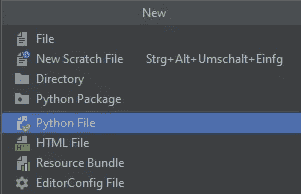
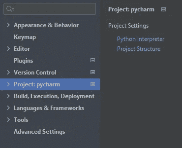
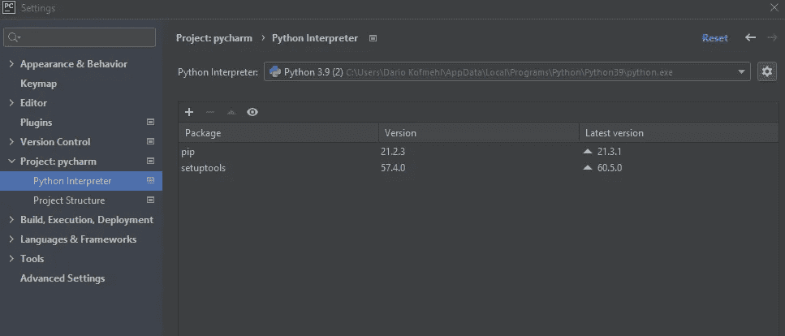
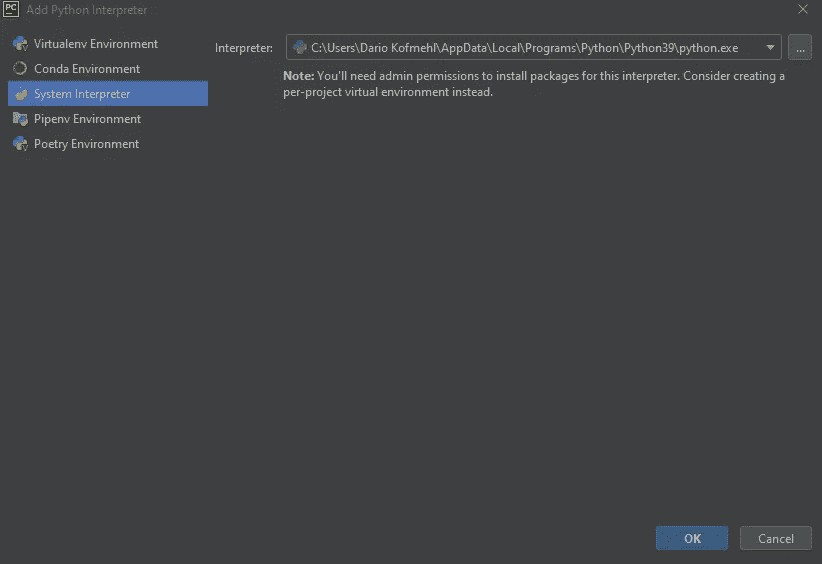
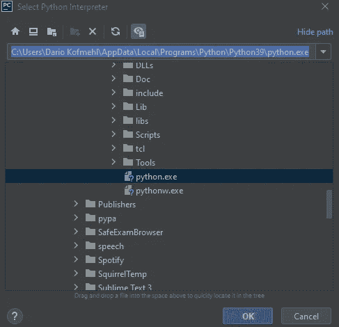
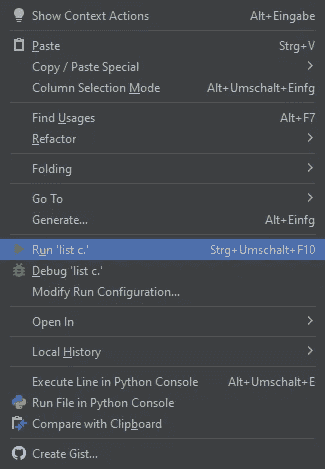

# 如何在 Windows / Mac OS 上安装和使用 PyCharm

> 原文：<https://medium.com/geekculture/how-to-install-and-use-pycharm-and-673f0b062717?source=collection_archive---------20----------------------->

要编码，你需要一个编码笔记本。我推荐的是 Pycharm。因此，这里有一个关于如何安装和使用它的指南。

首先你需要通过下面的链接下载 Pycharm 社区版。
[https://www . jetbrains . com/de-de/py charm/download/# section = windows](https://www.jetbrains.com/de-de/pycharm/download/#section=windows)

Python home screen

应用程序下载后，您可以像往常一样启动它。
您应该会看到这样的东西。
要开始你的第一个项目，你可以按“新建项目”。

Create a new project

启动项目后，会创建一个新文件夹。您可以通过单击位置旁边的文件夹图标来决定保存位置。之后，您可以按“创建”。

Open a new Python File

现在您应该看到 Pycharm 接口了。要编写您的第一个代码，您可以按文件并选择“新建”(或按 Alt + Enter)。你现在需要做的就是按下“Python 文件”并给它一个名字。

为了能够运行或执行代码，你需要一个 Python 解释器。让我展示一下你可以添加一个。

Pycharm Project settings

要添加一个解释器，你需要点击“文件”，然后点击“选项”，选择项目“项目:(你给项目的名字)”。之后，点击 Python 解释器添加一个新的解释器。

Add a Python Interpreter

通过点击下拉菜单，您应该能够选择 Python 解释器。
如果您无法选择口译员，请按照下一步添加。

*仅当您在上一步中无法选择 Python 解释器时才执行此步骤*
按下下拉菜单旁边的齿轮并点击“添加…”。转到窗口左侧的“系统解释器”。现在点击下拉菜单，选择基本解释器。你现在可以按“确定”了。

如果仍然没有 Python 解释器弹出，你需要在你的 PC 上找到一个名为 python.exe 的文件，并复制路径。现在您可以按下解释器下拉菜单旁边的三个点，并填写路径。现在你可以按“确定”了。

How to run a File for the first time

现在您在 Pycharm 中有了一个工作的 Python 文件。如果你写了你的第一个代码，想第一次运行/执行它，你得按右键，然后按“运行(文件名)”。每次之后，你可以按下右上角的“播放”按钮或按下 Shift + F10。

就这样，现在你知道如何使用 Pycharm 的基础知识了。如果你想了解更多关于 Pycharm 的知识，可以看看我的“Pycharm 的技巧和窍门”。如果你想学习 Python，可以看看我的 Python 初学者系列。

非常感谢你阅读我的故事，我真的很感激！

