# 如何在 Windows 上安装 React JS

> 原文：<https://medium.com/geekculture/how-to-install-react-js-on-windows-e8e5f1012797?source=collection_archive---------9----------------------->

React.js (React)是一个开源的 JavaScript 库，在构建用户界面方面非常有用。React 是一个库，所以本文的重点是安装一个 JavaScript 环境和包管理器，这样我们就可以下载和安装包括 React 在内的库。

# 安装 Node.js

第一步是下载 Windows 的 Node.js 安装程序。让我们为 [Windows 使用最新的长期支持(LTS)版本，并使用 Windows Installer 图标选择 64 位版本](https://nodejs.org/en/download/)。

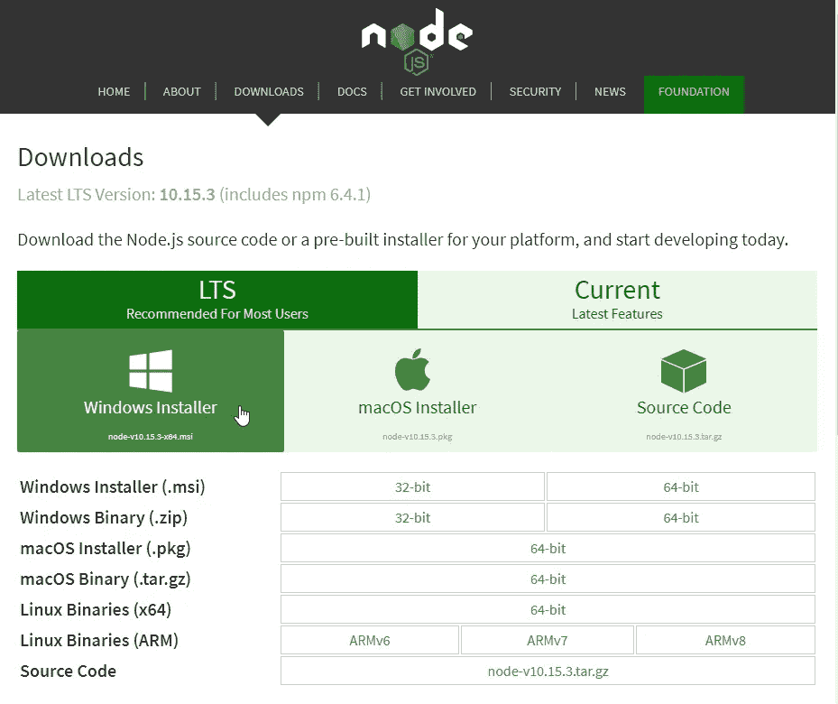

下载完成后，我们运行 Node.js 安装程序(。msi fuke)并按照步骤完成安装。


现在我们已经安装了 Node.js，我们可以进入下一步了。

# 命令提示符环境

我们将需要使用命令提示符(命令行)与 Node.js 和节点包管理器(NPM)进行交互，以安装 React。让我们花几分钟时间来了解一下我们需要使用的命令。下面是我们需要使用的基本命令来创建文件夹/目录:

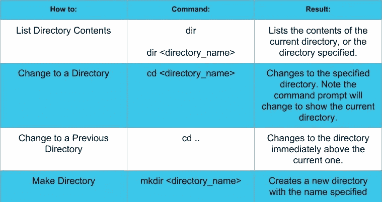

# 在 Windows 中打开命令提示符

单击“开始”菜单(1)，开始键入单词 command (2)，然后选择命令提示符或 Node.js 命令提示符(3)，两种选择都可以。

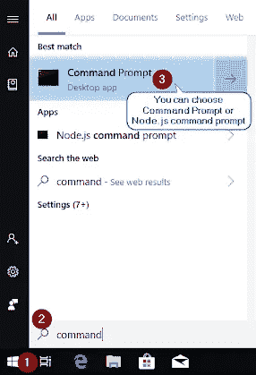

将打开一个命令提示符窗口，路径显示为 C:\Users\ <username>,其中系统上的<username>将是您登录的用户。</username></username>

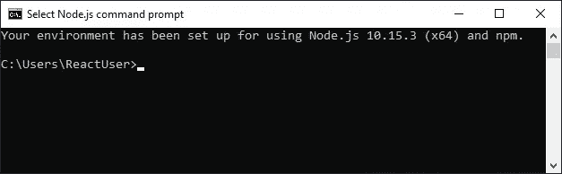

要执行命令，我们键入命令和任何必需的选项，然后按 Enter 键执行命令并查看结果。让我们浏览一下上面列出的每个命令，看看会发生什么:

```
dir
```

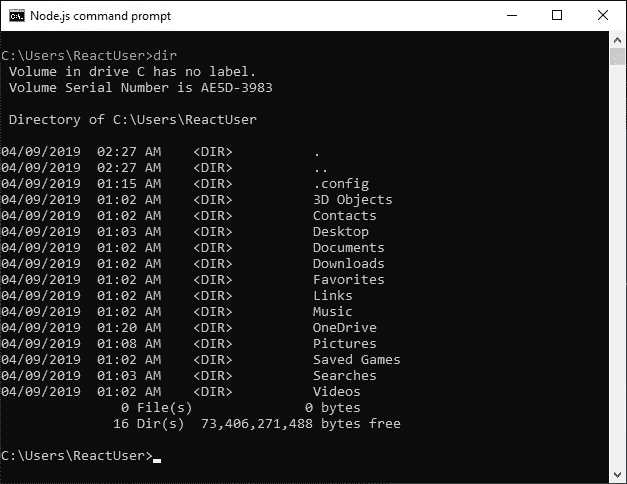

现在，让我们用这个命令来看看下载文件夹的内容:

```
dir downloads
```

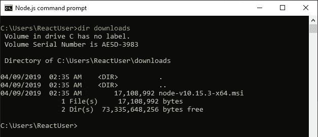

该路径显示我们仍然在目录 C:\Users\ReactUser >中，但是，我们正在查看 C:\Users\ReactUser\downloads 的内容，我们看到它有一个文件。让我们使用以下命令转到下载目录:

```
cd downloads
```

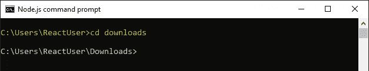

当命令提示符显示 C:\Users\ReactUser\downloads >时，我们已经切换到 Downloads 文件夹。您可以使用 dir 命令查看该目录/文件夹的内容。接下来，让我们使用以下命令返回到上一个目录:

```
cd..
```

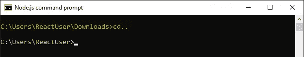

现在我们又回到了起点。让我们为第一个项目创建一个新目录，并将其命名为 reactproject1。我们将使用以下命令:

```
mkdir reactproject1
```

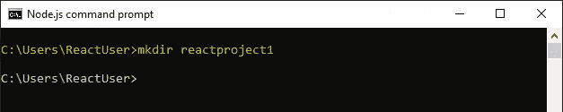

同样，我们使用 dir 命令列出当前文件夹中的文件。

```
dir
```

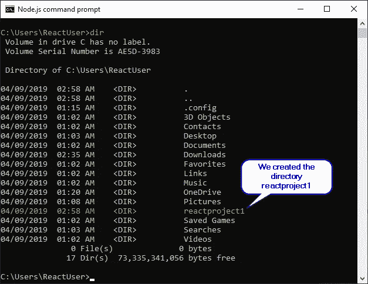

如果你想了解更多关于[命令](https://commandwindows.com/command3.htm)，请查看这个[微软链接。](https://docs.microsoft.com/en-us/windows-server/administration/windows-commands/windows-commands)

# 在 Windows 上安装 React

有两种方法可以为您的项目安装 React。让我们来看看每种方法，以便您可以决定您更喜欢使用哪一种。

# 选项 1

*   创建项目文件夹
*   更改到项目文件夹
*   创建 package.json 文件
*   安装 React 和您选择的其他模块

此安装选项允许您完全控制已安装并定义为依赖项的所有内容。

第一步:开始之前，我们需要打开一个命令提示符。按 Windows+R 键打开一个运行命令框。键入' *cmd* ，然后点击 OK 按钮。

步骤 2:创建名为 reactproject1 的项目文件夹:

```
mkdir reactproject1
```

按 Enter 执行命令，我们得到一个名为 reactproject1 的新目录。如果您在命令提示符示例中这样做，您可以跳过这一步，因为它会告诉您它已经存在。

步骤 3:使用 cd reactproject1 移动到项目文件夹，这样我们就可以在其中安装 React。

```
cd reactproject1
```

此时，您将看到提示 C:\ Users \ react user \ react project 1。

步骤 4:创建一个 package.json 文件。以下命令将指导您创建 package.json 文件。

```
npm init
```

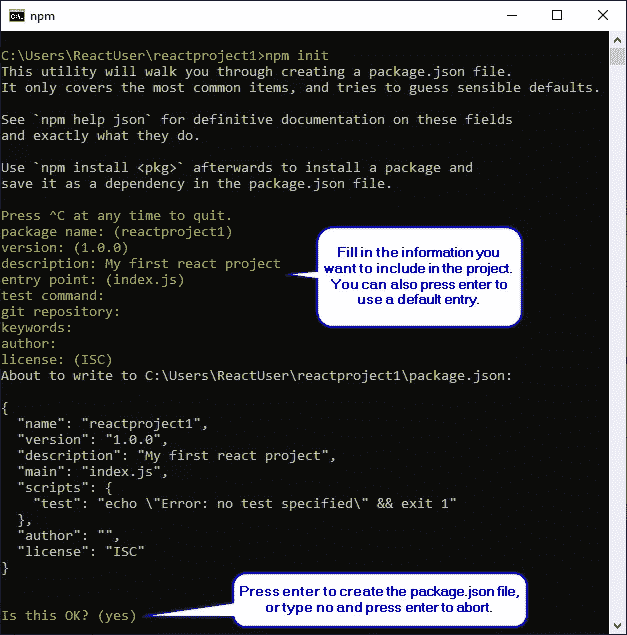

步骤 5:使用 npm install 安装 react 和其他模块—保存 React，这将把 React 安装到您的项目中，并使用依赖项更新 package.json 文件。

```
npm install --save react
```

我们可以使用 NPM install-save 和我们要安装的软件包的名称来安装其他软件包。这里我们正在安装 react-DOM:NPM install—save react-DOM

```
npm install --save react-dom
```

# 选项 2

*   安装 Create-React-App 包，以简化在项目中创建和安装 React 的过程

第 1 步:首先，我们需要使用 Win+R 打开一个命令提示符，并键入' *cmd* '。然后，键入以下命令。

```
npm install -g create-react-app
```

这将安装 *Create-React-App* 模块，使用一个命令就可以轻松地创建 React 并将其部署到项目中。

```
npm install -g create-react-app
```

注意

使用 create-react-app 时，请确保您位于所需的目录/文件夹位置，因为该命令将在当前路径中创建项目文件夹。

*Create-React-App* 模块现在安装在以下位置。

```
C:\Users\<username>\AppData\Roaming\npm\node_modules\create-react-app\
```

一旦安装了 Create-React-App 模块，我们就可以使用它来创建一个项目文件夹，并自动安装 React 和依赖项。

当创建一个新项目时，为了确保你在期望的目录中，你可以使用 dir 来查看你在哪里，以及 cd <directory_name>或 cd..才能到达目的地。</directory_name>

步骤 2:要创建一个新项目并将 React 部署到其中，我们将运行以下命令来创建 reactproject2。

```
create-react-app reactproject2
```

整个过程是自动化的，从为项目创建一个新的 React app 文件夹开始，然后安装包和依赖项。默认包包括 react、react-dom 和 react-scripts。安装将需要几分钟时间。

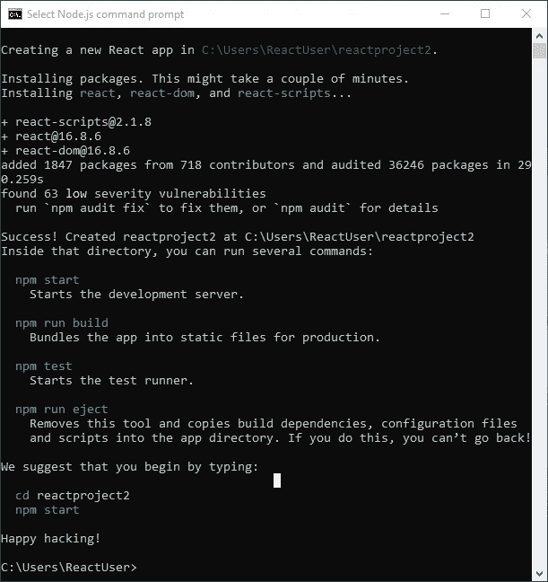

# 运行 React 项目应用程序

要运行我们的新项目，我们需要使用命令提示符切换到项目文件夹，然后启动它。cd reactproject2 命令会将我们带到 reactproject2 文件夹。

```
cd reactproject2
```

npm start 命令将运行项目应用程序。

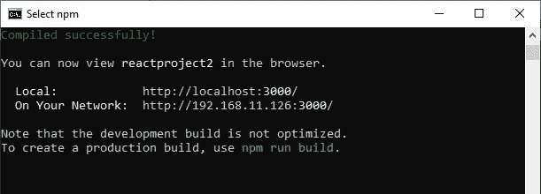

接下来，默认浏览器将打开并加载项目:

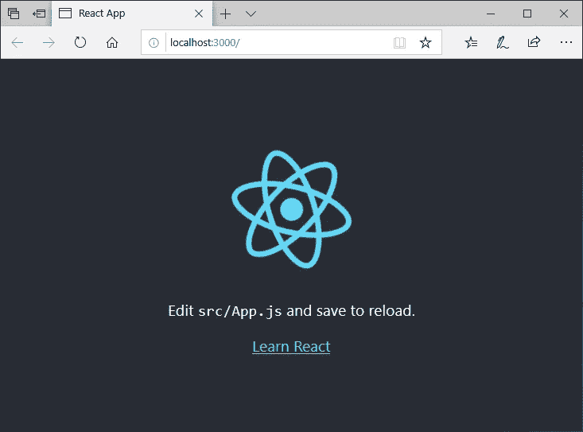

现在，您已经为构建项目设置好了环境！尽情享受吧！