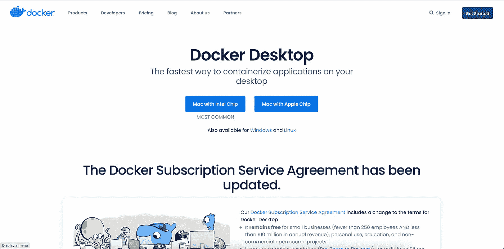
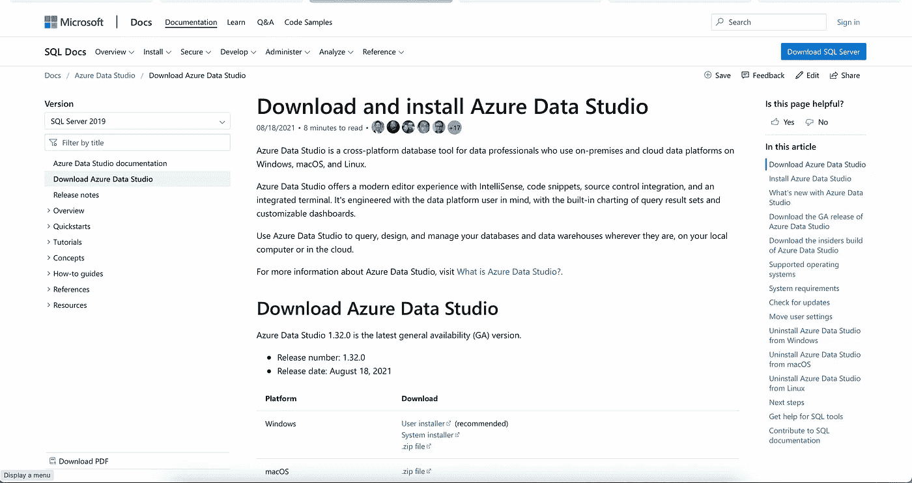
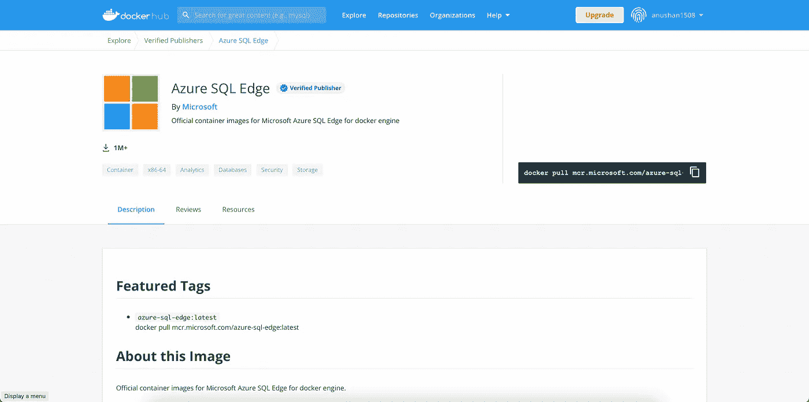
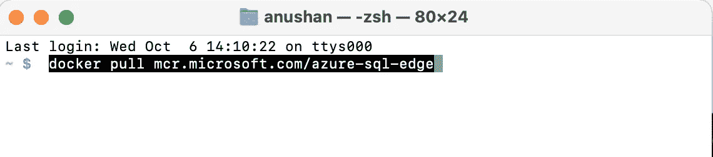
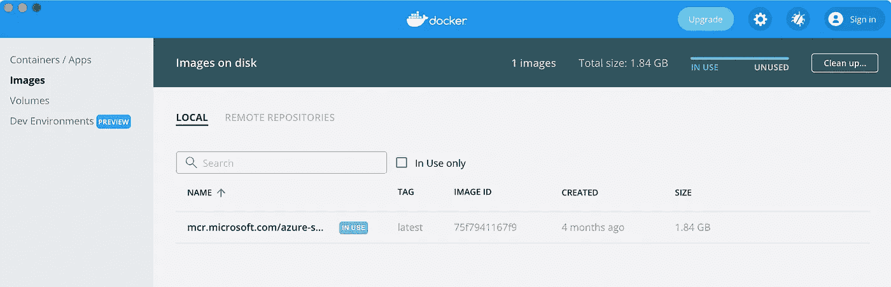
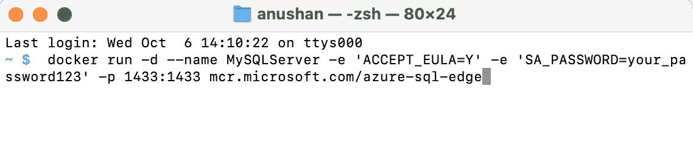
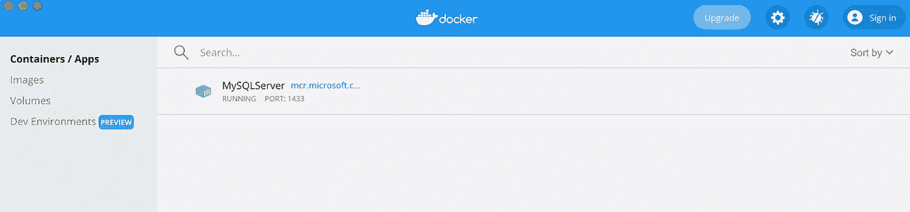
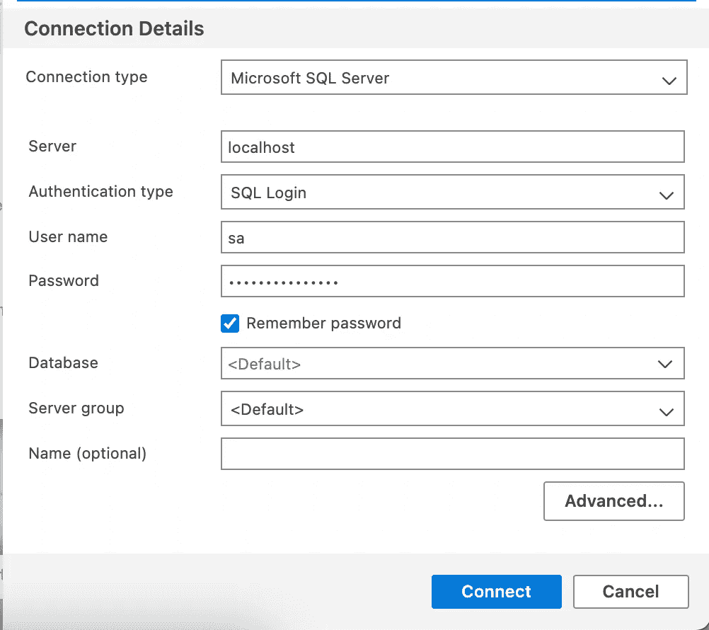

# 如何在 Mac M1 中安装 SQL Server

> 原文：<https://medium.com/geekculture/how-to-install-sql-server-in-mac-m1-41121e110214?source=collection_archive---------1----------------------->

## Mac OS 编程技巧

## 使用 Docker 在 Mac M1 中安装 SQL Server

大家好😃,

当我们转换操作系统时，比如从 Windows 转到 Mac OS X，🍎，我们可能会面临很多软件相关的安装问题。结果我想用 Mac OS。然而，Windows 和 Mac 之间存在显著差异。结果，我在 Mac OS 上安装软件时遇到了很多麻烦。在这个故事中，我将向您展示如何在 Mac M1 上安装 SQL Server。


Photo by [Christian Lue](https://unsplash.com/@christianlue?utm_source=medium&utm_medium=referral) on [Unsplash](https://unsplash.com?utm_source=medium&utm_medium=referral)

## 第一步

我们必须利用 Docker，因为 MacOS 不提供对微软技术的本地支持。幸运的是，Docker 已经支持 ARM 应用，所以我们可以从 Docker 网站上获取。

Docker 网站链接—[https://www.docker.com](https://www.docker.com)

直接下载链接(Docker)

【https://desktop.docker.com/mac/stable/arm64/Docker.dmg? UTM _ source = docker&UTM _ medium = web referral&UTM _ campaign = DD-smart button&UTM _ location = header



Image by Author

## 第二步

之后，运行 SQL 查询和其他 DB 活动。你需要下载一个 IDE。

SQL Server Management Studio 是 SQL Server 运行 SQL 查询的最佳工具，尽管它仅在 Windows 操作系统上受支持。

由于他们的团队，微软已经开发了 SQL Server Management Studio 的替代产品。 **Azure Data Studio** 是这个工具的名字。这个工具将在我们位于 M1 的 Mac 上使用。

下载 Azure Data Studio

[](https://docs.microsoft.com/en-us/sql/azure-data-studio/download-azure-data-studio?view=sql-server-ver15#get-azure-data-studio-for-macos) [## 下载并安装 Azure Data Studio—Azure Data Studio

### Azure Data Studio 是一个跨平台的数据库工具，面向使用内部和云数据平台的数据专业人员…

docs.microsoft.com](https://docs.microsoft.com/en-us/sql/azure-data-studio/download-azure-data-studio?view=sql-server-ver15#get-azure-data-studio-for-macos) 

Image by Author

**第三步**

我们需要在[https://hub.docker.com](https://hub.docker.com/)上创建一个 ID，或者使用您已有的 ID 登录。

登录后，你需要下载一个微软托管的 Docker 镜像，名为 Azure SQL Edge。



Image by Author

我们将使用 Docker 命令将这个映像下载到本地系统，然后在本地主机端口上的 Docker 容器中运行它。一旦我们在容器中运行了映像，我们就可以在基于 M1 的 Mac 上使用 SQL server 了。

**第四步**

我们可以用 macOS 终端下载 Docker 镜像。

在 Mac 系统中打开终端，输入命令:

```
docker pull mcr.microsoft.com/azure-sql-edge
```



Image by Author

在您运行上面的命令之后，Docker 将开始从 web 存储库中提取图像，并将其下载到您的本地机器上。

该图像也可以在 Docker 桌面窗口中看到，如下图所示。



Image by Author

**第五步**

一旦下载了 Docker 映像，就需要在一个本地主机端口上的 Docker 容器中执行它。

使用相同的终端窗口运行下面的命令。

```
docker run -d — name MySQLServer -e ‘ACCEPT_EULA=Y’ -e ‘SA_PASSWORD=your_password123’ -p 1433:1433 mcr.microsoft.com/azure-sql-edge
```

***强烈建议使用强密码***



Image by Author

当命令成功完成时，转到 Docker 桌面窗口中的容器选项，并查找与我们在命令中指定的容器同名的容器。



Image by Author

**第六步**

之后，我们可以使用刚刚创建的凭据登录 Azure Data Studio。以下是你接触它的方法:



Image by Author

现在，您可以使用新的查询选项构造查询来生成表、存储过程和其他对象。

如果您忘记了密码，您可以简单地删除图像并建立一个新的。

我相信你已经理解了今天讨论的主题。如果您有任何问题或需要任何澄清，不要犹豫，通过回复部分与我联系。感谢您花费宝贵的时间阅读本博客。相信这会对你在 Mac OS 上使用 SQL 有所帮助。

***享受文章？成为*** [***中等会员***](https://sthenusan.medium.com/membership) ***继续无限制学习。如果你使用上面的链接，我会收到你的一部分会员费，不需要你额外付费。***


Photo by [Pete Pedroza](https://unsplash.com/@peet818?utm_source=medium&utm_medium=referral) on [Unsplash](https://unsplash.com?utm_source=medium&utm_medium=referral)