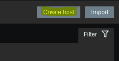
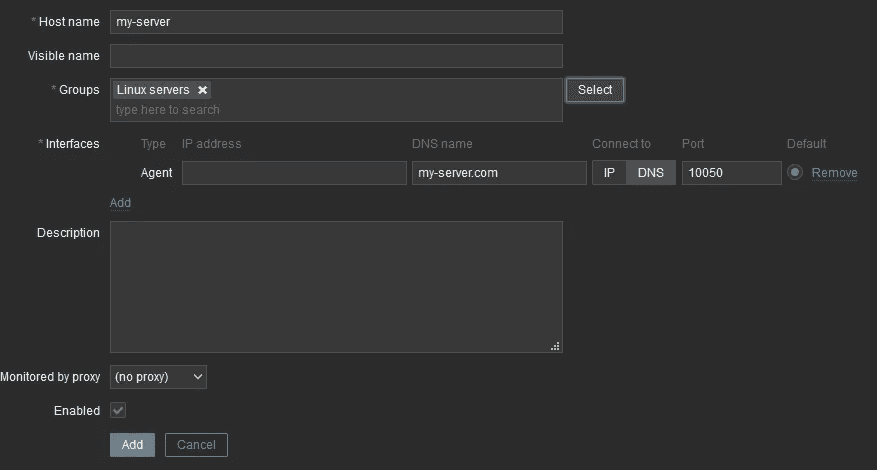
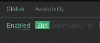

# 如何在 Linux 上安装 Zabbix-agent2

> 原文：<https://medium.com/geekculture/how-to-install-zabbix-agent2-on-linux-c603023207d2?source=collection_archive---------0----------------------->

Zabbix 是流行的监控软件。在本文中，我将展示如何安装 Zabbix-agent 的第 2 版。使用 Zabbix-agent2，您还可以监控 docker 容器。

# 将 Zabbix 资源库添加到已知资源库

为了通过 Linux 发行版的包存储库安装 Zabbix-agent2，必须将 Zabbix 添加到已知的存储库中。

对于 Debian 10，您可以通过执行以下命令来实现:

```
# wget https://repo.zabbix.com/zabbix/5.2/debian/pool/main/z/zabbix-release/zabbix-release_5.2-1+debian10_all.deb
# dpkg -i zabbix-release_5.2-1+debian10_all.deb
# apt update
```

对于其他发行版，你可以在[官方 Zabbix 下载页面](https://www.zabbix.com/download?zabbix=5.2&os_distribution=debian&os_version=10_buster&db=mysql&ws=apache)上找到说明。

然后，您可以使用以下命令安装 Zabbix-agent2:

```
apt install zabbix-agent2
```

# 配置代理

为了让代理运行，您必须设置一些基本配置。

为此，用您最喜欢的文本编辑器打开 zabbix_agent2.conf:

```
vim /etc/zabbix/zabbix_agent2.conf
```

调整以下属性:

*   *服务器= <* 在这里写下你的 ZABBIX 服务器的主机名 *>*
*   在这里写下你的 ZABBIX 服务器的主机名>
*   *主机名* = <在这里写下你当前服务器的主机名>

# 重新启动 Zabbix-agent2

要应用您的设置，您必须使用以下命令重新启动 Zabbix-agent2:

```
systemctl restart zabbix-agent2
```

# **将主机添加到 Zabbix 接口**

转到配置->主机


单击“创建主机”



输入主机名，选择至少一个组(例如 Linux 服务器)，并输入安装了 Zabbix-agent2 的新服务器的 DNS 名称或 IP 地址，然后单击“添加”。



几分钟后，在主机概述中，您应该看到 ZBX 是绿色的，因此代理是可用的。



如果它没有变绿，你可能配置错了或者防火墙关闭了。检查服务器和代理的 Zabbix 日志。


Photo by [Chris Liverani](https://unsplash.com/@chrisliverani?utm_source=medium&utm_medium=referral) on [Unsplash](https://unsplash.com?utm_source=medium&utm_medium=referral)