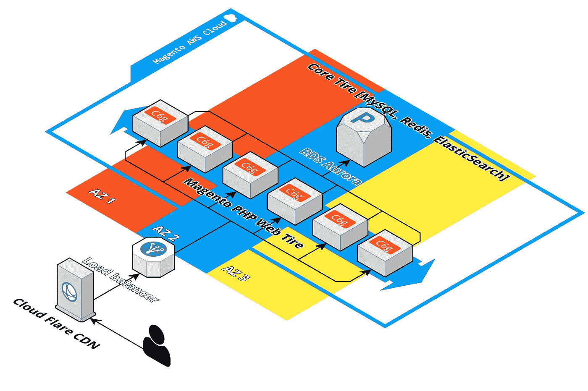

# 如何使用 Terraform 在 AWS 云上安装 Magento 2

> 原文：<https://medium.com/geekculture/how-to-installing-magento-2-on-aws-cloud-using-terraform-fdba062297e9?source=collection_archive---------10----------------------->

## 在本文中，我将展示如何使用 Terraform 在 AWS 上安装 Magento 2。



Magento 2 Cloud Terraform

# Magento 需要哪些 AWS 资源:

首先，我们需要一个 Magento 负载平衡器来在实例之间分配流量:

# Magento 负载平衡器组件

一个*负载平衡器*充当客户端的单点联系。负载平衡器将传入的应用程序流量分布在多个目标上，比如 Magento EC2 实例。这增加了应用程序的可用性。您可以向负载平衡器添加一个或多个侦听器。

应用负载平衡器在应用层运行，即开放系统互连(OSI)模型的第七层。负载平衡器收到请求后，会按优先级顺序评估侦听器规则，以确定要应用的规则，然后从规则操作的目标组(Web/Admin)中选择一个目标。您可以配置侦听器规则，根据应用程序流量的内容将请求路由到不同的目标组。即使一个目标向多个目标组注册，路由也是为每个目标组独立执行的。您可以配置在目标组级别使用的路由算法。默认的路由算法是循环法；或者，您可以指定最少未完成请求路由算法。

您可以根据需求的变化在负载平衡器中添加和删除目标，而不会中断应用程序的整体请求流。AWS 弹性负载平衡随着应用程序流量的变化而扩展负载平衡器。弹性负载平衡可以自动扩展到绝大多数工作负载。

您可以配置运行状况检查，它用于监视已注册目标的运行状况，以便负载平衡器可以仅向运行状况良好的目标发送请求。

```
terraform {
  source = "git::[git@github.com](mailto:git@github.com):terraform-aws-modules/terraform-aws-alb.git?ref=v5.1.0"
}include {
  path = find_in_parent_folders()
}dependencies {
  paths = ["../magento-cloud", "../loadbalancer-internal-securitygroup"]
}dependency "magento-cloud" {
  config_path = "../magento-cloud"
}dependency "loadbalancer-internal-securitygroup" {
  config_path = "../loadbalancer-internal-securitygroup"
}###########################################################
# View all available inputs for this module:
# [https://registry.terraform.io/modules/terraform-aws-modules/alb/aws/5.1.0?tab=inputs](https://registry.terraform.io/modules/terraform-aws-modules/alb/aws/5.1.0?tab=inputs)
###########################################################
inputs = {
  # The resource name and Name tag of the load balancer.
  # type: string
  name = "WebNodes-ELB"# Controls if the ALB will log requests to S3.
  # type: bool
  logging_enabled = false# The security groups to attach to the load balancer. e.g. ["sg-edcd9784","sg-edcd9785"]
  # type: list(string)
  security_groups = [dependency.loadbalancer-internal-securitygroup.outputs.this_security_group_id]# A list of subnets to associate with the load balancer. e.g. ['subnet-1a2b3c4d','subnet-1a2b3c4e','subnet-1a2b3c4f']
  # type: list(string)
  subnets = dependency.magento-cloud.outputs.public_subnets# VPC id where the load balancer and other resources will be deployed.
  # type: string
  vpc_id = dependency.magento-cloud.outputs.vpc_id

}
```

**用 Magento 实例自动缩放组。**

Amazon EC2 Auto Scaling 帮助您确保有正确数量的 Magento 实例来处理负载。您可以指定每个自动缩放组中 Magento 实例的最小数量，Amazon EC2 自动缩放确保您的组永远不会低于这个大小。您可以指定每个自动缩放组中实例的最大数量，Amazon EC2 自动缩放确保您的组永远不会超过这个大小。如果您在创建组时或之后的任何时候指定了所需的容量，Amazon EC2 Auto Scaling 会确保您的组有这么多实例。如果您指定缩放策略，那么 Amazon EC2 Auto Scaling 可以根据应用程序需求的增加或减少启动或终止实例。

例如，以下自动缩放组的最小大小为一个实例，所需容量为两个实例，最大大小为四个实例。您定义的扩展策略根据您指定的标准，在最小和最大实例数范围内调整实例数。

**我们将使用 EC2 实例(服务器)和** c6g .中型实例类型和 **EBS (SSD 磁盘)卷和**通用 3

如何使用 terraform 创建 Magento 2 自动缩放:

```
terraform {
  source = "git::[git@github.com](mailto:git@github.com):terraform-aws-modules/terraform-aws-autoscaling.git?ref=v3.4.0"
}include {
  path = find_in_parent_folders()
}dependencies {
  paths = ["../aws-data", "../magento-cloud", "../webnode-securitygroup", "../webnode-loadbalancer"]
}dependency "aws-data" {
  config_path = "../aws-data"
}dependency "magento-cloud" {
  config_path = "../magento-cloud"
}dependency "webnode-securitygroup" {
  config_path = "../webnode-securitygroup"
}dependency "webnode-loadbalancer" {
  config_path = "../webnode-loadbalancer"
}###########################################################
# View all available inputs for this module:
# [https://registry.terraform.io/modules/terraform-aws-modules/autoscaling/aws/3.4.0?tab=inputs](https://registry.terraform.io/modules/terraform-aws-modules/autoscaling/aws/3.4.0?tab=inputs)
###########################################################
inputs = {
  # The number of Amazon EC2 instances that should be running in the group
  # type: string
  desired_capacity = "1"# Controls how health checking is done. Values are - EC2 and ELB
  # type: string
  health_check_type = "EC2"# The EC2 image ID to launch
  # type: strin
  image_id = dependency.aws-data.outputs.amazon_linux2_aws_ami_id # magento image for test "ami-04937aae676c8b679"# The size of instance to launch
  # type: string
  instance_type = "c6g.large"# The maximum size of the auto scale group
  # type: string
  max_size = "20"# The minimum size of the auto scale group
  # type: string
  min_size = "10"# Creates a unique name beginning with the specified prefix
  # type: string
  name = "WebNode-ASG"# A list of security group IDs to assign to the launch configuration
  # type: list(string)
  security_groups = [dependency.webnode-securitygroup.outputs.this_security_group_id]# A list of aws_alb_target_group ARNs, for use with Application Load Balancing
  # type: list(string)
  target_group_arns = dependency.webnode-loadbalancer.outputs.target_group_arns# A list of subnet IDs to launch resources in
  # type: list(string)
  vpc_zone_identifier = dependency.magento-cloud.outputs.public_subnets}
```

# 存储 Magento 持久数据的数据库。

作为 Magento 数据库，我们将使用 AWS RDS AURORA DB。

Amazon Aurora (Aurora)是一个完全托管的关系数据库引擎，与 MySQL 兼容。您已经知道 MySQL 和 PostgreSQL 如何将高端商业数据库的速度和可靠性与开源数据库的简单性和成本效益相结合。您目前在现有 MySQL 数据库中使用的代码、工具和应用程序也可以在 Aurora 中使用。对于某些工作负载，Aurora 可以提供高达 MySQL 五倍的**吞吐量，而无需更改您现有的大多数应用程序。**

Aurora 包括一个高性能存储子系统。它的兼容 MySQL 的数据库引擎被定制来利用这种快速的分布式存储。底层存储会根据需要自动增长。Aurora 群集卷的最大容量可以增长到 128。Aurora 还自动化和标准化了数据库集群和复制，这通常是数据库配置和管理中最具挑战性的方面。

Aurora 是托管数据库服务 Amazon 关系数据库服务(Amazon RDS)的一部分。Amazon RDS 是一个 web 服务，它使得在云中设置、操作和扩展关系数据库变得更加容易。如果你还不熟悉亚马逊 RDS。

以下几点说明了 Aurora 与 Amazon RDS 中可用的标准 MySQL 引擎的关系:

*   Aurora 利用熟悉的 Amazon 关系数据库服务(Amazon RDS)特性进行管理。Aurora 使用 Amazon RDS AWS 管理控制台界面、AWS CLI 命令和 API 操作来处理日常数据库任务，如供应、修补、备份、恢复、故障检测和修复。
*   Aurora 管理操作通常涉及通过复制同步的整个数据库服务器集群，而不是单个数据库实例。自动集群、复制和存储分配使得设置、操作和扩展最大规模的 MySQL 和 PostgreSQL 部署变得简单且经济高效。
*   您可以通过创建和恢复快照，或者通过设置单向复制，将数据从 Amazon RDS for MySQL 和 Amazon RDS for PostgreSQL 引入 Aurora。您可以使用按钮式迁移工具将现有的 Amazon RDS for MySQL 和 Amazon RDS for PostgreSQL 应用程序转换为 Aurora。

**我们将使用 RDS Aurora DB 实例和** 20 GB 存储 db.r6g.micro 实例类，并启用备份和维护模式。

Terraform 代码将是这样的:

```
terraform {
  source = "git::[git@github.com](mailto:git@github.com):terraform-aws-modules/terraform-aws-rds.git?ref=v2.14.0"
}include {
  path = find_in_parent_folders()
}dependencies {
  paths = ["../magento-cloud", "../mysql-rds-securitygroup"]
}dependency "magento-cloud" {
  config_path = "../magento-cloud"
}dependency "mysql-rds-securitygroup" {
  config_path = "../mysql-rds-securitygroup"
}###########################################################
# View all available inputs for this module:
# [https://registry.terraform.io/modules/terraform-aws-modules/rds/aws/2.14.0?tab=inputs](https://registry.terraform.io/modules/terraform-aws-modules/rds/aws/2.14.0?tab=inputs)
###########################################################
inputs = {
  # The allocated storage in gigabytes
  # type: string
  allocated_storage = "5"# The days to retain backups for
  # type: number
  backup_retention_period = 0# The daily time range (in UTC) during which automated backups are created if they are enabled. Example: '09:46-10:16'. Must not overlap with maintenance_window
  # type: string
  backup_window = ""# Name of DB subnet group. DB instance will be created in the VPC associated with the DB subnet group. If unspecified, will be created in the default VPC
  # type: string
  db_subnet_group_name = dependency.magento-cloud.outputs.database_subnet_group# Aurora database engine type, currently aurora, aurora-mysql or aurora-postgresql
  # type: string
  engine = "aurora-mysql"# Aurora database engine version.
  # type: string
  engine_version = "5.7.12"# The name of the RDS instance, if omitted, Terraform will assign a random, unique identifier
  # type: string
  identifier = "mysql"# The instance type of the RDS instance
  # type: string
  instance_class = "db.r6g.large"# The window to perform maintenance in. Syntax: 'ddd:hh24:mi-ddd:hh24:mi'. Eg: 'Mon:00:00-Mon:03:00'
  # type: string
  maintenance_window = ""# Specifies the major version of the engine that this option group should be associated with
  # type: string
  major_engine_version = "5.7"# Specifies if the RDS instance is multi-AZ
  # type: bool
  multi_az = false# Password for the master DB user. Note that this may show up in logs, and it will be stored in the state file
  # type: string
  password = "kjj2flgyM0Ml"# The port on which the DB accepts connections
  # type: string
  port = "3306"# Username for the master DB user
  # type: string
  username = "bass"# List of VPC security groups to associate
  # type: list(string)
  vpc_security_group_ids = [dependency.mysql-rds-securitygroup.outputs.this_security_group_id]}
```

您可以在此查看完整代码:

[](https://github.com/Genaker/TerraformMagentoCloud) [## Genaker/TerraformMagentoCloud

### 该存储库包含 Magento 2 Cloud Terraform 基础架构，作为 AWS 公共云的代码。这种基础设施是…

github.com](https://github.com/Genaker/TerraformMagentoCloud) 

## 有一个小视频介绍了如何为 Magento 配置 Terraform:

# 在 Centos 和 AWS Linux 上安装 Magento:

使用此回购:

[](https://github.com/Genaker/Magento-AWS-Linux-2-Installation) [## ge naker/Magento-AWS-Linux-2-安装

### 如果你有任何问题，随时给我发电子邮件-yegorshytikov@gmail.com 每个商人都想…

github.com](https://github.com/Genaker/Magento-AWS-Linux-2-Installation)