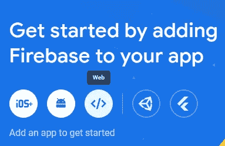

# 如何将 Firebase 与 Angular 应用集成？

> 原文：<https://medium.com/geekculture/how-to-integrate-firebase-with-angular-applications-5f57a05d38e0?source=collection_archive---------13----------------------->

## 编程；编排

## Firestore 数据库与 Angular 应用程序集成指南


Photo by [Caspar Camille Rubin](https://unsplash.com/@casparrubin?utm_source=unsplash&utm_medium=referral&utm_content=creditCopyText) on [Unsplash](https://unsplash.com/s/photos/databases?utm_source=unsplash&utm_medium=referral&utm_content=creditCopyText)

在这篇短文中，我们将介绍设置远程 Firebase 数据库的过程，即带有 Angular 应用程序的 Firestore。

我将本指南分为以下两个部分:

1.  在 Firebase 上创建项目
2.  整合 Firebase 和角度应用

## 第 1 部分:在 Firebase 上创建一个项目

首先，转到 [Firebase 控制台](https://console.firebase.google.com/)

然后，选择“添加项目”并为项目命名。

一旦在 Firebase 上创建了项目，从选项中选择“Web”将 Firebase 添加到您的 Angular 应用程序中，如下图所示，为您的应用程序取一个昵称，然后单击“注册应用程序”。



## 第 2 节:将 Firebase 与角度应用程序集成

现在，转到您的 Angular 应用程序，打开终端，运行以下命令来安装 Firebase SDK。

```
npm install firebase
```

安装 SDK 后，复制 Firebase 配置细节(如控制台所示)并粘贴到`environment.ts`文件中，如下所示:

```
export const environment = {
  production: false,
  firebase: {
    apiKey: "xxxxxxxxx",
    authDomain: "angular-demo-1234a.firebaseapp.com",
    projectId: "angular-demo-1234a",
    storageBucket: "angular-demo-1234a.appspot.com",
    messagingSenderId: "xxxxxxxxxx",
    appId: "1:xxxxxxxxxx:web:dexxxxxxyyyxxx"
  }
};
```

下一步是使用以下命令安装 AngularFire:

```
ng add @angular/fire
```

> 如果您收到要求您输入授权码的验证错误，请按照[本 pos](https://stackoverflow.com/questions/70657254/how-to-get-authorisation-code-during-angularfire-installation) t 中给出的步骤接收授权码。

运行`ng add @angular/fire`命令后，选择您想要添加到应用程序中的特性。例如`ng deploy --hosting`、`Authentication`、`Firestore`、`Realtime Database`。

选择与您的 Firebase 应用程序和在 Firebase 上创建的项目相关联的帐户。

相关的配置和代码更改将在角度应用程序代码中自动进行。

现在，转到`app.module.ts`并导入以下内容:

```
import { FIREBASE_OPTIONS } from '@angular/fire/compat';
```

并在提供程序中进行以下更改:

```
providers: [
  {provide: FIREBASE_OPTIONS, useValue: environment.firebase}
]
```

现在，您的应用程序已经准备好将 Firestore 数据库用于 Angular 应用程序。

## 与我联系

领英:[https://www.linkedin.com/in/jimit105/](https://www.linkedin.com/in/jimit105/)
GitHub:[https://github.com/jimit105](https://github.com/jimit105)
推特:[https://twitter.com/jimit105](https://twitter.com/jimit105)