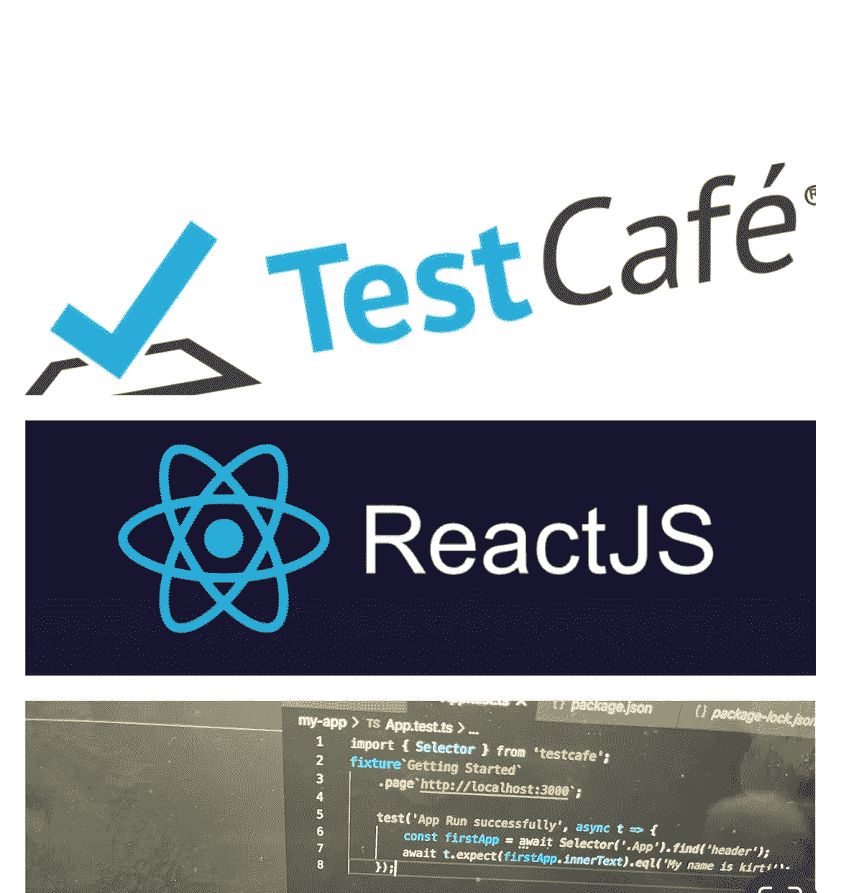

# 如何在 React 应用中集成 TestCafe——使用 test cafe 进行端到端测试初学者指南

> 原文：<https://medium.com/geekculture/how-to-integrate-testcafe-in-react-app-end-to-end-testing-with-testcafe-beginner-guide-dd3b2fdad3bd?source=collection_archive---------9----------------------->

在本教程中，我们将学习如何将 testCafe 集成到现有的 React 应用程序中。

在我们开始之前，请找出以下重要定义:

1.  **测试咖啡馆** —

*自动化端到端 web 测试的 Node.js 工具。用 JS 或 TypeScript 编写测试，运行它们并* …