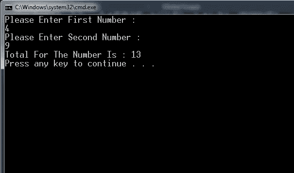

# 编程中如何与用户互动？

> 原文：<https://medium.com/geekculture/how-to-interact-with-users-in-programming-d9eaebb565c1?source=collection_archive---------26----------------------->



T2 软件就像一个工厂，获取原材料并生产出产品。该软件接受输入并给出输出。每个软件的基本功能是从用户或环境中获取数据(输入),并产生新的数据(输出),这将使软件的用户受益。到目前为止，我们一直在没有用户交互的情况下编程。当与用户互动时，编程开始变得有趣。

# 扫描函数()

[为了将值输出到屏幕上，我们使用了 printf()函数。](https://medium.datadriveninvestor.com/codefactory-hello-world-f5ae4ed545d2)为了通过屏幕接收用户的输入，我们使用 scanf()函数。用法相似，只有细微的差别。scanf()所做的是从用户那里获取值，并将其存储在一个变量中。我们稍后可以使用这个变量中的值。

```
scanf("%d", &num);
```

这里 scanf()接受一个[格式说明符](https://medium.datadriveninvestor.com/code-factory-variables-and-data-types-aa20cfccfe80)，它指定输入将是一个整数。“& num”指定该值应该存储在 num 变量中。下面是一个将输入输出到屏幕的例子

```
#include <stdio.h>int main()
{   
    int num;
    printf("Enter a number: ");
    scanf("%d", &num);
    printf("%d", num); return 0;
}
```

输出

```
Enter a number: 10
10
```

这里，当程序执行到 scanf()时，它将暂停执行，直到从用户那里得到输入。只有得到输入后，它才会进行下一行。因此，在这种情况下，程序在执行 printf()函数后向用户显示一条消息:“输入一个数字:”之后，执行将停止，程序将等待用户输入。一旦获得输入，它将把输入存储在 num 变量中，并使用 printf()函数在屏幕上显示它。

您还可以使输出更有说服力，如下所示

```
#include <stdio.h>int main()
{   
    int num;
    printf("Enter a number: ");
    scanf("%d", &num);
    printf("The number you just entered was %d", num); return 0;
}
```

输出

```
Enter a number: 10
The number you just entered was 10
```

看，我们把格式说明符放在我们的消息中，我们想用变量 num 的值替换格式说明符。我们可以用更多的输入做同样的事情。

```
#include <stdio.h>int main()
{   
    int num1, num2;
    printf("Enter a number: ");
    scanf("%d", &num1);
    printf("Enter a number again: ");
    scanf("%d", &num2);
    printf("The first number you enterd is %d and the second number
    you entered is %d", num1, num2); return 0;
}
```

输出

```
Enter a number: 10
Enter a number again: 20
The first number you entered is 10 and the second number you entered is 20
```

我们只是在我们的消息中使用格式说明符，我们希望用一个值来替换它，我们还将指定包含该值的变量，其顺序与我们希望显示的顺序相同。

现在让我们编写一个简单的程序，从用户那里获取两个数字，计算它们的总和并显示结果。

# 算法

1.  声明三个变量 num1、num2 和整数类型的 sum。
2.  显示一条消息:“输入第一个数字”
3.  获取输入并将其存储在 num1 中
4.  显示一条消息:“输入第二个数字”
5.  取输入并存储在 num2 中；
6.  将“num1 + num2”的值存储在 sum 中
7.  展示结果

# 程序

```
#include <stdio.h>int main()
{   
    int num1, num2;
    int sum;
    printf("Enter the first number: ");
    scanf("%d", &num1);
    printf("Enter the second number: ");
    scanf("%d", &num2);
    sum = num1 + num2;
    printf("%d + %d = %d", num1, num2, sum); return 0;
}
```

输出

```
Enter the first number: 10
Enter the second number: 20
10 + 20 = 30
```

我们在这里做的是，我们从用户那里获得两个输入，并计算其总和。然后我们将它显示给用户。这就是我们在编程中与用户互动的方式。

[**Previous = >逻辑运算符中的逻辑**](/geekculture/the-logic-in-logical-operators-1cb16f4f0af3)

[**Next = >编程中的决策**](/geekculture/decision-making-in-programming-743e86895ce4)