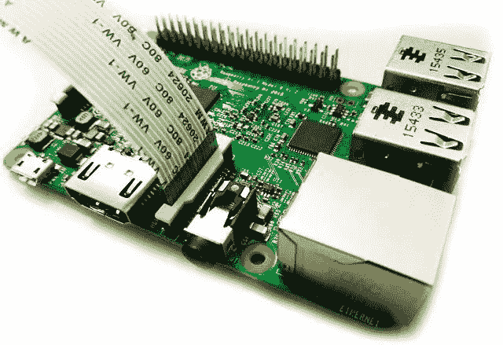
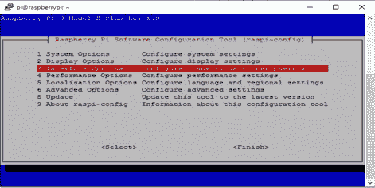
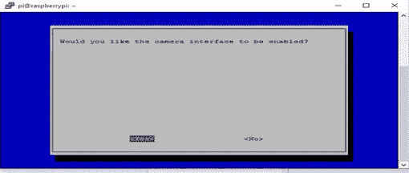
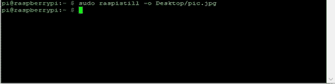
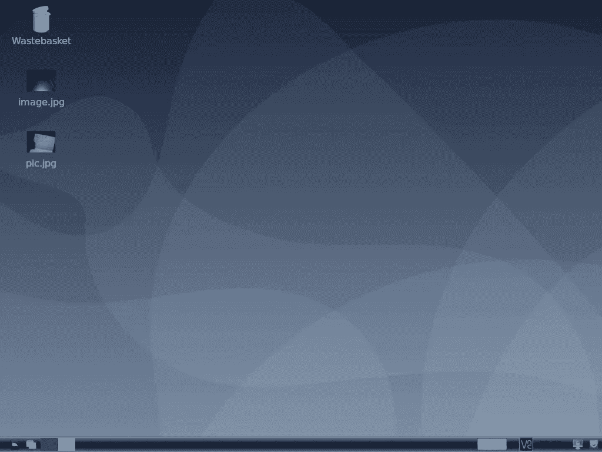
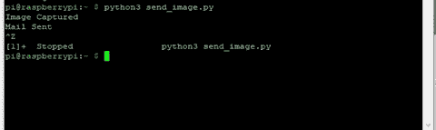

# 如何使用 python 将 Picamera 模块与 Raspberry Pi 接口

> 原文：<https://medium.com/geekculture/how-to-interface-the-picamera-module-with-raspberry-pi-using-python-1570e499cc?source=collection_archive---------3----------------------->

> 嘿伙计们！这是另一个关于树莓派的系列。在文章中，我们将学习如何安装相机模块，拍摄照片，并将照片作为邮件发送。少我忘了，你可以在这里找到其他关于树莓派[的有趣文章。](/geekculture/detecting-motions-using-pir-motion-sensor-with-raspberry-pi-98f88f9d5ffe)


image from [projects.raspberrypi.org](https://projects.raspberrypi.org/en/projects/getting-started-with-picamera)

在我们进入实用部分之前，让我们先来看看 Raspberry Pi 的强大组件——Pi 相机模块。

Pi 相机模块拍摄照片和高清视频。它有两个版本，分别是**标准**和**黑色版本**。

*   [**标准版**](https://www.raspberrypi.org/products/camera-module-v2/) 正常光线下拍照。
*   [**黑色版**](https://www.raspberrypi.org/products/pi-noir-camera-v2/) 没有红外滤镜。它和红外光源一起使用，在黑暗中拍照。

Raspberry Pi 板具有 CSI(相机串行接口)接口，用于连接 PiCamera 模块。

该 Pi 摄像头模块可以使用 15 针带状电缆连接到 Raspberry Pi 的 CSI 端口。

有关 Pi 摄像头模块的更多信息，请务必检查[文档](https://projects.raspberrypi.org/en/projects/getting-started-with-picamera)。

我们去安装组件吧。

## 所需硬件:

1.  Pi 摄像头模块
2.  树莓 Pi 3 型号 B+
3.  一个 5V 2A 微型 USB 电源适配器。

## **所需软件:**

1.  油灰
2.  拉斯比安操作系统

注意:**确保树莓派已经关闭。**

**步骤 1:** 安装摄像头模块

*   在 Raspberry Pi 上，找到音频端口和 HDMI 端口之间的摄像头模块端口。如果您使用的是 Raspberry Pi B，它位于以太网端口和 HDMI 端口之间。
*   轻轻拉起摄像头模块端口塑料片的边缘，插入摄像头模块带状电缆。插入电缆时，确保蓝色面朝向以太网端口，银色面朝向 HDMI 端口。



image from electronicwings.com

*   然后，将塑料片按入到位。
*   给树莓派通电。

**第二步:**连接摄像头模块。

*   使用其 IP 地址和端口 SSH 到 Raspberry PI
*   输入**用户名**和**密码**
*   升级和更新 Pi。每次我们使用 pi 时，总是更新和升级它是一个好习惯。输入`sudo apt-get update`和`sudo apt-get upgrade.`
*   在终端上，运行`sudo raspi-config.`
*   单击接口选项。



image depicting raspberry pi software configuration

*   点击相机，然后启用相机界面。


image depicting Picamera configuration



Picamera configuring

*   重启树莓派

> 让我们拍一张静态照片，以确保它正常工作。

在命令行(SSH)上，运行`raspistill -o Desktop/pic.jpg`



命令`raspistill` 用于拍摄静态图片。因为我们从终端运行代码，所以我们不能查看捕获的图像。但我们可以使用一些软件，如 VNC，查看树莓的桌面或通过命令行发送文件到你的电脑。

在这里，我们将使用 VNC 来查看拍摄的图片。

**输出:**



using VNC to display raspberry’s desktop


image captured using Picamera module

首先，在 Raspbian OS 上安装 Picamera 库。否则，我们将得到一个导入错误:“没有名为 PiCamera 的模块”。

```
sudo apt-get install python-picamera python3-picamera
```

现在，让我们编写一个 python 代码来捕获一个图像并发送一封附有图片的邮件。

**第三步:** Python 代码

*   创建一个 python 文件`send_image.py`
*   跑`sudo nano send_image.py`
*   输入以下代码

代码解释:

首先，我们导入 Python `picamera`库，它允许我们控制摄像头模块。`sleep` 库用于在相机捕捉图像之前添加延迟。然后，import `smtp`(简单邮件传输协议)是一个 SMTP 客户端会话对象，用于在邮件服务器之间发送电子邮件。

接下来，相机预览打开五秒钟，然后捕捉一张静止图片。

接下来，我们附上包含必要细节的文件。

最后，我们使用`session.sendmail(sender_address,receiver_address, text)`发送邮件

*   现在，运行`python3 send_image.py`

**让我们来看看结果——**



image depicting mail sent from the raspberry pi

注意:千万不要将文件保存为`picamera.py`。

在这里检查代码。

但是，想要更多关于树莓派的项目吗？请关注我的下一篇文章。或者更好的是，跟随😊这样你就能收到我文章的通知了。

❤ ❤感谢你阅读这篇文章。❤❤