# 如何解读低空风切变预警系统的预警数据

> 原文：<https://medium.com/geekculture/how-to-interpret-low-level-wind-shear-alert-systems-warning-data-a24a47b47ae2?source=collection_archive---------18----------------------->

## 微软公司的一个案例

Photo by [Marcus Ng](https://unsplash.com/@marcusxsnapz?utm_source=medium&utm_medium=referral) on [Unsplash](https://unsplash.com?utm_source=medium&utm_medium=referral)

嗨，实际上这是我关于低空风切变预警系统的简历。LLWAS 是探测低空风切变(LLWS)现象的系统。我为自己写这篇文章，这样我可以“绑定”这些知识，因为这对我很重要。

> 警告！几乎是这篇文章中我的观点。

在这里，我试图利用身边可用的资源来掌握 LLWAS 警告数据中的信息。所以，如果你看到什么不对的地方，请随时纠正我。我会更新这篇文章，当我获得了新的知识或者这里有什么不对的时候。

好了，说重点。如果你有 LLWAS 警告数据(在我的例子中，我有 Microstep LLWAS 数据)，就会是这样的。

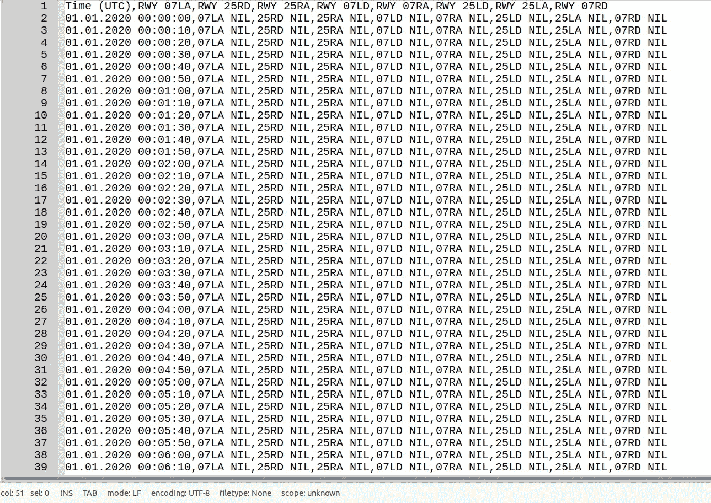

LLWAS warning data sample

这是 CSV 数据，其中包含一些

> 时间(UTC)，RWY 07LA，RWY 25RD，RWY 25RA，RWY 07LD，RWY 07RA，RWY 25LD，RWY 25LA，RWY 07RD

所以有一个时间和任何其他标题是**跑道的状态** (RWY)。仅供参考，跑道命名基于**罗盘方位，跑道延伸至**。

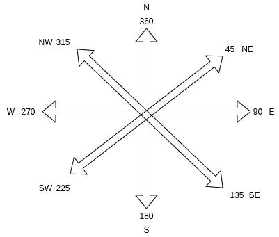

跑道命名由 01 到 36 组成，其中 01 表示 10 度，36 表示 360 度或 0 度。

你可能认为像下面这样的跑道的安德一侧会被这样命名

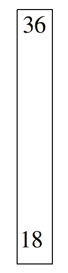

但是不，这是错误的

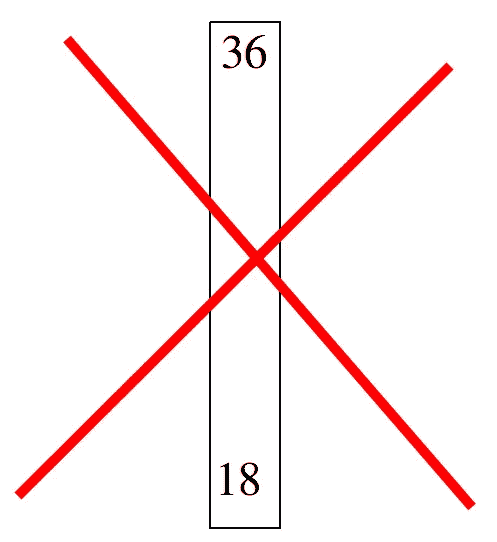

正确答案是

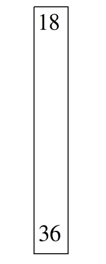

呃，什么？这是反直觉的(至少对我来说)。命名系统是基于**当使用跑道**时，当飞机想要起飞或降落时，它将朝向哪个方向。

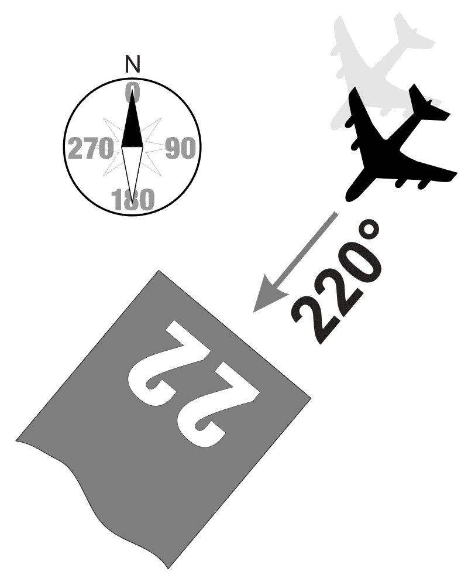

source: [https://en.wikipedia.org/wiki/Runway](https://en.wikipedia.org/wiki/Runway)

在这里 LLWAS 的警告数据中，头的 1 是`RWY 07LA`。我们知道 RWY 是“Runway”的缩写，07 是跑道的名字，但是什么是`LA`？所以 **A 是到达(着陆)的反义词 D 是出发(起飞)**。剩下的就是`L`！在此之前，我得告诉你**我们这里观察的机场有 2 条跑道**，所以 **L 和 R(L 的反义词)是左和右**的缩写。等等，左右是看视角不同的。我们在这里使用了谁的视角？**飞机的视角！**所以这里的 **LLWAS 数据是有 2 条跑道的机场**的数据。这种约定与命名系统是一致的。如果从飞机的角度来看，飞机使用跑道，那么命名是基于飞机将朝向的方向。

为什么在 LLWAS 的信息中有 A(到达)和 D(离开)？因为飞机在着陆和起飞时最关心跑道的哪一部分是不同的。我将在这篇文章的后面详细阐述这个问题。关键是，来自 LLWAS 的警告信息旨在帮助飞机上的飞行员。

在这里，我给我们的跑道一个简单的说明。

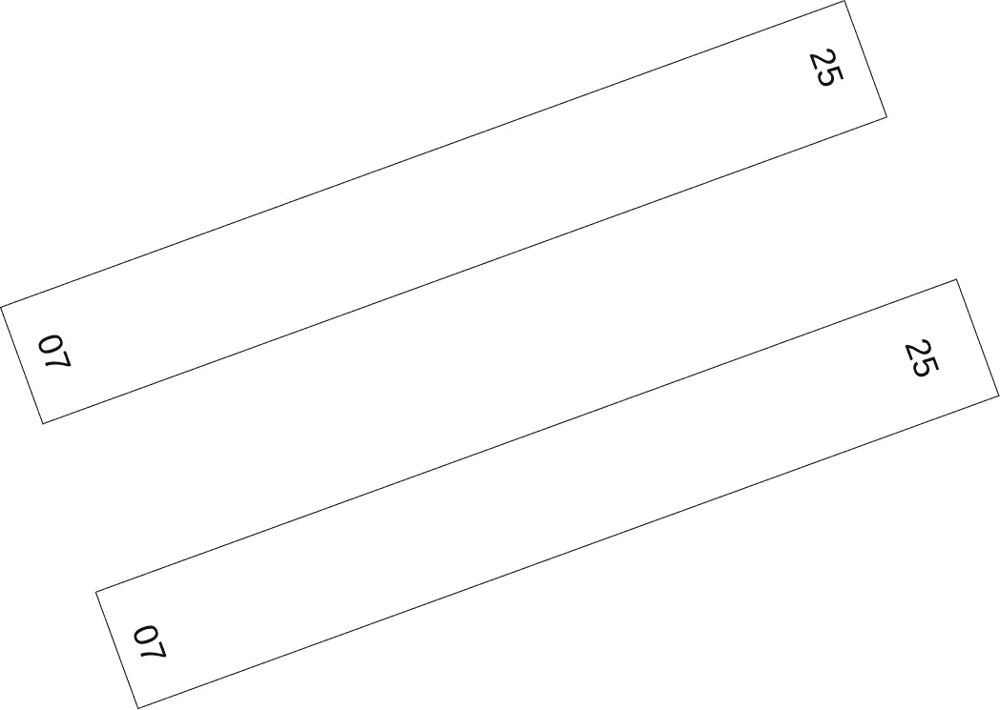

LLWAS 将覆盖的区域分为 4 个象限，即 **07L、07R、25L 和 25R** 。但是如果没有固定的飞机视角，我们就无法选择谁在哪里。为了这个例子，我们假设飞机来自 07 号跑道，如下图所示，这样我们可以划分象限区域。

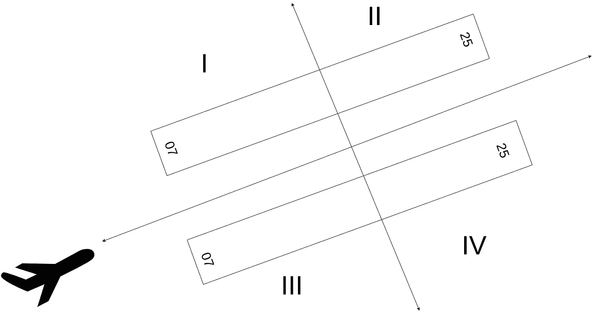

在之前的 LLWAS 警告数据图中，我们可以看到`NIL`的值后面跟着跑道的名称。`NIL`表示此时没有 LLWS 发生，所以我会给你新的样本数据。例如，现在世界协调时 15-02-2020 07:39:50 有一个 LLWS 警告。

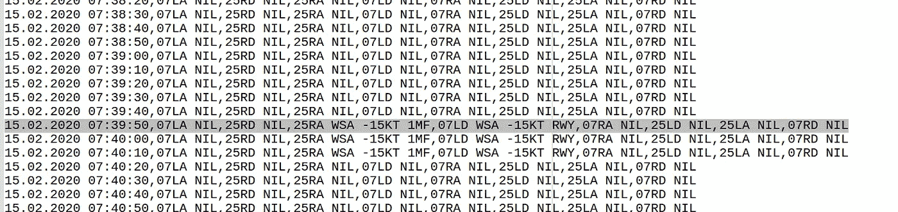

首先，让我们评估 LLWS (WSA)发生在哪个象限。这一行除了`NIL`以外的值是`25RA WSA -15KT 1MF`和`07LD WSA -15KT RWY`。这发生在象限二。

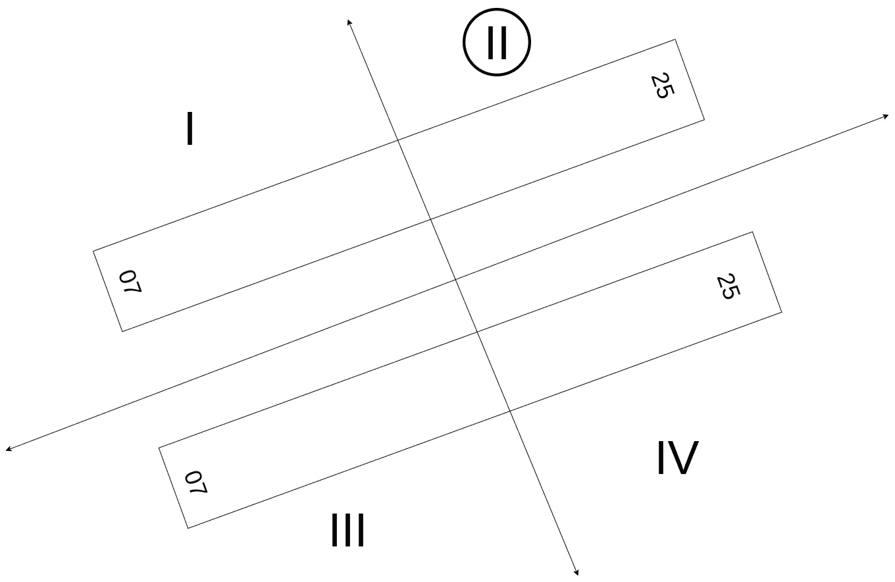

是的，它说的是`25RA`，但为什么不是象限 I，因为它也提到了`07LD`？因为当你着陆(到达)和起飞(离开)时，你最关心的跑道的哪个**部分是不同的**。着陆时，你关心的是飞机最先着地的**跑道的前半段**。

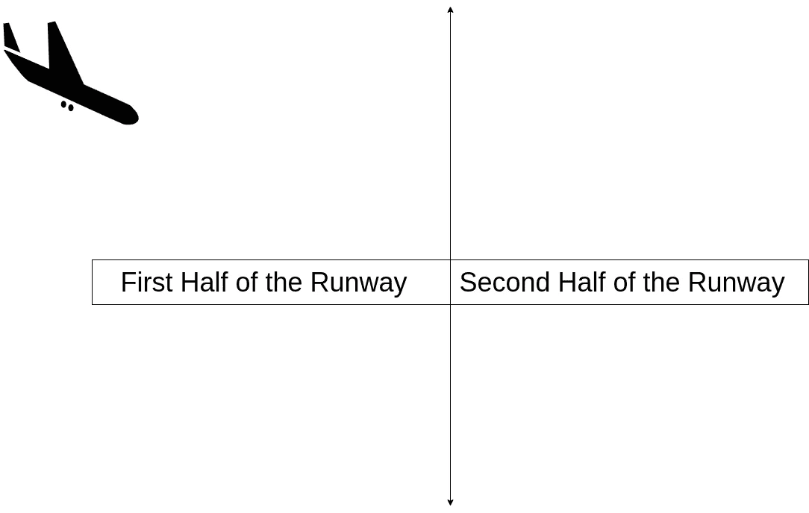

另一方面对于起飞来说，飞机最关心的是**跑道的后半段**，飞机将在那里升上天空。

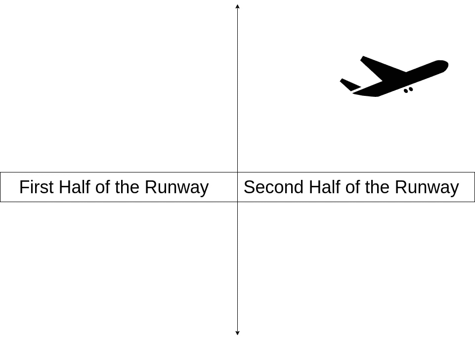

现在`1MF`和`RWY`指的是 LLWS 发生的确切地点。1MF 表示它发生在距离跑道起点 0 到 1 海里的范围内，RWY 表示 LLWS 发生在跑道上。现在数据显示是 RWY，为什么我确定它发生在象限 II，而 07 跑道也覆盖了象限 I？因为在`RWY 25RD`和`RWY 07LA`一栏中是`NIL`。与`MF`相反的是`MD`，这意味着它发生在跑道的尽头。`1MD`表示发生在距离跑道末端 0-1 海里的地方。

现在我们将试着破译 LLWS 的强度？上面写着`WSA -15KT`，这是什么意思？`WSA` **表示风切变预警**。这就是现象。LLWAS 可以探测到的另一个现象是`MBA`，这意味着微下击暴流警报。`-15KT`表示飞机有 15 节的逆风损失。这意味着顺风。逆风是来自飞机前方的风，顺风是来自飞机后方的风。

那是暂时的。如果你发现我的解释有什么错误或令人困惑的地方，请随时告诉我。

## 参考

https://en.wikipedia.org/wiki/Runway 于 2021 年 4 月 19 日进入

Microstep 的 LLWAS 手册