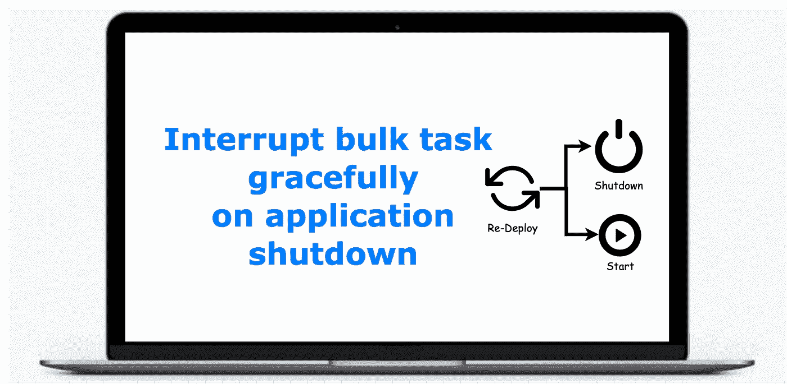

# 当应用程序关闭时，如何优雅地中断异步(或批量)任务

> 原文：<https://medium.com/geekculture/how-to-interrupt-an-async-or-bulk-task-gracefully-when-an-application-shutdown-c6f69fbefaee?source=collection_archive---------22----------------------->

在我们的应用程序中，可能会有一些需要我们进行耗时操作的特性。对于这些请求，我们不想让我们的用户等到它们完成。我们如何满足这些要求？我们以异步方式接收这些请求，并告诉我们的用户 ***您的请求已被成功接收，一旦请求完成，您将会收到通知。请按照请求跟踪器检查您的请求*** 的实时状态。这意味着我们将请求及其状态存储在某个地方，以便向用户提供更新。



# 当应用程序关闭时，正在运行的请求会发生什么情况？

如果我们不明确处理关闭场景 ，运行中的请求将永远处于 ***运行状态，因为所有运行中的请求都将在应用程序关闭期间被终止，应用程序的新实例将不会知道旧的运行中的请求。这将是糟糕的用户体验，因为用户永远不会知道他的请求被中断。***

# 我们如何解决这个问题？如何向我们的用户提供正确的请求状态？

有几种方法可以实现这一点。我们将在下面看到它们:

1.  **添加关机挂钩。**当应用程序被触发关闭时，它将调用这个关闭钩子来执行添加的方法。***JVM 只在正常终止的情况下运行关闭挂钩*。**所以，当外力突然杀死 JVM 进程时，JVM 就没有机会执行关机钩子了。

```
Thread updateRequests = new Thread(() -> updateRequestsInDB()); Runtime.getRuntime().addShutdownHook(updateRequests);
```

2.**添加@PreDestroy 方法**:这和关机挂钩的工作原理一样。我们可以定义在应用程序上触发关闭时要触发的步骤。它也适用于正常端接的情况。

```
@PreDestroy
public void updateRequests() {
   System.*out*.println("Updating requests in DB");
   // write logic to update requests in DB
}
```

3. **Add @PostConstruct 方法**:这个方法在应用程序启动时被调用。我们可以在这个方法中放入相同的`updateRequests()`逻辑。

```
@PostConstruct
public void updateRequests() {
   System.*out*.println("Updating requests in DB");
   // write logic to update requests in DB
   methodToUpdateRequest();    
}//methodToUpdateRequest() will be async method as it blocks the application start up until it completes its execution.
@Async
methodToUpdateRequest() {
    //to write logic
}
```

# 应用程序何时关闭？

应用程序关闭有两种情况。

1.  由于应用程序中的一些内存或线程问题，应用程序自行停止。在这种情况下，上述所有方法都可以很好地解决这个问题。
2.  一些外力通过运行`kill command or (CTRL + C)`杀死应用程序，当我们试图停止应用程序或用新的变化重新部署应用程序时，就会发生这种情况。 ***95%的时候，我们会遇到第二种情景。*** 有两种常用的方法可以杀死应用程序。

```
//force kill, it does not respect any shutdownhooks and preDestroy()
kill **-9** <pid>//it kills the application gracefully, respects all shutdownhooks and preDestroy methods
kill <pid>
```

因为我们理解`kill -9 <pid>`不尊重任何`shutdownhooks` 和`preDestroy()`方法。**为什么不能用** `**kill <pid>**` **杀死应用？如果我们这样做，我们将失去对何时启动新应用程序的控制，因为我们不确定旧应用程序是否已经停止。它执行应用程序关闭前需要执行的所有语句。**

现在，我们只剩下唯一的`kill -9 <pid>`命令来重新部署应用程序。这里`@PostContruct method`是唯一可以用来更新运行请求状态的方法。

我试图分享我的方法，为我们的用户提供正确的请求状态。如果你在申请中也遇到了同样的问题，并且有更好的方法，请在评论区分享。

感谢阅读！