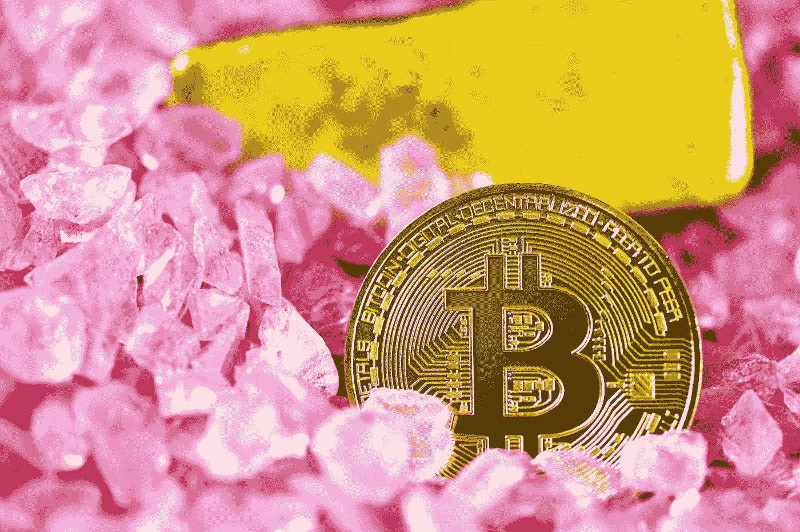

# 第 3 部分:共识机制

> 原文：<https://medium.com/geekculture/how-to-invest-in-cryptocurrencies-and-decentralized-finance-defi-consensus-mechanisms-e261c5fb1200?source=collection_archive---------30----------------------->

## [如何投资加密货币和分散金融(DeFi)](https://medium.datadriveninvestor.com/how-to-invest-in-cryptocurrencies-and-decentralized-finance-defi-crypto-and-defi-for-dummies-b63609ce2c3a)

什么是比特币挖矿，它与赌注加密有何不同

Photo by [Executium](https://unsplash.com/@executium?utm_source=medium&utm_medium=referral) on [Unsplash](https://unsplash.com?utm_source=medium&utm_medium=referral)

这是关于投资加密货币和 DeFi 的介绍性系列的第 3 部分。要返回目录，请点击此处的。