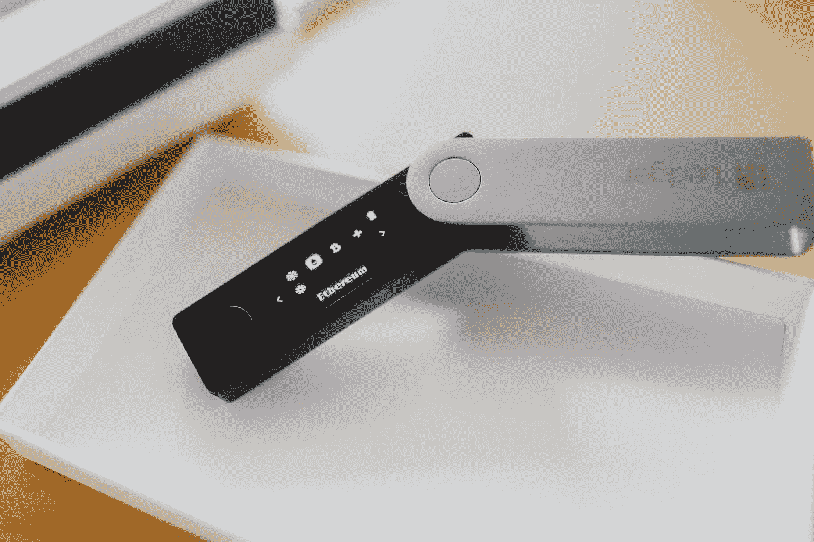

# 第 4 部分:加密钱包和私钥

> 原文：<https://medium.com/geekculture/how-to-invest-in-cryptocurrencies-and-decentralized-finance-defi-crypto-wallet-private-keys-e5494fbe722c?source=collection_archive---------14----------------------->

## [如何投资加密货币和分散金融(DeFi)](https://medium.datadriveninvestor.com/how-to-invest-in-cryptocurrencies-and-decentralized-finance-defi-crypto-and-defi-for-dummies-b63609ce2c3a)

什么是加密钱包，什么是私钥，比特币钱包和以太坊钱包有什么不同？

Photo by [Max Saeling](https://unsplash.com/@maxsaeling?utm_source=medium&utm_medium=referral) on [Unsplash](https://unsplash.com?utm_source=medium&utm_medium=referral)

这是关于投资加密货币和 DeFi 的介绍性系列的第 4 部分。要返回目录，请点击此处的。