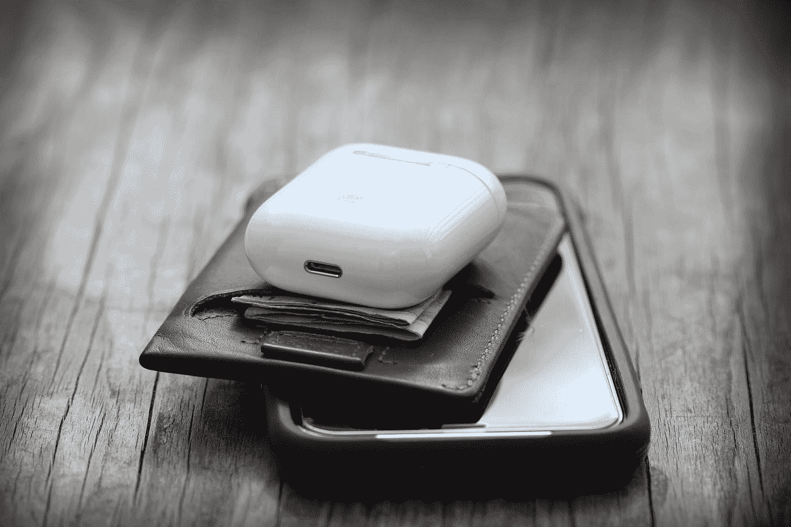

# 第 8 部分:钱包应用和硬件钱包

> 原文：<https://medium.com/geekculture/how-to-invest-in-cryptocurrencies-and-decentralized-finance-defi-wallet-apps-and-hardware-fa9f2b2892fe?source=collection_archive---------21----------------------->

## [如何投资加密货币和分散金融(DeFi)](https://medium.datadriveninvestor.com/how-to-invest-in-cryptocurrencies-and-decentralized-finance-defi-crypto-and-defi-for-dummies-b63609ce2c3a)

立即设置您的冷热加密钱包，了解如何投资比特币！

Photo by [Henry Boulind](https://unsplash.com/@hboulind?utm_source=medium&utm_medium=referral) on [Unsplash](https://unsplash.com?utm_source=medium&utm_medium=referral)

这是关于投资加密货币和 DeFi 的介绍性系列的第 8 部分。要返回目录，请点击此处的。