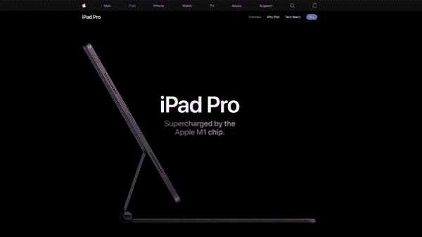

# 如何用 JavaScript 让你的网站变得像苹果一样有趣

> 原文：<https://medium.com/geekculture/how-to-jazz-up-your-website-like-apple-with-javascript-eed2bf227fec?source=collection_archive---------4----------------------->

## 揭秘让苹果产品页面上的动画成为可能的 JavaScript


不可否认，苹果公司的人知道如何制作一个有趣的产品页面。对于那些不熟悉的人，当你滚动时，下面是他们的 [iPad Pro 页面](https://www.apple.com/ipad-pro/)上发生的事情:



Elegant transitions take your attention from one thing to the next, crafting a narrative to sell the product.

作为一个视频，它已经非常令人印象深刻了，但他们把它变成了浏览器中的一个互动应用程序！如果浏览器中仅有的工具是 HTML、CSS 和 JavaScript，他们是如何做到的？

这篇文章有望揭开它背后的一些神秘面纱。

*快速提示，由于我不是业内人士，我不想解释苹果团队制作它的确切工作流程。(事实上，我相信他们使用了像 ScrollMagic 这样的库，正如其他人所提议的那样。)这篇文章旨在呈现一个详细的、低层次的观点，可以用最简单的基础知识来复制。*

# 定义行为

这是产品页面的行为方式:

1.  元素不会随着滚动条垂直移动，它们会停留在屏幕上的同一个位置。
2.  在某些时候，元素不再粘在屏幕上，用户可以滚动到下一部分。
3.  有些动画会随着滚动而出现，如果用户停止滚动就会暂停。
4.  当你向上滚动时，这些动画会反转。
5.  有些动画只要滚动位置达到某一点就会触发，如果用户停止滚动也不会暂停。

我今天介绍的方法让您可以用简单的 JavaScript 实现所有这些行为。

# 这是怎么做到的

我建议您继续探索我创建的站点，以说明我的意思。

[活生生的例子在这里](https://ww-apple.netlify.app/#/)。对于那些更好奇的人来说，[回购在这里](https://github.com/weimingw/weiming-demystify-apple)(用 React 编写，尽管概念仍然是普通的 JS)。

## 第 1 部分:HTML 结构

基本上是这样的:

`position: sticky;`允许滚动时每个部分的元素停留在屏幕内(要求 1)。它必须是`sticky`,因为我们希望元素在我们完成这个部分后不再停留在屏幕上(需求 2)。[在我的基本示例](https://ww-apple.netlify.app/#/basic)中，您可以看到当您在父容器内滚动并经过它时，粘性元素是什么样子。

我们在 id 为`container`的最外层元素上滚动，让 JavaScript 正确运行。

## 第 2 部分:JavaScript

单单一个 HTML 结构并不能解释需求 3 和需求 4 的完美过渡。这需要两个部分:

1.  元素上的多个滚动监听器，每个部分一个。这些滚动侦听器将滚动位置转换为一个数字—当视图显示一个部分的顶部时为 0，当视图显示一个部分的底部时为 1。([由于很难解释，我强烈推荐看看我的真实例子，当你滚动](https://ww-apple.netlify.app/#/basic)时，数字会明显更新。)
2.  插值函数可以从第 1 部分中获取一个数字，并将其转换为 HTML 的 CSS 样式。这些函数倾向于以渐进的比例进行插值，就像这个函数，当用户滚动一个部分直到底部达到最大不透明度时，它会增加不透明度:

最终的结果是，随着用户滚动，样式发生变化，并给出一个渐变的样式，导致一个类似于旧学校翻页书的动画的错觉！[在实践中，参见我的完整示例的第一部分](https://ww-apple.netlify.app/#/full)。

## 第 3 部分:CSS(和更多的 JS)

最后，对于需求 5，我们有这样一行简单的 CSS:

```
transition: 0.5s all;
```

然后，我们将它与一个非渐进的插值函数配对:

然后，这种组合允许动画通过滚动位置触发，但通过 CSS 动画！[在我的完整示例中，第二部分的文本表现如下](https://ww-apple.netlify.app/#/full)。

# TLDR 版本

综上所述，它的工作机制其实很简单:

1.  滚动容器
2.  `position: sticky;`元素
3.  将滚动容器的滚动位置转换为粘性元素样式的 JavaScript
4.  (有时)CSS `transition`属性

这四个简单的步骤是你和美丽的用户体验之间的所有障碍。试试看！它能带来巨大的不同！