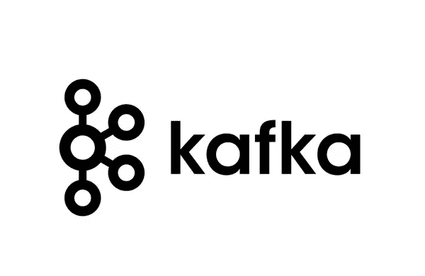
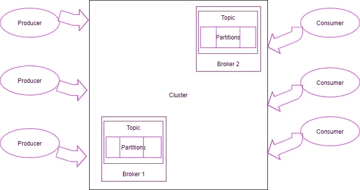
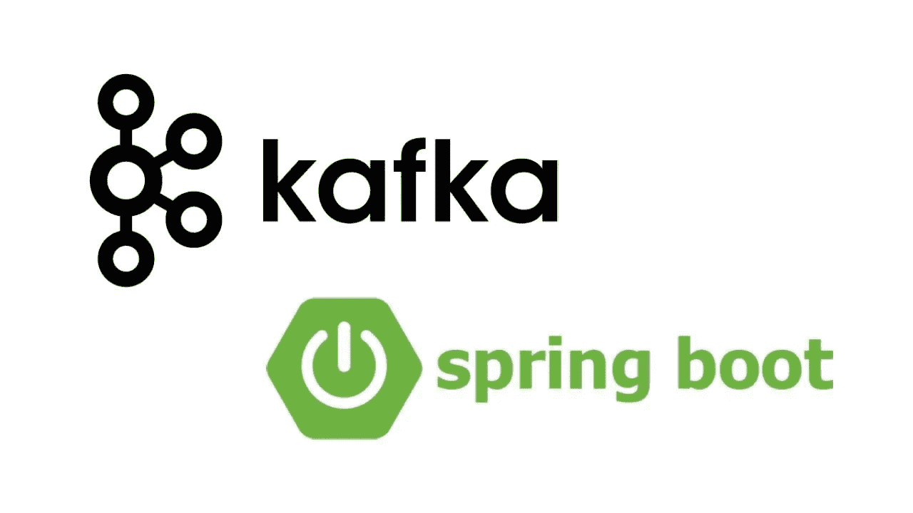
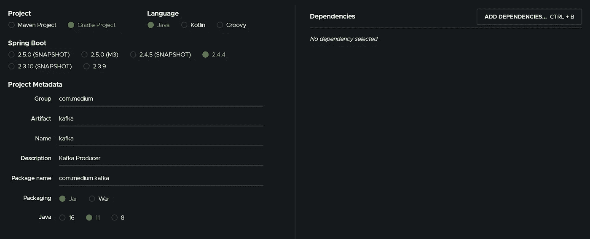
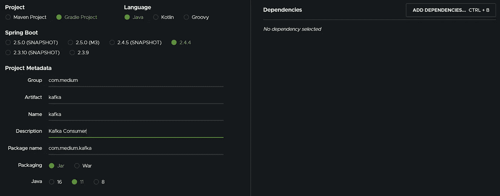
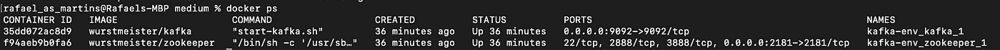
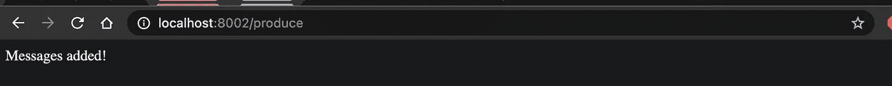
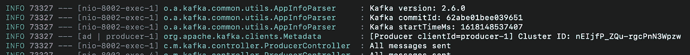
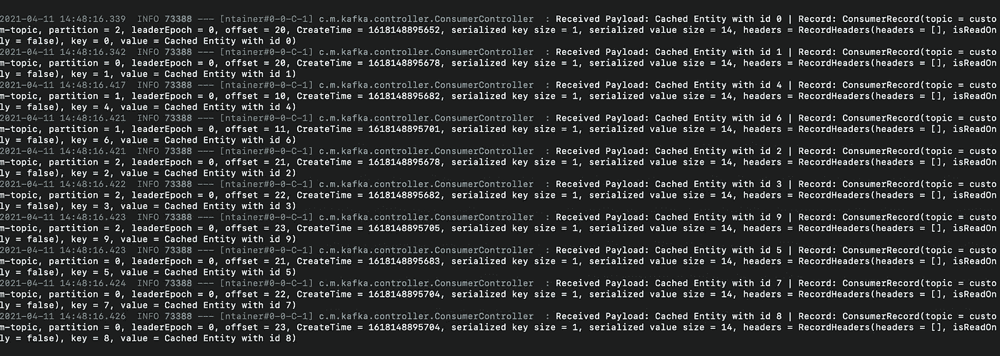

# 如何 Kafka 你的微服务

> 原文：<https://medium.com/geekculture/how-to-kafka-your-microservices-9ef45a9e882a?source=collection_archive---------1----------------------->

Photo by [Mathyas Kurmann](https://unsplash.com/@mathyaskurmann?utm_source=medium&utm_medium=referral) on [Unsplash](https://unsplash.com?utm_source=medium&utm_medium=referral)

应用程序工作流最吸引人和最具挑战性的话题之一是*消息/事件驱动的设计*。从长远来看，这甚至可能是成败的关键。

所有提交的代码都可以在 *Github 上获得。Y* 你可以通过文末的“**有用资源”**一节轻松获取。

# #索引

1.  建筑说明
2.  卡夫卡是什么？
3.  实际例子
4.  结论
5.  有用的资源

# #架构解释

Photo by [Anders Jildén](https://unsplash.com/@andersjilden?utm_source=medium&utm_medium=referral) on [Unsplash](https://unsplash.com?utm_source=medium&utm_medium=referral)

您可能已经知道，服务耦合是我们应该始终避免的。否则，应用的任何更改都会对其他服务产生重大影响。

为了解决紧密架构的问题，我们倾向于依赖两种不同的架构:

*   事件驱动架构(EDA)
*   消息驱动架构(MDA)

这些模式有什么新的地方？使用消息传递表示状态变化的事件的概念。

要快速向应用程序添加新功能，您的服务只需开始监听另一个服务发出的事件/消息流。

我经常想到的最好的例子是内存缓存更新。

假设您创建了 ***客户端*** 和 ***地址*** *服务*。每当有人请求客户端时，您将需要从**地址**服务中获取剩余的数据。不幸的是，这个服务需要花费大量的时间来获取这样的数据，而且数据只是偶尔更新一次，所以您还是决定缓存它。

使用耦合架构，每次地址更新时，都必须撤销缓存的数据。所以在每次更新时， ***地址*** 服务必须联系 ***客户端*** 服务进行缓存撤销。不仅需要更新新服务，还需要更新 ***地址*** 服务本身 ***。***

有了 **EDA/MDA** 架构，你只需要 ***地址*** 服务来传达已经发生了变化。所有相关方都会收到消息并撤销缓存的数据。

重要概念:

*   ***主题*** —服务可以放置或读取消息的一个**消息桶**。
*   ***消费者*** —正在收听特定**话题**的服务。每当有新消息到达时，它将从**桶**中移除并处理它。
*   ***制作者*** —向**主题**添加消息，以便相关方可以据此行事。

优势:

*   ***松耦合*** —两个服务都不知道对方的数据更新事宜。
*   ***持久性*** —保证即使消费者服务关闭，消息也将被传递。每当消费者再次起身时，所有消息都将出现在那里。
*   ***可伸缩性*** —因为消息存储在桶中，所以不需要等待响应。我们在所有服务之间创建异步通信。
*   ***灵活性***——消息的发送者不知道谁会消费它。这意味着您可以用更少的工作轻松地添加新消费者(新功能)。

缺点:

*   ***语义—*** 开发者需要对消息流有深刻的理解作为其严格要求。可能会出现复杂的回退方法。
*   ***消息可见性—*** 您必须跟踪所有这些消息，以便在出现问题时进行调试。相关 id 可能是一个选项。

> 信息传递可能很复杂，但同时也很强大。

# #卡夫卡是什么？

What’s kafka

Kafka 是一个开源的发布/订阅系统，最初由 LinkedIn 开发，于 2011 年开源。也称为分布式事件系统。

信息会在磁盘上保留一段时间，这段时间由[保留策略](https://www.cloudkarafka.com/blog/what-is-kafka-retention-period.html#:~:text=A%20message%20sent%20to%20a,of%20one%20of%20the%20logs.&text=The%20message%20stays%20in%20the,days%20after%20it%20is%20published.)确定。

Kafka 的主要目标是为处理实时数据流和构建数据管道提供一个可靠的高吞吐量平台。它允许创建现代化的可扩展系统，例如:

*   **ETL** (提取、转换、加载)
*   **CDC** (变更数据捕获)
*   **BDI** (大数据摄取)

从体系结构的角度来看，我们有一个规模确定的组件，称为集群。在一个集群中，我们有几个服务器，也称为代理。我们通常至少有三个经纪人来提供足够的冗余。

每个代理负责接收来自生产者的消息，并将这些消息提交到磁盘。代理还负责回答消费者的获取请求并为他们提供服务。

在 Kafka 中，当一个消息被发送到一个代理时，它被发送到一个特定的主题。正如上一节提到的，主题允许我们对数据进行分类。数据最终会被分成几个分区。

通过将主题分成多个分区，我们提高了可伸缩性，因为每个分区都可以由单独的消费者读取。

卡夫卡是一个系统中所有事件的中枢。

# #实际例子

Spring boot with kafka

对于这个实际的例子，在架构部分使用的内存缓存例子是被选中的。

我们将有两个服务，消费者和生产者。

生产者将负责接收 HTTP 请求。在每个请求中，我们将生成几个数据更新。这些数据更新应该通过缓存这些数据的服务进行传播。通过消息系统，所有感兴趣的团体将通过主题消息得到通知。

消费者将会听到这个话题，每当它收到一条新消息时，就会相应地撤销数据。

要求:

*   ***弹簧启动*** →这样我们就可以很容易地有一个工作的、可配置的例子。
*   ***Docker*** →所以你可以在任何环境下运行任何东西。
*   ***Apache Kafka →*** 基于消息的服务器。

1.  使用以下[连杆](https://docs.docker.com/compose/install/)安装 docker-compose。

2.进入[***Spring Initializer***](https://start.spring.io/)*，用以下属性创建 Spring 项目，然后点击 **' *生成'。****

**

*Producer project initializer*

*3.重复步骤 1，但针对消费者。*

**

*Consumer project initializer*

*4.创建一个文件夹，提取两个下载的压缩文件。*

*5.创建一个名为***docker-compose . yml***的文件，添加下面的内容。通过这样做，我们定义了将连接到我们的应用程序的 Kafka 集群*

*   ****版本→*** Docker 版本。*
*   ****服务→*** 同一个 docker-compose 内的所有服务都可以互相看到。出于通信目的，您可以使用服务名，因为 docker 将解析相应的位置。*

****注:*** 通过禁用自动创建主题，我们指定我们将创建自己的主题。*

*6.要启动这两个服务，只需运行下面的 docker 命令。*

*以下容器应该可用:*

**

*Command: docker ps*

*7.是时候编写我们的业务逻辑了。对于每个微服务，我们将有一个“两个包”结构。*

*   *配置→生产者/消费者配置。*
*   *控制器→ REST 或消息控制器。*

*8.从配置我们的生产者开始。在其依赖项文件中，插入下面的配置。*

****注意:*** Lombok 是一个依赖项，它允许我们删除一些由构造函数、设置函数和获取函数创建的样板文件。*

*9.在应用程序配置文件中，让我们添加下面的属性。*

*10.我们离完成生产者配置又近了两步。创建属性读取器类。*

****注:*** 龙目 ***@Data*** 注释会生成，在构建时，对应的构造函数、getters 和 setters。*

*11.最后但同样重要的是，介绍我们的生产者配置组件。*

*   *我们首先通过映射注入我们的生产者配置。在本例中，我们添加了默认的。对于键，我们将使用 Kafka 的字符串序列化程序，而对于值，我们将使用 JSON。*
*   *定义生产者工厂。主要是因为我们正在定制我们的生产者配置。*
*   *我们将使用 Kafka 模板向 Kafka 服务器发送消息。我们有一个对象值，因为我们希望最终支持多种类型的对象。*
*   *通过注入新的主题，我们告诉卡夫卡去创造它。*

*12.有了我们的配置集，我们只需要定义将通过消息和相应控制器的对象。*

*每次调用 HTTP *produce* 端点时， *x* 消息将被创建并发送到 Kafka 服务器，其中包含我们想要从缓存中删除的实体。*

*每当您调用[http://localhost:8002/produce 时，您应该能够看到下面的结果。](http://localhost:8002/produce.)*

**

*Web browser*

**

*Log information*

*13.定义了生产者之后，再定义消费者。步骤和上面的步骤类似。用下面的配置设置***application . yml***。*

****注:*** 各梯度依赖关系相同。*

*14.添加以下配置类:*

*   *与上面对新主题 Bean 的解释相同。*
*   *我们定义我们的消费者反序列化器。*
*   *我们设定工厂定义。*

*15.将相同的 PropertiesReader 和 CachedEntity 实体添加到您的基本代码中。*

*16.添加以下消息控制器。*

*   *我们定义一个用***KafkaListener***注释注释的消费者方法。这样做可以让你研究一个特定的主题。*

*目前，我们只是记录收到的有效载荷。*

*启动消费者应用程序后，您应该能够看到以下结果:*

**

*Consumer logging information*

*在所有这些步骤之后，我们将 MDA 嵌入到了微服务架构中。恭喜你。*

# *#结论*

*实践和时间是理解这种有影响力的架构的必要条件。继续努力，你会到达那里的。*

*有了这样一个实际的例子，我希望你离将这个架构扩展到你的项目更近了一步。*

*欢迎在评论中分享这篇文章对你的帮助！*

# *#有用的资源*

* [## 将您的 Spring Boot 与 Redis 缓存系统集成

### 你上一次需要从网站上提交或提取数据，并且花费了很长时间是什么时候？

medium.com](/swlh/integrate-your-spring-boot-with-a-redis-cache-system-ff707e61e75e)  [## 通过 Spring Cloud Gateway 和 Eureka 使用关联 id

### 在微服务架构中，有时我们希望确保所有服务的行为，例如:请求跟踪…

medium.com](/swlh/using-correlation-ids-with-spring-cloud-gateway-and-eureka-f00145c579ab)  [## 拉斐尔·马丁斯/中等

### 此分支是 1 提交在前，2 提交在主后。在这个分支机构，你将…

github.com](https://github.com/rafael-as-martins/medium/tree/kafka)*