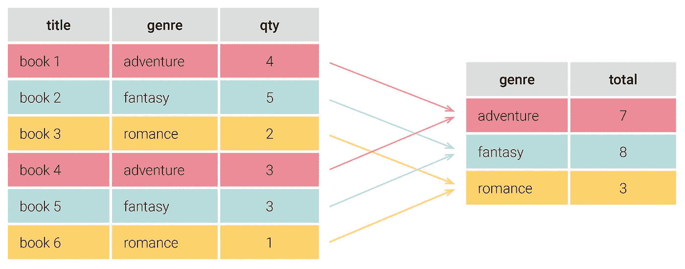
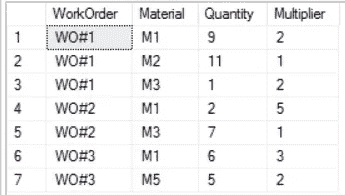
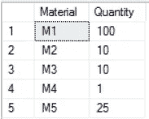

# 如何保存 SQL“GROUP BY”详细信息/信息以便跟踪

> 原文：<https://medium.com/geekculture/how-to-keep-sql-group-by-details-information-for-the-purpose-of-tracking-4a33fc443977?source=collection_archive---------11----------------------->

## 以 MSSQL 为例



Photo from: [https://learnsql.com/blog/group-by-in-sql-explained/](https://learnsql.com/blog/group-by-in-sql-explained/)

假设我们有表“ *ProductionWork* ”，它记录了生产过程的制造元数据。

```
DECLARE [@ProductionWork](http://twitter.com/ProductionWork) TABLE
(
   WorkOrder varchar(20), -- store work order number
   Material varchar(15),
   Quantity smallint,
   Multiplier smallint -- multiplier for the quantity
);-- create some sample data
INSERT INTO [@ProductionWork](http://twitter.com/ProductionWork) VALUES
('WO#1', 'M1', 9, 2),
('WO#1', 'M2', 11, 1),
('WO#1', 'M3', 1, 2),
('WO#2', 'M1', 2, 5),
('WO#2', 'M3', 7, 1),
('WO#3', 'M1', 6, 3),
('WO#3', 'M5', 5, 2);
```



> 根据上表，我们可能知道完成整个制造流程的 WO#1 应消耗的材料:M1: 18 (9 x 2)、M2: 11 (11 x 1)和 M3: 2 (1 x 2)。

然后我们有另外一个表“*materialsinventoryonhan”和*，保存每种材料的最新库存数量。

```
DECLARE [@MaterialInventoryOnH](http://twitter.com/MaterialInventoryOnH)and TABLE
(
   Material varchar(15),
   Quantity smallint  -- quantity on hand
);-- create some sample data on hand
INSERT INTO [@MaterialInventoryOnH](http://twitter.com/MaterialInventoryOnH)and VALUES
('M1', 100),
('M2', 10),
('M3', 10),
('M4', 1),
('M5', 25);
```



下一步，我们需要统计和计算目前的生产量，以决定我们是否能生产出没有任何问题的最终产品？以下脚本总结了制造数据的材料，但也通过动作记录了**组中的工单编号。**

```
;WITH Sum_Material_Qty_CTE AS
(
  SELECT
    Material,
    STUFF((
            SELECT ',' + WorkOrder
   FROM  [@ProductionWork](http://twitter.com/ProductionWork) AS S
   WHERE O.Material = S.Material  
            FOR XML PATH('') 
         ), 1, 1, '') AS WO_SEQ,
    SUM(O.ComsumeQty) as TotalConsumeQtyPerMaterial
   FROM
   (
       SELECT
         WorkOrder,
         Material,
         Quantity * Multiplier AS [ComsumeQty]
       FROM [@ProductionWork](http://twitter.com/ProductionWork)
   ) AS O
   GROUP BY Material
)SELECT
   S.Material,
   WO_SEQ,
   TotalConsumeQtyPerMaterial,
   H.Quantity AS OnInvHandQty
FROM Sum_Material_Qty_CTE AS S
-- join back with on hand qty
LEFT JOIN [@MaterialInventoryOnH](http://twitter.com/MaterialInventoryOnH)and AS H 
ON S.Material = H.Material
```

> 这里的关键点是 **STUFF** 函数与 **FOR XML PATH** 函数相匹配，这有助于我们在 GROUP BY 中跟踪每个 WO# merge。


Sum_Material_Qty_CTE

所以根据上面的结果。我们发现工单: ***WO#1*** 可能由于***【M2】***的现有库存不足而无法完成。

您也可以使用 WO#作为关键字，通过以下方式连接回表 Sum_Material_Qty_CTE:

```
-- caution for the performance for using full wildcard
✍️WO_SEQ LIKE '%,' + WorkOrder + ',%' ✍️WO_SEQ LIKE '%,' + WorkOrder✍️WO_SEQ LIKE WorkOrder + ',%'✍️WO_SEQ = WorkOrder
```

# 参考

*   [https://stack overflow . com/questions/47689303/how-can-I-sum-strings-in-one-column-into-one-row-in-Microsoft-SQL-group-by-does/47690995](https://stackoverflow.com/questions/47689303/how-can-i-sum-strings-in-one-column-into-one-row-in-microsoft-sql-group-by-does/47690995)
*   [https://docs . Microsoft . com/zh-tw/SQL/t-SQL/functions/stuff-transact-SQL？view=sql-server-ver15](https://docs.microsoft.com/zh-tw/sql/t-sql/functions/stuff-transact-sql?view=sql-server-ver15)