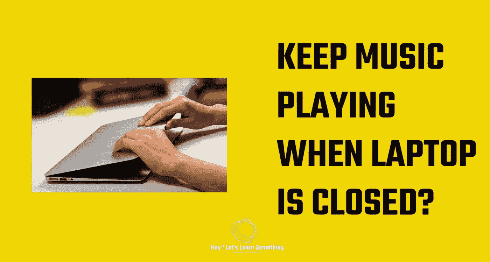

# 如何在合上笔记本电脑盖的情况下保持笔记本电脑开机或播放音乐？

> 原文：<https://medium.com/geekculture/how-to-keep-the-laptop-on-or-play-music-even-when-the-laptop-lid-is-closed-a2cdf1c31b56?source=collection_archive---------0----------------------->

这实际上是非常基本的，但合上笔记本电脑的盖子却能让电脑正常工作是非常有用的。有时候，我们只想躺在床上听一些好听的音乐或冥想的声音，放松一下。当然，没有必要打开笔记本电脑的盖子。因此，本文分享了如何在合上笔记本电脑盖子的情况下打开笔记本电脑——不…