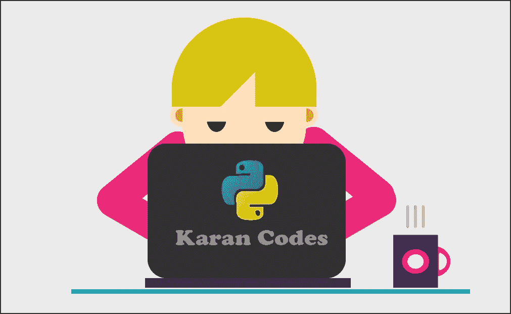

# 如何在不到 20 行代码中使用 Slack 和 Python 跟踪您正在运行的代码

> 原文：<https://medium.com/geekculture/how-to-keep-track-of-your-running-code-using-slack-and-python-in-less-than-20-lines-of-code-cac531799a08?source=collection_archive---------18----------------------->

## 创建 Slack Bot 的最简单和最容易的方法

Slack 是一个基于渠道的消息传递平台，允许团队以一种新的更好的方式相互交流。大多数组织已经采用该工具来连接跨混合团队以完成项目。一些…