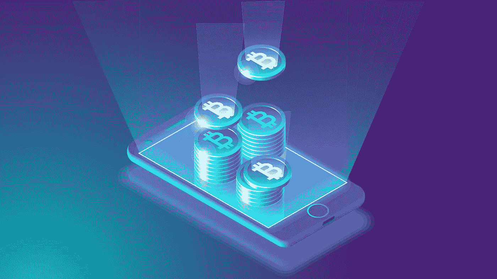

# 如何保证加密货币的安全

> 原文：<https://medium.com/geekculture/how-to-keep-your-cryptocurrencies-safe-55915a26f5b7?source=collection_archive---------15----------------------->

## 加密货币钱包和安全最佳实践的实用介绍

Source: Bitcoinist

在过去的几十年里，我们用来进行交易的货币，也就是法定货币，已经大部分被非物质化了。纸币已经逐渐过时，而我们的大部分现金资产已经转移到通常由银行服务器托管的**数字账户**上。在这种集中系统下，银行完全控制你的数据和资金，并负责确保你账户的安全。

直到 2009 年，对于那些不想把钱交给别人的人来说，唯一的选择是坚持纸币——这仍然是高风险的，也不是很方便。然后，中本聪创造了比特币，加密货币的时代开始了……

使用加密货币，货币仍然是非物质化的。然而，**数字账户数据不再存储在一个中央实体拥有的服务器上，而是分布在多个机器上，**由独立的参与者(网络节点)操作。这个分散的网络形成了一个区块链。在该系统中，安全性由用户与之交互的区块链设计结构和算法来管理。

作为加密货币用户，我认为重要的是:

1.  了解如何使用**加密货币钱包正确地与区块链互动。**
2.  熟悉**安全最佳实践**以避免最常见的与区块链相关的黑客和诈骗**。**

对于那些对加密货币投资感兴趣的人，我也写了一篇[补充文章](/geekculture/tips-tools-for-cryptocurrency-investors-5ff20685d9f8)，讲述我的个人建议和工具，以最佳利率购买，赚取被动收入，最小化风险，…

# 什么是加密货币钱包？💼

区块链帐户与两个要素相关联:

*   一个**私钥**——一个长的十六进制数字，它能够证明你是账户的所有者，并防止其他人冒充你。这是一种密码，可以进入你的个人资金，并允许你确认交易。
*   一个**公钥**——另一个长的十六进制数字，通过特定算法从您的私钥生成。它是您用来接收/存入资金的帐户地址——在传统的银行系统中，它是您的 IBAN。

**公钥/私钥对代表一个加密货币钱包**，它允许你与你的区块链账户互动。顾名思义，公钥可以和任何人共享(那个人只能给你汇款)，而私钥应该保密(那是进入你的账户和确认交易的密码)。显然，不可能从相关的公钥中检索私钥。

现在，市场上存在各种各样的加密货币钱包……问题是**如何区分它们，并最终选择最适合我们需求的(取决于我们的投资者档案)？**

首先，让我们看看加密货币钱包的两个主要特征:**私钥所有权**和**互联网连接**。

# *加密货币钱包的两大特点*🔍

> ***1。监禁与非监禁***

第一个也是最重要的特性是**私有密钥所有权**。让我们记住，任何知道你的私钥的人都可以完全控制你的资金。

因此，当你选择钱包时，知道谁持有你的私人钥匙是很重要的。基本上，那个人可以是*你*(非保管或分散钱包)或*钱包提供者*(保管或集中钱包)。

保管解决方案在某种意义上接近于今天的银行系统，钱包提供商完全控制你的资金，并在你进行交易时充当中介代理。当使用这种解决方案时，这意味着你必须信任第三方。

另一方面，非托管解决方案由智能合同构建和操作，支持点对点交易，无需任何中介代理。这意味着你完全控制和负责你的资金:你是你自己的银行。

欲了解更多信息，请参考[保管型与非保管型钱包](https://freewallet.org/blog/custodial-vs-non-custodial-wallet)。

> **2*2。热 VS .冷***

持续连接到互联网的钱包(如网络平台、移动应用)被称为*热钱包*。相比之下，*冷钱包*(例如硬件设备)大部分时间都与互联网断开连接。

热门钱包通常提供更高质量的服务(更好的用户体验、简单快捷的交易、被动的收益选择等等)，但更容易受到网络攻击。在这方面，冷钱包被认为是安全得多。

更多信息，请参考[加密钱包类型解释](https://academy.binance.com/en/articles/crypto-wallet-types-explained)。

# ***如何明智地选择钱包？*** ⭐

选择钱包时，您基本上可以从以下三种类型中进行选择:

*   **托管和热门** —最灵活和最有利的选择(有竞争力的被动收益率、衍生产品、加密卡等)。大玩家有[Crypto.com](http://Crypto.com)，[币安](https://accounts.binance.com/en/register?ref=WPBYWVU3)，[瑞士堡](https://join.swissborg.com/r/yannIQ4K)，[比特币基地](https://www.coinbase.com/join/delclo_8)，…
*   **非托管和热门** —中介选择，相当安全，同时提供灵活性和有利的选择(如赌注、被动收益)。这些多为*桌面或手机 app*，如[元蒙版](https://metamask.io/)、[信任钱包](https://share.trustwallet.com/Rg3AXdC)、[银色](https://www.argent.xyz/)、…
*   **非托管冷** —最安全的选择(高安全性标准)但不灵活(不适合高频交易)。这些大多是*硬件钱包*如[总账](https://shop.ledger.com/?r=795240e8c7c7)或 [Trezor](https://trezor.io/) 。

现在，从安全的角度来看，使用一个钱包是有风险的:即使钱包本身是高度安全的，也总有可能出问题(私钥丢失、黑客攻击、网络攻击等等)。考虑到这一点，明智的做法是将你的资金分成多个钱包，尤其是当你已经进行了重大投资的时候。

我个人所做的是使用一个**硬件钱包进行长期投资** ( [账本](https://shop.ledger.com/?r=795240e8c7c7))和一个**组合的热门钱包，以受益于它们的高质量服务** ( [信任钱包](https://share.trustwallet.com/Rg3AXdC)、[Crypto.com](http://Crypto.com)和[币安](https://accounts.binance.com/en/register?ref=WPBYWVU3))。

*我希望你喜欢这篇文章！*

*如果是这样，请不要犹豫，分享您的反馈*👏

*联系人:*[*LinkedIn*](https://www.linkedin.com/in/yann-delclos/)*或* [*脸书*](https://www.facebook.com/yann.delclos.9/) *。*

***免责声明*** *:本文内容基于个人观点，不建立任何理财推荐。你只对你过去和未来的投资负责。*