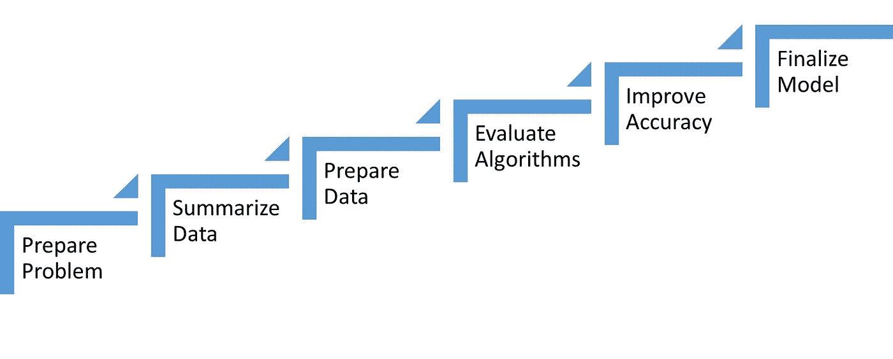
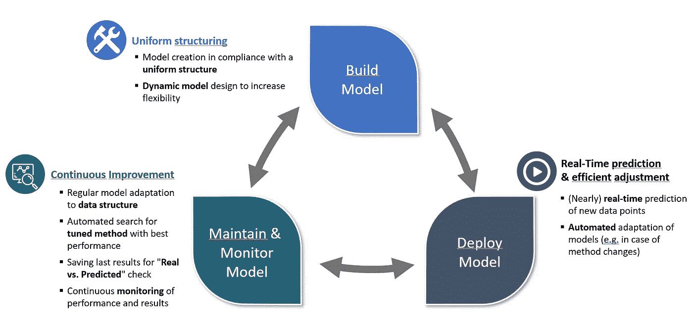

# 如何在您的公司启动机器学习项目——轻量级方法

> 原文：<https://medium.com/geekculture/how-to-kickoff-a-machine-learning-project-in-your-company-a-lightweight-approach-6f094c6fd14a?source=collection_archive---------24----------------------->

今天，机器学习对于所有公司都是可能的，无论是什么规模和行业。得益于易于获取的技术和大量不断增长的数据。但是成功的机器学习项目的关键是从一开始就采取一种明智的——因此也是轻量级的方法。以**业务为中心的**而不是以技术为中心的方法允许您适当地识别和调整正确的元素(人才、数据和执行)。这篇文章将使我们更接近如何开始一个 ML 项目。

在我们上一个机器学习项目中，我们提出了以下成功整合机器学习项目的步骤模型:

Stages for a successful Machine Learning Project

1.  **准备问题，确定你的业务用例以及业务需求。**

与其在最终不符合您需求的基础设施和昂贵资源上大量投资，不如采用自上而下的方法，从您想要解决的一个特定业务挑战开始。使用您的业务路线图作为指南。以您的业务需求为导向，而不是技术需求。在这一步骤中，从对技术和机器学习机会有良好感觉的顶级业务利益相关者那里获得认同是非常有意义的。

**2。汇总数据并确定您需要的数据集**

扪心自问:解决这个问题需要哪些数据？我们有可以回答你的问题的数据源和属性吗？如果不是:从长远来看，我们如何获取这些信息，我们如何从所需信息的子集开始？

**3。准备数据并关注数据质量**

数据清理是每个数据科学项目最重要的部分之一，通常占工作的 80%以上。在这一步中，删除异常值，插入缺失值，确定格式，并寻找合规性和隐私性，例如，数据集的一部分是否应该匿名？

**4。评估算法并创建模型**

在您的机器学习模型中，可以使用许多算法来解决一个特定的业务案例，其准确度水平差异很大。简单的模型通常更容易实现、扩展和维护。不要试图从一开始就过度设计你的模型。如果您可以在精确度非常高的非常奇特的模型和更简单(精确度更低)的模型之间进行选择，如果后者能够更有效地满足您的业务需求，您应该选择后者。

**5。提高精确度并测试您的模型**

这是项目中最激动人心的阶段。在挑选了正确的数据并实现了算法之后，是时候测试模型了。在这个阶段，我很好地体验了一个相当经典的流程模型:
**构建，维护&监控，部署**，相辅相成。通过智能地衔接这三个组件，您可以实现不断改进的统一结构，并实现实时预测。例如，基于输入数据的模型生成受制于统一的结构和通过动态选项的灵活性。系统进行自我调节，并在此基础上定期对数据结构进行模型适配。

Life Cycle of models

**6。最终确定模型并推出**

当然，机器学习模型永远不会真正完成。然而，为了显示结果，模型应该在一个版本中被最终确定，并被引入到生产操作中。在这里，最好不要等太久，因为否则，你将错过从专家那里获得直接反馈的重要时间，这些专家稍后将定期处理模型的结果。

## 摘要

在本文中，我们了解了如何在您的公司中启动一个新的机器学习项目。我们研究了最有希望的不同步骤，尤其是对于新项目。我们还研究了具体的机器学习模型应该如何构建。然而，在技术上成功实现之后，必须使模型和从中获得的知识对最终用户也是有形的。这需要与各个部门不断交流。这将帮助你从机器学习投资中获得最大收益，并增加实现目标的机会。