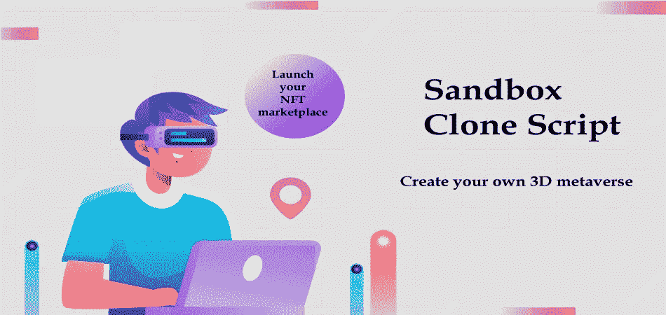
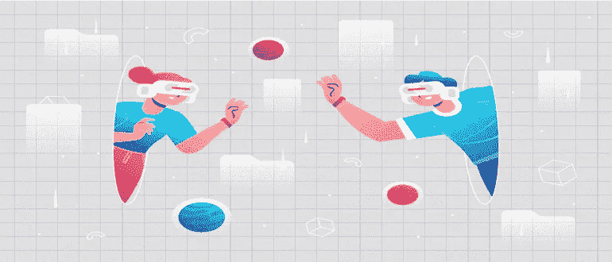
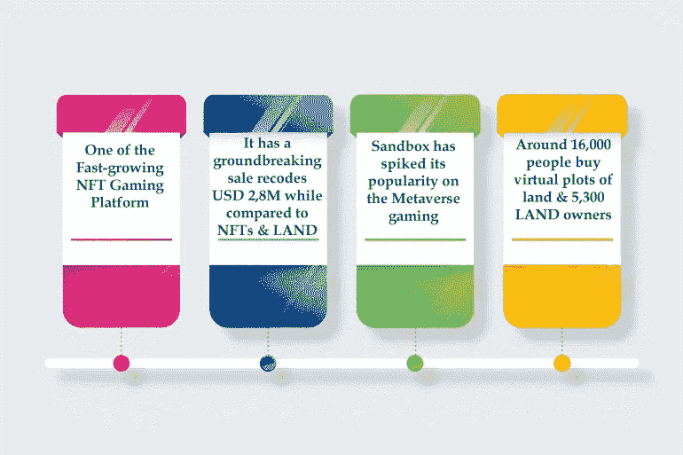
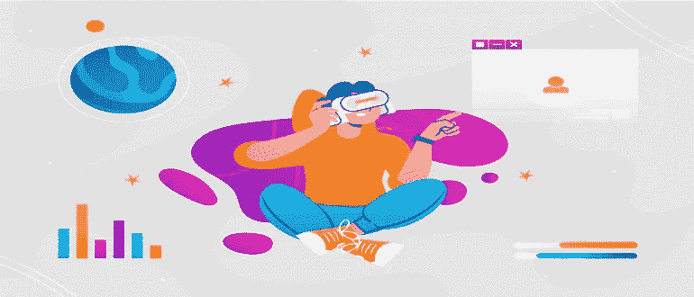
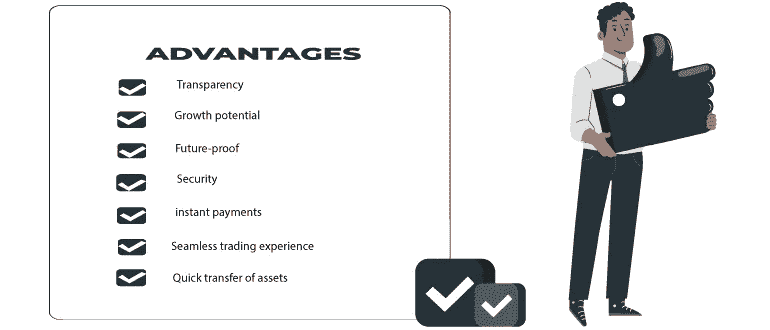
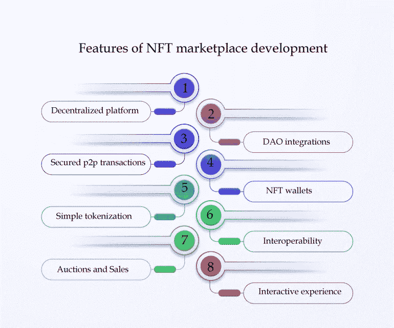

# 如何像沙盒克隆脚本一样启动 3D 元宇宙市场？

> 原文：<https://medium.com/geekculture/how-to-launch-3d-metaverse-marketplace-like-sandbox-clone-script-e9fbd02012f7?source=collection_archive---------15----------------------->

沙盒克隆脚本是一个位于元宇宙的 NFT 市场和游戏网站脚本。通过使用沙盒克隆，你可以建立一个基于区块链的 3D 游戏应用程序，类似于沙盒的当前功能。

沙盒 NFT 克隆脚本是一个独特的元宇宙市场，特别强调 3D 加密资产。随着用于 NFT 交易的较新的多媒体格式的开发，您可以为您的用户提供可靠的沙盒克隆脚本，并使用您自己所需的特性对其进行专门化。

# **沙盒克隆简介**

沙盒克隆脚本是一个基于元宇宙的 NFT 市场，继承了最常用的虚拟市场沙盒的所有选项和功能特性。**沙盒脚本**是一款独具特色的 3D 游戏脚本。 [**沙盒克隆**](https://radindev.com/sandbox-clone-script/) **软件开发**强调玩家可以出售和购买虚拟物品的 3D 游戏资产。

沙盒克隆使任何人都可以创建自己的元宇宙 NFT 游戏市场。在这个平台上可以买到秘密生物、宇宙飞船和秘密收藏品。您可以利用尖端技术重现世界上最好的虚拟体验。

# **沙盒的来源**

沙盒于 2011 年由 Pixowl 作为移动游戏平台推出。该软件发布时，下载量超过 4000 万次。当它在 2011 年发布时，可以在移动游戏应用程序上使用。2018 年，联合创始人决定在以太坊区块链网络上开始 3D 元宇宙。当它在 2020 年发布时，它与 axie infinity 和分散的土地一起成为了快速增长的 NFT 游戏之一。

在沙盒中，克隆脚本玩家可以通过分散的游戏生态系统来管理、开发和货币化游戏体验。在沙盒克隆，用户可以很容易地出售，发布，上传和购买 NFTS。

# **沙盒市场统计**

随着 2022 年 3 月 alpha season 2 游戏的发布，沙盒已经有超过 200 万人注册了游戏。沙盒的现值约为 1.36 美元，382，028，099 美元是一个 24 小时内的交易价值。

**SAND——沙盒的原生令牌**

SAND 是沙盒克隆脚本

本地令牌，可以通过参加比赛和玩游戏获得。作为沙盒克隆上所有交互和交易的基础，我们使用 SAND。在加密货币交易所也可以购买沙子。

玩家可以在沙盒游戏平台上创建虚拟商品，并将它们转化为 NFT 并出售以赚取沙子。

## **沙盒克隆令牌的类型**

陆地

沙

资产

# **沙盒克隆是如何工作的？**

沙盒克隆脚本是一个位于元宇宙的 NFT 市场，它声称是元宇宙最重要的部分之一。它建立在以太坊区块链网络令牌 ERC-721 上。ERC-1155 用于游戏和加密货币交换。

公众可以在注册参加在线拍卖后购买土地令牌、europhia、carebears、创新者、元宇宙、meta 和 carebears。土地代币可以具有以下状态之一:可用、已预订、溢价购买。

玩家可以使用 ETH 和 SAND 来购买有价值的土地。每个土地单元的销售项目是照片、位置、创作者的姓名、价格和区块数。用户可以通过 opensea NFT 市场集成进行交叉销售和追加销售。

# 为什么要建立像沙盒一样的元宇宙 NFT 市场？

[沙盒](https://www.sandbox.game/en/)是增长迅速的 NFT 游戏平台之一

在 3D 元宇宙中通过 Defi、区块链和 NFTs 赢得区块链游戏的热门游戏

创纪录的 NFTs 和 sandbox clone script 内的土地销售总额达到 280 万美元

在这几个月里？沙盒克隆剧本打破了沙盒内 NFT 和土地销售的记录，总价值约 380 万美元

在最近的沙盒统计记录中，沙盒中有超过 30，000 个帐户和 6，300 个土地所有者

这是一款 p2p 区块链流行游戏，在 3D 元宇宙中，创作者可以与 DeFi 和 NFTs 分享他们的财务价值。

# **如何开发一个像沙盒元宇宙 NFT 市场？**

你可以开发一个位于元宇宙的 NFT 市场，并在几天之内成为沙盒克隆市场这样的虚拟市场的所有者。您可以使用与沙盒平台具有相似功能和特性的现成沙盒克隆来启动元宇宙克隆脚本。

您还可以使用白标沙盒克隆脚本，根据您的需求启动基于元宇宙的定制业务。在**元宇宙脚本**开发过程中，可以定制功能系统、特性、操作流程和收入模式。

## **考虑开发类似沙盒的 NFT 市场的关键特征**

商情分析

用户界面/UX 设计

以太坊区块链网络部署

在市场上开始沙盒克隆

测试速度和性能

开发 ERC-20、ERC-721 和 ERC-1155 令牌标准

构建最小可行产品

将所有功能集成到前端和后端

## **沙盒克隆平台怎么可能产生利润？**

**创建体素资产:**在体素编辑上创建资产，并在 NFT 市场上出售。

**土地:**购买土地，并通过租借或增加人口来丰富土地。

**与游戏制作人一起制作游戏:**用户可以通过沙盒克隆脚本中的游戏制作人来赚钱和制作游戏，以获得互动体验。

**沙盒克隆开发成本估算**

它在不同平台上的表现如何

应用程序功能的复杂性

平台的用户界面/UX 方面

使用什么类型的工具

应用维护

开发团队

app 平台的选择

多种技术的利用

## **沙盒克隆脚本的主要特性**

**Voxedit**

沙盒克隆脚本中的用户可以使用沙盒克隆的免费功能 voxedit 创建 3D 对象并制作动画，如动物、车辆、人类、工具、体积和项目。这

**NFT 的市场**

沙盒用户可以使用克隆脚本在 NFT 市场上传、发布和销售使用 voxedit 生成的 NFT 艺术品。NFTs 的用户可以使用这个功能特性。首先，NFT 的作品被放入一个由 IPFS 网络提供的分散存储系统中。接下来，他们在区块链上注册，以确立 NFT 作品的所有权。

**游戏制作者**

沙盒克隆游戏制造商让每个用户与每个级别的能力，创造三维游戏，没有成本。构建不可思议的 3D 游戏不需要视觉编码知识。沙盒克隆脚本的创作者们正试图创建一个大规模的元宇宙沙盒克隆，里面有各种各样壮观的互动 3D 游戏。

**为什么要选择沙盒克隆开发？**

白色标签服务

安全管理面板

API 和插件集成

简单的技术支持

快速的商业启动

多平台开发

## **开发沙盒克隆脚本如何盈利？**

沙盒环境中的土地所有者可以向参与购买土地的玩家收取注册费。

如果所有者能够为其他人使用不可替换的代币，他们就有机会获得一定数量的现金。

它可以在沙盒克隆脚本上使用，以确保佣金的收取，从而促进沙盒环境中新游戏的创建和开始。

拍卖和汽油成本是维持交易进行的费用。

采矿和铸币费可以增加流动性，从而创造出新的、奇妙的艺术品。

在 voxedit 上创建资产，并在 NFT 市场上出售。

购买土地，并通过租赁或增加人口来丰富土地。

用户可以通过沙盒克隆脚本中的游戏制造商来赚钱和构建游戏，以获得互动体验。

## **使用元宇宙沙盒克隆的好处**

**增长潜力:**元宇宙 NFT 市场已经做好充分准备，以达到周围热潮 crypto 和 NFTs 的最大关注，这使其快速增长。它已经成为三个最好的 NFT 元宇宙游戏克隆脚本之一。

**透明:**由于可以查看市场中所有持续的交易，它可以获得传统市场无法获得的信任和可靠性。

**未来证明:**密码和非功能性加密技术将成为未来。除了对元宇宙市场的所有批评，这个市场的受欢迎程度是不可否认的。NFT 交易者社区正在快速发展，交易量已经增长了数十亿，所以对于一个企业来说，推出一个像沙盒克隆脚本一样的 NFT 元宇宙市场是一个经得起未来考验的想法。

**资产快速转移:**元宇宙 NFT 市场为拥有原始物品的买家提供内置的所有权认证。用户还可以将自己的资产进行令牌化，并在定制的元宇宙市场上出售。

安全:元宇宙 NFT 市场上的所有交易都有区块链保护，使得盗取资产成为不可能。此外，你的资产永远不能被改变，替换，删除，替代，并从区块链抹去，而他们是不可改变的。

**即时支付:**区块链元宇宙市场上的所有交易都简单、快捷、安全、省事。当用户在沙盒克隆脚本上进行交易时，不需要个人信息和信用卡详细信息**。**

**无缝交易体验:**平台努力实现高效、无缝的交易，为用户创造高端体验。沙盒克隆是利用一种算法推出的，与其他市场相比，它提供了最佳的交易过程。

**创建 3D mataverse mrketplace 的要点**

通过使用复杂的工具确保无限的游戏功能

你在元宇宙举办的运动会的惯例

通过启用存储、购买和销售等功能，构建极其简单的游戏体验和体素环境

增强版提供游戏选项，如相机灵敏度控制、可调屏幕分辨率、声音开/关控制等。

元宇宙市场有哪些不同的类型？

元宇宙房地产营销

元宇宙博彩营销

元宇宙 NFT 艺术市场

元宇宙电子商务市场

**NFT 市场发展的特点**

安全的 p2p 交易:分散的 NFT 市场实现了安全的 p2p 交易。点对点技术的强大安全性保护交易免受网络攻击。数据和购买细节通过安全编码智能合同传输。

**分散平台:**区块链市场的基础设施是分散的。事实上，它们不可能只有一个主人。这意味着它是一个多用户可以轻松操作和传输数据的系统。在沙盒克隆脚本中，不需要第三方控制，而所有事务都是安全的、私有的和受控的。

**简单的标记化:**在 NFT 市场，克隆脚本用户应该能够标记他们的资产，并轻松地列出它们。这一功能在元宇宙市场是一个至关重要的选项，如沙盒克隆应用程序，用户可以交易 NFT，也可以标记他们的资产。

拍卖和销售:用户可以在沙盒克隆脚本上主持拍卖。不同的非艺术作品可以被拍卖，不仅仅是艺术品。用户可以在现场拍卖上提出他们的价格，并确定从低到高的价格。

**道整合:**最近，大部分元宇宙商场都在采用道来建立自治组织。启用了 DAO 的市场可以由成员通过投票和提案来管理，以参与各种决策。

**NFT 钱包:**一旦用户将 NFT 钱包整合到市场中，交易就可用了。钱包必须通过第三方钱包号码进行整合，以实现简单的交易。NFT 钱包的功能与实体钱包不同。你不需要在其中存储加密货币，但你可以在沙盒克隆脚本中通过 NFT 钱包访问区块链资产。

**互操作性:**元宇宙的互操作性功能与区块链网络的互操作性功能具有相似的工作流程。这个特性允许一个分散的系统交互、共享任意数据和利用彼此的服务。互操作性是连接多个元宇宙项目的一个重要特征，以便用户可以作为化身参与各种社会文化活动。

**互动体验:**在元宇宙市场开发中，确保其具有互动、生动的设计。除了创建 NFT 克隆脚本的技术方面，环境设计也是必不可少的。你可以为用户提供一个 3D 和现实的环境设计，并尝试让他们参与各种交易活动。

**结论**

沙盒克隆脚本元宇宙提供了一个令人难以置信的商业机会，可以提供巨大的投资回报(ROI)。沙盒软件开发专业知识的良好开端可以让你的沙盒克隆元宇宙。我们可以根据您的业务需求为您提供专门的沙盒元宇宙。