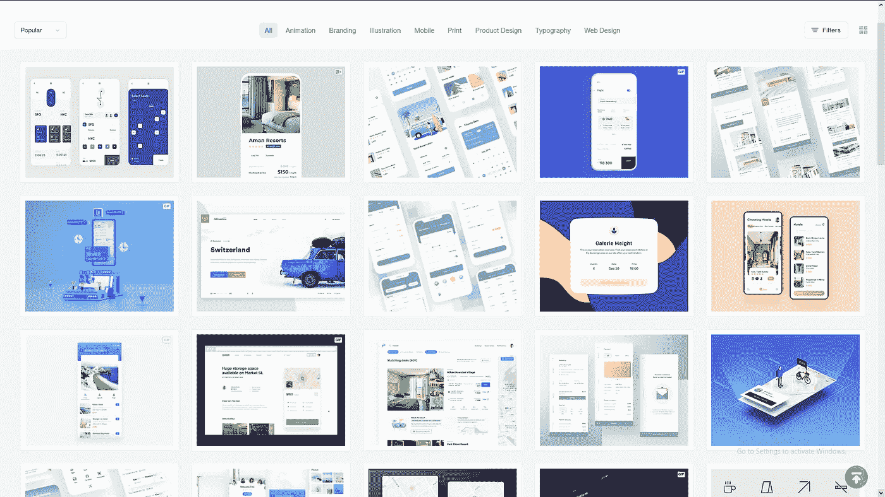
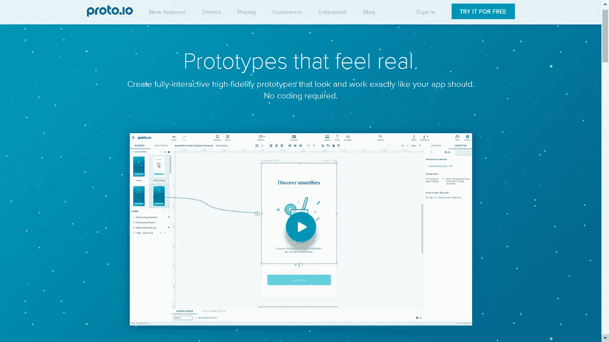
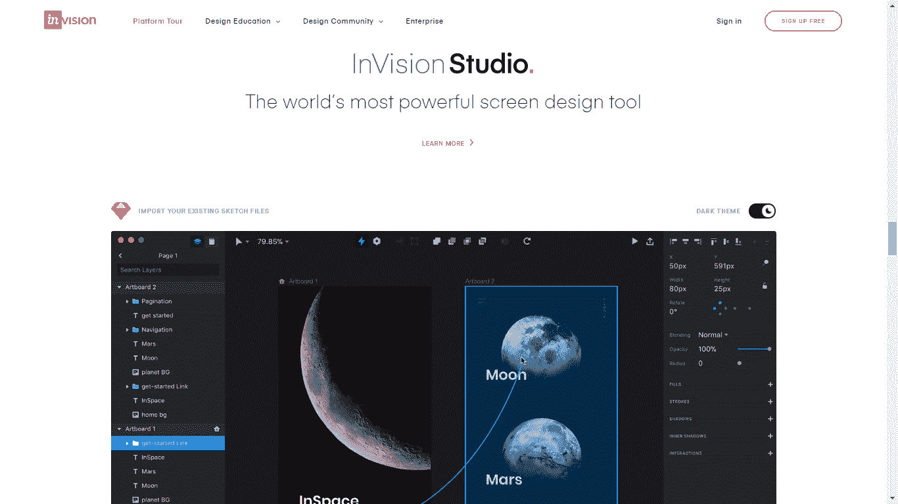
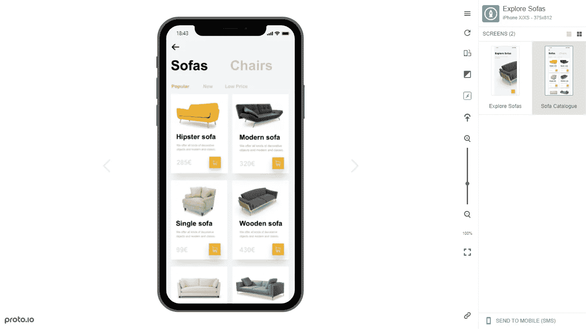
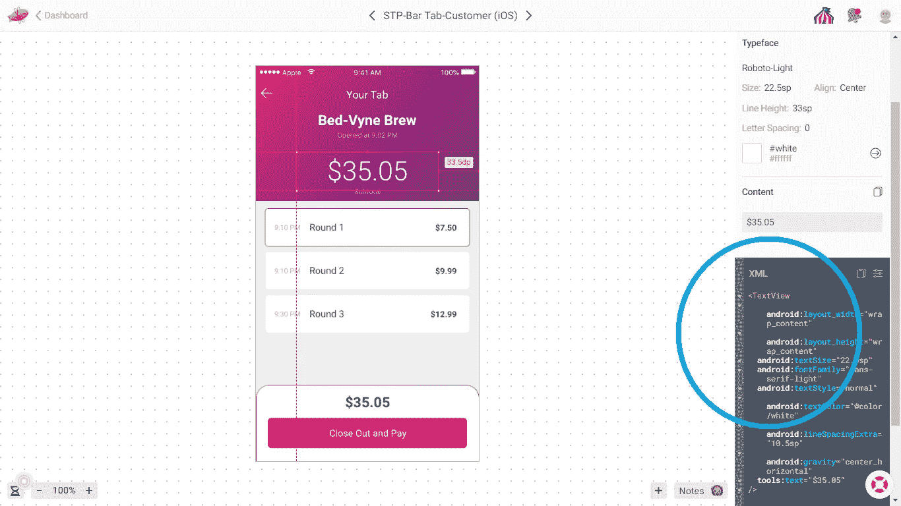

# 如何在 2021 年推出一款 App

> 原文：<https://medium.com/geekculture/how-to-launch-an-app-in-2020-96b766d5101a?source=collection_archive---------7----------------------->

最近，我非常荣幸和高兴地与一些有抱负的企业家分享了我关于开发应用程序的一些经验。在将两款金融科技应用从创意阶段带到成千上万用户手中后，我学到了很多关于如何高效地推出一款应用的知识。

根据请求，我很高兴在这里分享我的建议，以接触到更多的人，并希望在他们采取错误的方法启动他们的应用程序之前接触到他们。

作为摘要:2021 年高效推出一款 app 的关键是“原型先行”策略。像 [Invision](http://invisionapp.com/) 、 [Proto.io](http://www.proto.io/) 、 [Zeplin.io](http://www.zeplin.io/) 和 [Figma](http://figma.com/) 这样的原型工具已经改变了如何构建和启动移动和网络应用的游戏。你可以不用写一行代码就能构建一个漂亮的、功能性的原型来展示你的应用程序*的关键特性，而且这样做绝对是*成功发布你的应用程序的关键*，正如你将看到的那样。这是战术手册:*

**第一步:从设计开始。**

你的首要任务是找到一个平面设计师，他可以为你的应用程序设计一个漂亮的、引人注目的界面和屏幕。许多第一次创业的人会犯这样的错误:首先找一个软件开发者，认为开发者能够为应用程序设计界面。

但是程序员不是平面设计师。大多数软件开发商店制作漂亮界面的能力和一个平面设计师的能力有着巨大的差异。大多数软件工程师会给你提供一个标准外观的界面，可能只是遵循他们为哪个平台开发的基本 UX 指导方针。

但这还不够好。设计对你的应用程序的成功至关重要。应用程序比任何人需要的都多，大多数消费者觉得他们的设备上已经有太多的应用程序了。如果你想在他们的手机或电脑上赢得一席之地，你的应用程序必须具有吸引力和吸引力。你的应用应该让用户兴奋，让它看起来至少和顶级应用一样好也有助于赢得消费者的信任。

平面设计师也可以帮助你开发你的品牌，从标志和调色板到字体和排版。品牌调色板真的是一个很大的资产。它让你的公司和应用程序看起来专业和值得信赖，并且非常方便，可以确保你的应用程序和公司总是以最好的方式呈现，而不会看起来业余。

我寻找设计师的首选地是 [Dribbble](http://www.dribbble.com/) (有 3 个 b)。设计师在 Dribbble 上发布他们的作品，以获得知名度和找到工作。只需搜索一个与你的应用相关的术语，然后浏览所有出现的漂亮的相关作品。选择那些吸引你眼球的作品，并联系设计师以获得你项目的报价。你可能会发现许多有才华的海外平面设计师有很好的时薪。

这里的要点是，设计师比开发人员便宜得多，*和*他们会为你的应用程序提供一个更好看的界面。这两件事对一个成功的发布是至关重要的，这就是为什么你从设计开始。

**第二步:制作原型**

在与设计师合作开发所有界面和设计资产后，您可以将屏幕的设计文件导入到 Invision 或 Proto.io 中，并将它们转化为应用程序的交互式原型，无需任何编码即可展示其功能。亲眼看看，这些工具的工作方式几乎是不可思议的。

许多设计师将原型设计作为他们服务的一部分。但是如果可能的话，我建议你自己承担原型制作。这对设计师来说可以节省一些计费时间，但我个人也觉得原型制作真的很有趣。像 Proto.io 这样的工具很容易使用，我认为对于一个创始人来说，创建你希望应用程序如何工作的愿景是非常令人兴奋的。

我不会在这里详细介绍 Proto.io 或 Invision 的完整教程，这里有一个学习曲线。但是这些应用程序使得创建应用程序的交互式演示就像创建 PowerPoint 演示一样简单。如果你以前用过像 PowerPoint 这样的东西，你会很快掌握基础知识。

您可以创建的原型看起来像真正的应用程序，甚至可以加载到移动设备上，向您的应用程序用户演示它们。对于任何一个开发应用的人来说，很难夸大这是如何改变游戏规则的。我个人认为，迟早有人会发现如何从 Proto.io 这样的程序的基本接口自动编写代码，这是我们未来构建应用程序的方式(至少是前端)。

**第三步:原型的巨大战略价值**

一个能够以高水平的视觉保真度展示你的应用功能的原型是非常有价值的。你可以用它来推销客户，测试你的应用程序的市场，而不用花很多钱。这不仅仅是在你投资开发你的应用程序之前做市场调查的一个聪明的方法，你可能会有客户准备为你还没有开发的应用程序付费(不要担心，这是一个很大的问题)。

同样，原型给投资者留下了更深刻的印象。你的想法越具体，给投资者的印象就越深刻。当你能把你的“应用”放在投资者手中，让他们看到它的外观和功能时，它对他们的影响要大得多，让你看起来比餐巾纸上的想法更进一步。当你告诉他们，你已经有 20 个客户对你的应用程序感兴趣了，他们可能会给你开支票让你把它做出来！

在建造任何东西之前，我用原型法获得了大约 20 家当地商家使用我的应用程序 [Stuypend](http://www.stuypend.com/) 。这些用户验证了我们的 MVP 功能集的想法，并帮助我们提升了我们的朋友和家人，因为我们可以表明人们想使用我们的应用程序。我们只是需要为他们建造它！

很难夸大获得潜在客户和投资者的能力对提高你发布应用的成功几率有多重要。它降低了风险*和*有助于获得资金(无论是来自客户还是投资者)，简单地说，客户(或用户)和投资者是你成功所需要的。但是当你最终开发一个真正的应用程序时，拥有一个原型也会提供价值。

**第四步:最终构建你的应用**

原型对于向软件开发人员展示交互、功能和用户流也是很棒的。

一个原型可以让你向工程师展示你希望你的应用程序如何工作，并大大减少 UX 细节的来回奔波。当你考虑到开发人员的时间是应用程序构建过程中最昂贵的，你就会明白为什么把所有 UX/用户界面细节的哈希转移到设计阶段而不是编码阶段是一个好主意。这样，开发人员可以轻松地完成工作，而不必询问有关 UX 细节的问题，你也不必纠正应用程序中不按你希望的方式工作的交互。

此外，Zeplin.io 和 Figma 等工具会自动生成 HTML、JavaScript 和 XML 代码，用于在应用程序的前端实现设计，因此开发人员只需复制和粘贴即可，从而节省更多时间，并确保您的应用程序看起来完全符合您的需求(Invision 等原型工具通常会内置这样的功能)。

在构建 [Stuypend](https://apps.apple.com/us/app/stuypend/id1275561009) 的时候，当我准备开始开发时，我使用这些工具来帮助降低开发人员的报价。我会从我的项目的规格开始，并从开发人员那里得到报价。然后，我会向他们展示我已经完成了整个应用程序的原型，并且已经为他们完成了大部分前端编码，看看他们是否可以降低报价。这不仅降低了他们的报价，他们还喜欢这些工具提供的整洁有序的“设计交接”,让他们的工作变得更容易。

这就是我今天以聪明的方式发布应用程序的详细剧本。原型不仅仅是设计过程中的一个有用的工具，它还是一个强大的策略，通过大幅降低成本和*风险*，帮助确保你的应用的成功。编写应用程序是启动它最昂贵的部分。原型可以让你获得资源(无论是投资者，客户，还是两者都有！)在你冒险进行昂贵的开发之前，可能会有助于降低开发成本。而是如何在 2021 年推出一款 app。

安德烈

创始人

Stuypend

另外，请对其他工具发表评论，因为即使是我也不知道那里有什么。我随时欢迎您对本行动手册中任何可以改进的地方提出意见！