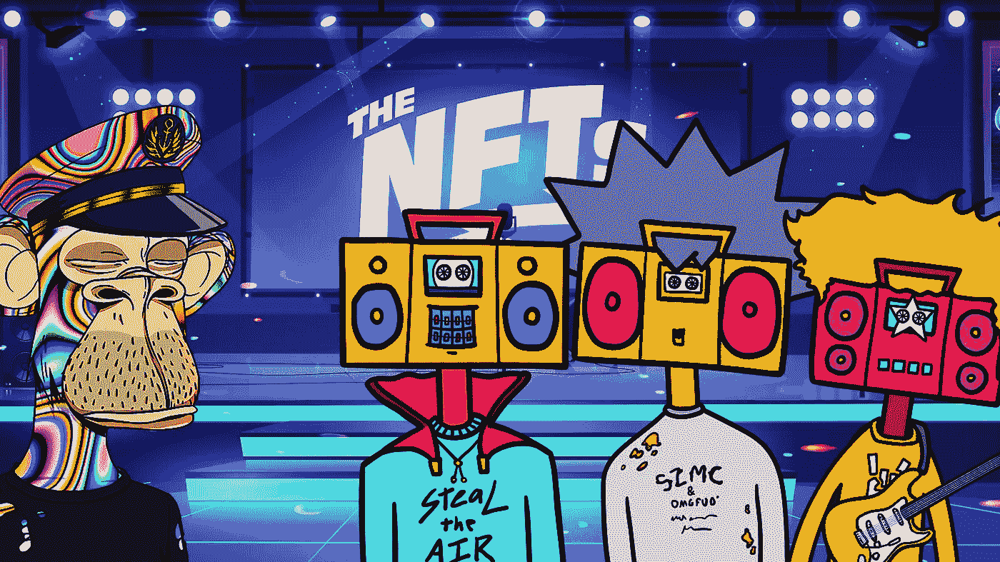
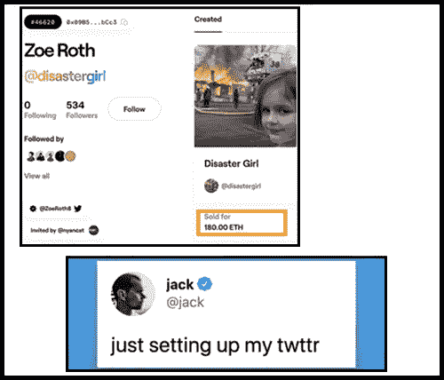
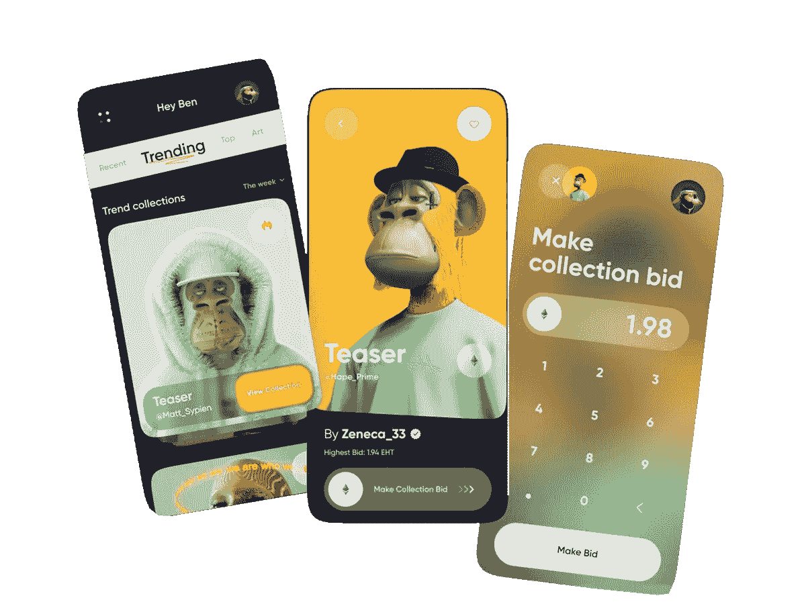
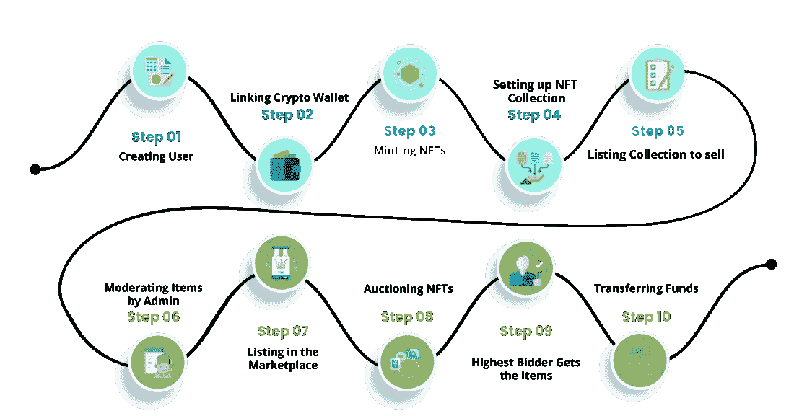

# 如何启动 NFT 市场？|完整的 NFT 指南！

> 原文：<https://medium.com/geekculture/how-to-launch-an-nft-marketplace-a-complete-nft-guide-c67b546c8a05?source=collection_archive---------3----------------------->

NFT 已经开始用他们百万美元的市场创造全世界的新闻。根据 nonfungible.com 的数据，从 2021 年开始，NFT 的市场已经增长了 2100%。最受欢迎的 NFT 已经卖出了将近 7500 万美元。那么， [***什么是 NFT 呢？***](https://en.wikipedia.org/wiki/Non-fungible_token) 为什么卖上百万美元？

## 非同质化通证

术语 NFT 被缩写为不可替换的令牌；顾名思义，它们是代表资产的唯一令牌。NFT 是存储在区块链上的独特的、不可编辑的数字资产，使其可追踪并可供所有人使用。NFT 有潜力代表各种数字资产，从书面作品和音乐作品到幽默的互联网模因。

值得注意的是，灾难女孩梅梅的原始照片作为 NFT 奖拍出了 50 万美元的价格。同样，杰克·多西的第一条推文以近 290 万美元的价格售出，一位名为 Gozanli 的印度尼西亚学生以惊人的 100 万美元出售了他在 2017 年至 2022 年间拍摄的自拍照。

## NFT 的属性

所有权:NFT 是唯一的，只有一个人可以拥有 NFT。NFT 可以交易，但不能被取代。NFTs 保证资产的所有权。

**透明性:**透明性是 NFTs 的最佳特性之一。因为它建立在区块链之上，所以 NFT 公开记录数据，通过这些数据我们可以知道谁创建了 NFT 以及谁拥有它们。

**不可分割性:**不可分割性意味着你不能将一个 NFT 分割成更小的标志。因此，当我们购买了 NFT，我们完全拥有它。

**真实性:**有了 NFTs，更容易有效地发现 NFT 的细节。通过这一点，我们可以确保在交易或交换过程中更好地验证真实世界的资产。

**可追溯性:**NFT 可以在各种加密货币交易所进行交易，所有者可以从这些交易平台中获得收益。

## NFT 市场

NFT 市场是一个基于区块链技术的分散平台，用户可以在这里购买、销售、创建甚至存储 NFT。这些市场促进了各种艺术、音乐和游戏形式的数字代币的买卖，提供了关于代币所有权和有效性的透明信息。

## NFT 市场的特点

**NFT 排名:**参见与 NFT 相关的评级和统计数据，根据价格、交易量和其他因素定期更新。

**钱包集成:**为 NFT 市场创建一个集成的钱包，用于存储、发送和检索 NFTs 的资金。

**Mint NFTs:** 在市场上将你的独特资产注册为 NFT。铸造 NFT 需要支付汽油费，这取决于所用的区块链。

**拍卖和招标:**通过现场拍卖为非功能性森林交易提供招标选项，买家可以为特定的 NFT 出价。这可以通过给予更高的收入来使创作者受益。

**搜索和过滤:**搜索和过滤 NFT 收藏和个人非功能表，为用户提供一个无障碍的浏览体验。

## 如何创建 NFT 市场:

NFT 市场是建立在区块链技术之上的。区块链允许人们在其网络上开发和托管应用程序。一些著名的区块链平台有以太坊、超账本、多边形和创。以太坊是一个广泛使用的区块链平台。**以太坊常用的数据标准有 ERC 721、ERC 998、ERC 1155。**

有了 ERC 721，代币从一个账户到另一个账户的转移被简化了；我们可以知道账户中当前的代币余额以及网络上可用的代币总数。

 [## 从白色标签解决方案建立多链 NFT 市场

### NFT 已经存在了至少五年(也就是从 2014 年开始)。然而，这些不可替代的令牌爆炸了…

www.blockchainappfactory.com](https://www.blockchainappfactory.com/blog/building-a-multi-chain-nft-marketplace-from-a-white-label-solution-is-it-worth-the-effort/?utm_source=Medium+&utm_medium=Guest+Post-+04%2F08%2F2022&utm_campaign=vignesh) 

## 创建 NFT 市场的关键步骤:

1.  为你的市场选择一个利基市场；它可以是任何东西，从视频游戏内容，艺术品，体育纪念品，甚至是一个配乐。
2.  为你的市场设计一个合适的用户界面。确保界面与你的定位相关。
3.  为您的市场选择最佳的区块链。
4.  为安全可靠的平台进行完美的前端和后端开发。
5.  创建智能合同，在满足销售条件的情况下，自动启动购买交易和创建 NFT。
6.  bug 和错误可能会扰乱用户体验。因此，测试是 NFT 市场发展过程中的另一个重要阶段。确保平台给用户一个无障碍的体验。
7.  设置加密支付途径以实现 NFT 的购买和销售。
8.  一旦市场启动，定期更新市场是很重要的

当您[开始创建您的 NFT 市场](https://bit.ly/3LGkoot)时，请确保您为用户提供高端安全功能，因为安全问题在区块链生态系统中很常见。

## 为您的市场提供多链功能

在单个区块链上创建市场会有各种限制。因此，通过整合几个区块链和数字钱包来创建一个多链市场。这导致了市场的可持续性，优化了区块链能源，并扩大了您的市场的客户范围。

## NFT 市场是如何运作的？

**Workflow**

1.  创建一个帐户并在 NFT 市场注册。
2.  将您的加密钱包与您的 NFT 市场链接。
3.  向您的市场添加数字资产。
4.  列出你的 NFT 收藏。
5.  上市的非上市公司被挂牌出售。
6.  代币所有者开始拍卖 NFT。
7.  出价最高的人赢得拍卖并拥有 NFT。
8.  该平台管理 NFT 的资金转移和数字所有权。

**总结一下**，在过去的几年里，对非功能性测试的需求一直在激增。我们可以看到 NFT 和他们的百万美元市场一起制造新闻。因此， [**开发一个 NFT 市场**](https://bit.ly/3LGkoot) 可以是一个创收的冒险。但是正确地完成它非常重要。雇佣一个在 NFTs 和市场开发方面有专长和知识的团队会帮你完成一半的工作。