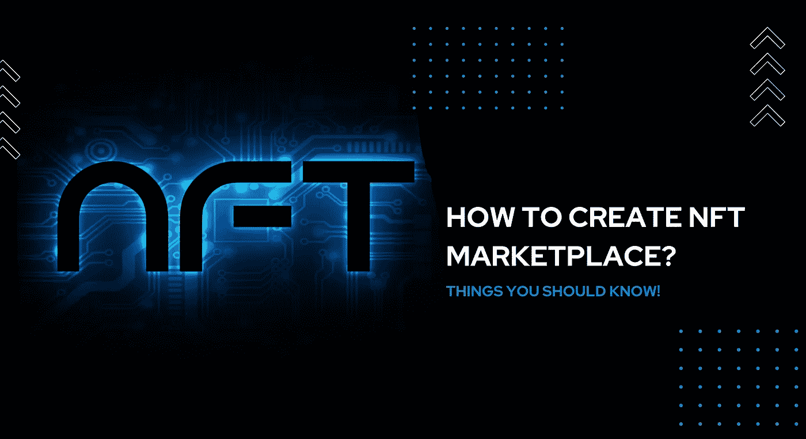

# 如何创建 NFT 市场？—你应该知道的事情

> 原文：<https://medium.com/geekculture/how-to-launch-an-nft-marketplace-things-you-should-know-996de1be98f5?source=collection_archive---------15----------------------->

## 推出新的 NFT 市场是怎么回事？想现在就开始吗？

在过去的十年里，我们日常生活中的其他事物的数字化变得越来越普遍。加密货币、NFTs、元宇宙和 GameFI 等最近的趋势在社交媒体上反响热烈。其中，作为不可替代代币的 NFT 目前吸引了更多的人，尤其是艺术和游戏爱好者。任何形式的艺术，音乐，图像或图片都可以转化为 NFT 收藏品。现在，我们在哪里可以做所有这些事情，在哪里可以通过销售来赚钱？这就是 NFT 市场派上用场的地方。人们可以在市场上铸造、购买和出售非功能性食品，这是一个为 NFT 目的的专用平台。随着 NFT 市场用户数量的增加，对 NFT 市场的需求不仅是需求，它还为市场所有者创造了数十亿美元的收入，并被视为近年来最赚钱的商业模式之一。

## **NFT 市场业务的收入因素**

任何一种商业模式在商业界越来越受欢迎，是因为它的投资回报率会很高，这是它出名的主要原因。同样，在 NFT 市场业务中有许多收入因素，让我们看看其中一些突出的因素。

*   **交易费用** —每当市场上发生交易时，都会从交易中扣除一笔金额作为交易费用。
*   **铸造费** —市场中的创作者将不得不支付铸造市场中的 NFT，这被认为是铸造费。
*   **上市费用**—NFT 在市场中上市，以进行拍卖，人们可以通过拍卖投标和购买这些 NFT，并且对上市 NFT 收取费用。
*   **竞价费用** — NFT 藏家可以购买竞价拍卖的非遗藏品，并收取一定的费用。
*   **版税**——NFT 所有者甚至可以在出售他们的 NFT 后从其中赚取版税，其中一部分归市场所有者所有。
*   **手续费** —许多 NFT 创作者不会专注于营销他们的非功能性广告，市场将此视为通过收取一些费用来营销他们的非功能性广告的机会。

# 创建 NFT 市场的方法

创建 NFT 市场有两种可能的方法，一种是自己从头开始创建，另一种是选择 NFT 市场的克隆脚本。靠自己构建它并不像听起来那么容易，因为它前面设置的要求是巨大的。你将需要一个强大的技术背景以及一大笔钱，也需要近一年的时间来完成它。这不是一个可行的选择，这最终导致每个人转向另一个选择，即使用 [**NFT 市场克隆脚本**](https://www.firebeetechnoservices.com/white-label-nft-marketplace-development?utm_source=launchnftmarketplacetop&utm_medium=geekmedium&utm_campaign=joy) 来创建它。这满足了在 scratch 方法中发现的所有滞后。

## 什么是 NFT 市场克隆脚本？

NFT 市场克隆脚本是一个预先开发的脚本，它复制了一个在市场上成功运行的受欢迎的 NFT 市场。汇编了各个 NFT 市场的各个方面和特点。它可根据业务需求进行定制，并可在短时间内部署。你不需要任何技术知识或技术团队。获得 NFT 市场克隆脚本的成本也远低于临时成本。集成了所有安全选项，完全安全。它具有令人兴奋的功能，并且能够集成额外的功能。

## NFT 市场克隆脚本的基本特征

*   店面
*   NFT 上市
*   过滤器选项
*   拍卖
*   投标
*   NFT 铸币厂
*   轻松搜索等等。

## 企业家使用 NFT 市场克隆脚本会有什么好处？

当一个企业家选择 NFT 市场的克隆脚本时，他会得到很多好处。让我列出一些重点。

*   可以得到一个个性化的 NFT 市场使用克隆脚本。
*   一个划算的选择，投资回报率高。
*   响应界面，提供增强的用户体验。
*   内置功能和安全选项，安全性更高。
*   最多在 10 天内即可部署。

## 使用 NFT 市场克隆脚本开发 NFT 市场的成本

之前我说过，scratch 开发成本很高，最低成本约为 10 万美元，但在 NFT 市场克隆脚本中，你不必担心，因为 NFT 市场的价格仅为 scratch 成本的 10%，是的，你没听错，克隆脚本的价格范围在 6k 美元到 12k 美元之间。如果您计划集成几个高级功能，那么成本可能会略有不同，但 it 成本不会有很大变化。这一方面使得企业家和商人依赖克隆脚本。

## 哪里可以找到 NFT 市场的克隆脚本？

一旦你找到了符合你业务需求的合适的克隆脚本提供商，那么你的 NFT 市场业务的剩余流程就很容易了。你可能会发现选择一个提供商是一件轻而易举的事情，但这不是真的，因为在选择你的克隆脚本提供商之前，你必须根据他们多年的经验，投资组合，他们提供的服务和他们收取的价格来搜索他们。如果选择是这样做的，那么一切都是有序的，但这本身需要你付出代价，因为它需要深入的研究。

不用担心，为了简化过程，我对市场上最好的 NFT 市场克隆脚本提供商进行了深入的研究，他们以合理的价格提供高质量的克隆脚本。作为我研究的结果，我能够得出结论， **Fire Bee Techno Services** ，一个克隆脚本提供商，为 cryptoprenuers 提供了无可挑剔的服务。他们在这一领域有丰富的经验，并为他们的服务收取合理的价格。如果你计划得到一个 NFT 市场的克隆脚本或端到端的开发，你可以向他们寻求进一步的程序。

## 结束语

我希望我已经涵盖了在开始 NFT 市场业务之前应该知道的所有重要细节。做一些研究，选择你的利基，决定要集成的功能，接近一个可靠的 [**NFT 市场克隆脚本提供者**](https://www.firebeetechnoservices.com/white-label-nft-marketplace-development?utm_source=launchnftmarketplace&utm_medium=geekmedium&utm_campaign=joy) ，传达你的业务需求，并最终启动你的业务。所有这些步骤几乎不需要一两个月的时间，但一旦做得好，你的 NFT 市场可以赚取超过你投入的利润。