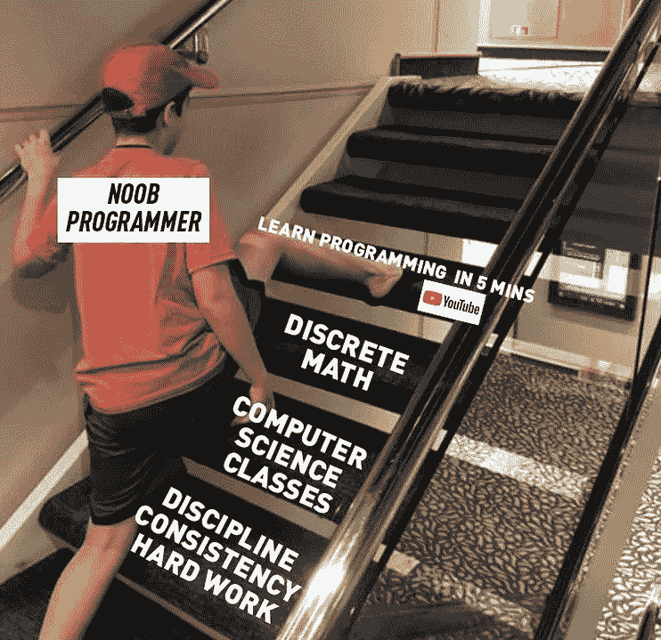

# 如何更快地学习任何编程语言

> 原文：<https://medium.com/geekculture/how-to-learn-any-programming-languages-faster-9f7ba637ba1e?source=collection_archive---------20----------------------->

这个周末我开始学习 R，我决定记录下这段经历，因为我认为这对不知道如何开始学习编程语言的人来说可能是有用的。

在本教程中，你将会更仔细地了解我学习编程语言的最快方法。

# 原则

## 一、你应该有一个目标:

当你学习一门编程语言时，有一个目标是非常重要的，它可以是任何东西，但是你应该有一个目标。

当你清楚自己为什么学习时，事情会变得更容易，因为你有一个目标，当目标实现时，你的动力会增加，这样一切学习都会变得有趣。

**我个人的例子**:“我学 R 建学院工程”。

## 二。你应该有一个期限:

另一个基本的，但非常重要的一点是，标出你要花多少时间来学习编程语言，这取决于你需要解决什么样的问题。

在这一部分中，你必须自己估计学习这种编程语言所需的实际时间。

**我个人的例子**:“这个周末我将学习 R，8 小时的奉献”。

# 快速概述

你需要的第一件事是对你将要学习的编程语言有一个总体的概念。我建议你看一个最长 3 小时的 YouTube 视频。

有了这个视频，你应该设置好你的机器，开始做他们在那个教程中教你的事情，并且了解那种语言的基本语法。

**我个人的例子** : [R 编程初学者](https://www.youtube.com/watch?v=BvKETZ6kr9Q)

# 文档+实践

官方文档是你会发现的必须的重要资源，强烈建议你考虑到这一点，在看其他网站之前先检查官方文档。

最后，既然你已经对编程语言的基本语法有了一个概念，那么是时候开始尝试 Katas、小项目和任何与你要解决的最终问题相关的东西了。

**我个人的例子**:

*   [R 公文](https://www.r-project.org/other-docs.html)
*   [R 编程练习](https://www.geeksforgeeks.org/r-programming-exercises-practice-questions-and-solutions/)

# 包装它

有明确的目标和期限。

观看 YouTube 上的视频，快速浏览一下。

练习+官方文档是学习一门编程语言的最好方法。

在此之后，开始建立在你在这个阶段的乞讨设置的真正的问题。