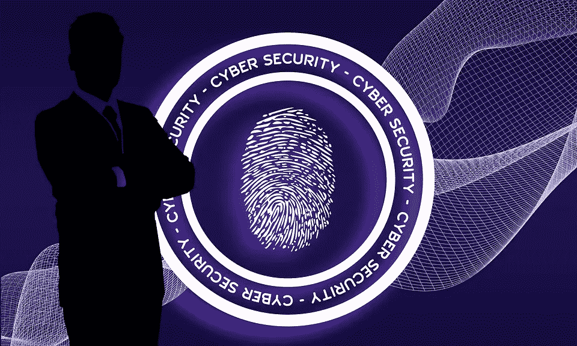

# 如何自学网络安全

> 原文：<https://medium.com/geekculture/how-to-learn-cybersecurity-on-your-own-7f3b4cdd408a?source=collection_archive---------8----------------------->

## 通过自学了解学习网络安全的最快方法

Image by [Pete Linforth](https://pixabay.com/users/thedigitalartist-202249/?utm_source=link-attribution&utm_medium=referral&utm_campaign=image&utm_content=4503696) from [Pixabay](https://pixabay.com//?utm_source=link-attribution&utm_medium=referral&utm_campaign=image&utm_content=4503696)

# **我如何开始学习网络安全？**

开始学习网络安全的最佳方式是通过使用互联网。你可以找到一些在线课程和认证计划，帮助你学习基础知识。此外…