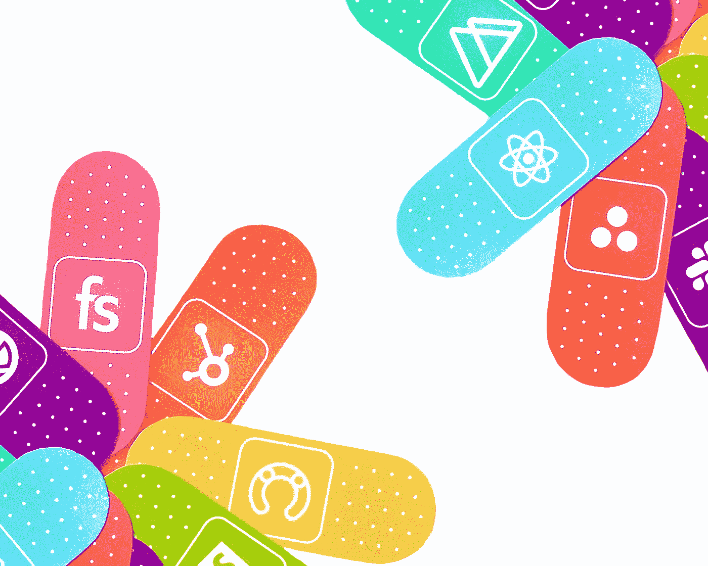

# 如何学习盖茨比 JS

> 原文：<https://medium.com/geekculture/how-to-learn-gatsby-js-ff64b608a632?source=collection_archive---------16----------------------->

如果你想学盖茨比 JS，网上有很多培训课程供你选择。你可以在 Udemy、Edx、skillshare、Coursera 等各种平台上找到盖茨比 js 课程。这些课程大多会定期更新，并根据编程语言进行组织。为了让你的搜索更容易，按类别浏览它们，并通过参加在线课程学习盖茨比 JS 的基础知识。

Photo by [Webstacks](https://unsplash.com/@webstacks?utm_source=medium&utm_medium=referral) on [Unsplash](https://unsplash.com?utm_source=medium&utm_medium=referral)