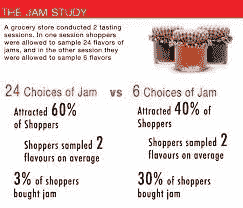
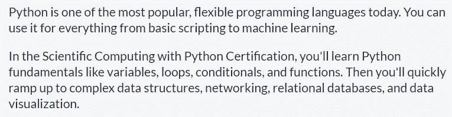
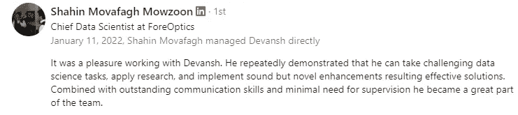
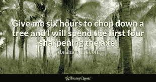

# 2022 年如何学习机器学习

> 原文：<https://medium.com/geekculture/how-to-learn-machine-learning-in-2022-9ef2ea904986?source=collection_archive---------2----------------------->

## 进入机器学习的逐步指南

为了帮助我了解您[请填写此调查(匿名)](https://forms.gle/7MfQmKhEhyBTMDUD7)

随着我的内容越来越受欢迎，越来越多的人向我咨询各种问题。其中一个共同的主题是来自希望进入机器学习的人。更具体地说，这是来自试图自学机器学习的人。他们告诉我他们在课程、项目和电子书/指南中遇到的各种困难，他们没有完全理解自己在做什么，也没有对自己的 ML 建立信心。更重要的是，他们发现自己忘记了基础知识，这进一步削弱了他们的信心，使他们很难知道如何继续下去。

Since there are so many ways to do ML, people are trapped by the Paradox of Choice

你可能会认为有了这么多奇妙的资源，开始工作会容易得多。有大量很棒的图书馆、教程和课程供你选择。甚至可以拿到各种认证，知道自己的立场。然而，事实恰恰相反。有了这些信息，人们很容易不知所措。我在周二收到了上述消息。注意，尽管是某知名学校的计算机科学专业学生(信息发送者是硕士生)，他仍然感到不知所措。这是由于选择的悖论，这是一种人们被太多选择压垮的现象。下面是一个众所周知的研究。

All the options can really overwhelm people, causing them to get stuck and not even take the first step

在这篇文章中，我会给你一个详细的分步计划，帮助你学习机器学习。将没有付费课程/链接，以便更多的人可以访问。在继续下一步之前，一定要慢慢来，真正理解基础知识。如果你有任何好的资源，请在下面的评论中链接它们/给我发消息。让我们互相帮助。

# 第一步:熟悉编码

这是必须的。绝对步骤 1。这应该是显而易见的，但是人们总是忽略编码的需要程度。是的，没有代码是一个东西。是的，像 Tensorflow 和 Keras 这样的包使得创建模型变得非常容易。但它们只是你工作的一小部分。您将花费大量时间阅读其他人编写的管道。你必须查看在线发布的模型及其文档。你会花很多时间在非常具体的实现细节上。所有这些都要求你熟悉编码。最好的资源之一是 freecodecamp 的[科学计算和 Python](https://www.freecodecamp.org/learn/scientific-computing-with-python/) 。它很好地涵盖了大部分细节和结构。除此之外，让自己熟悉递归和回溯。这些都是 ML 中至关重要的技能。

The course description. I love that they cover both DS and databases.

当您开始熟悉创建自己的类、最简单的自动化、记录文件和使用数据库时，您可以继续第 2 步。

# 第二步:计算

我个人最讨厌的是人们自信地告诉我，他们不需要数学来进行深度学习(Tensorflow 是根据一个数学概念命名的)。我不知道是谁散布了这个愚蠢的谣言，但这绝对不是事实。数学不仅仅是计算。它教会你如何思考。这是一种语言，你可以用它来准确地表达你如何构建和解决一个问题。这是没有商量余地的。

The reason I was able to come up with novel and effective solutions was because of my math training.

既然我们意见一致，那就谈谈你需要多少吧。不是很多。只要你熟悉数学思维，理解核心概念，你就会有效。自然，随着你努力变得更好，数学会越来越重要。请务必看完下面的视频。[它详细介绍了你需要的四个数学题目(以及你需要多少)](https://www.youtube.com/watch?v=b8WjF-6Bhqc&t=255s&ab_channel=Devansh%3AMachineLearningMadeSimple)。它是帮助你达到良好基线水平的指南。如果你决定继续前进，这只会有所帮助。

至于可以学习数学的来源，可汗学院才是王道。奇妙的课程，大量的问题，和一个伟大的系统。伦纳德教授有很好的高阶微积分。YouTube 是一个学习和提高数学技能的好地方。

# 第三步:基础 ML

一旦你开始获得数学直觉，就开始了解基本的机器学习。 [ThreeBlueOneBrown 在神经网络上有一个很棒的播放列表](https://www.youtube.com/watch?v=aircAruvnKk&list=PLZHQObOWTQDNU6R1_67000Dx_ZCJB-3pi&ab_channel=3Blue1Brown)。[stat quests](https://www.youtube.com/c/joshstarmer)和 [RitvikMath](https://www.youtube.com/channel/UCUcpVoi5KkJmnE3bvEhHR0Q) 是两个精彩的频道，它们以清晰的方式谈论了许多机器学习/数据科学相关的概念。[还有一个特定的 YouTuber，它以清晰适用的方式解释了不同的机器学习思想和概念(wink wink)](https://www.youtube.com/channel/UC1JX4z0BxxNDzniJe1skzTQ) 。

This video explains how to design and build ML projects to maximize your learning and employability.

如果你已经掌握了基础知识，这时你会注意到基础知识对 ML 是多么有用。您将能够阅读文档，浏览人们的 GitHub 项目，并了解大部分资源。这是你应该进入开发项目的时候。上面的视频是一个指南，告诉你应该如何设计你的 ML 项目，以便最大限度地应用于实践学习。

在这一点上，你仍然是一个相对的初学者。然而，当你开始接触 ML 频道并了解更多的事情时，你会开始注意到一些模式和想法。现在你有能力学习机器。现在是你开始加速成长的时候。怎么会？看下一步。

# 第 4 步:深入研究论文/ML 社区

到目前为止，我们一直致力于为您提供合适的工具。你已经发展了从理论上(通过你的数学基础)和实现上(通过编码)理解机器学习的能力。你应该能够解释常见算法和实现背后的思想和概念。

Variants of this quote are around the internet. This is what we have focused on.

下一步是接触更复杂的文学作品。一开始这可能会令人沮丧。你会打开试卷，看到你感到困惑的试卷和批注。共享的 ML 演讲看起来像是 5 分钟的英语和 40 分钟的行话。没关系。这是一个渐进的过程。你阅读/了解的论文越多，你就越能理解。开始时，你可以专注于理解每篇论文中的一两件事(我的注释论文可以帮助你)。你做得越多，你就能越好地从他们那里获得洞察力。[这篇文章详细介绍了你应该如何与这些复杂的 ML 文件进行交互，以提高你的机器学习技能](/geekculture/an-overlooked-tool-for-becoming-a-machine-learning-expert-edfef1556135)。这是迄今为止我收到的最好的文章之一。

一旦到了这个阶段，就是一辈子的过程。你会不断从网上分享知识的大量聪明人那里学习。一些好的起点是 Henry AI Labs、Yannic Kilcher、Robert Miles、Mathematical Monk 和 Primer。[你也应该尝试更难的项目，比如这里详述的那个](https://youtu.be/A5wfVTyzv9E)。

为了获得最佳效果，请确保您订阅了我的每日时事通讯，[简单编码访谈](https://codinginterviewsmadesimple.substack.com/)。它涵盖了算法设计、数学、最近的技术事件、软件工程等主题，让你成为更好的开发人员。 [**我目前正在进行一整年的八折优惠，一定要去看看。**](https://codinginterviewsmadesimple.substack.com/subscribe?coupon=1e0532f2)

我创建了[编码面试，使用通过指导多人进入顶级科技公司而发现的新技术，使面试变得简单](https://codinginterviewsmadesimple.substack.com/p/faqs-and-about-this-newsletter?r=4tnbw&s=w&utm_campaign=post&utm_medium=web)。时事通讯旨在帮助你成功，避免你在 Leetcode 上浪费时间。[你可以在这里阅读常见问题并了解更多信息](https://codinginterviewsmadesimple.substack.com/p/faqs-and-about-this-newsletter?r=4tnbw&s=w&utm_campaign=post&utm_medium=web)

如果你也有任何有趣的工作/项目/想法给我，请随时联系我。总是很乐意听你说完。以下是我的 Venmo 和 Paypal 对我工作的金钱支持。任何数额都值得赞赏，并有很大帮助。捐赠解锁独家内容，如论文分析、特殊代码、咨询和特定辅导:

https://account.venmo.com/u/FNU-Devansh

贝宝:[paypal.me/ISeeThings](https://www.paypal.com/paypalme/ISeeThings)

# 向我伸出手

你可以在任何平台上联系我，或者查看我的其他内容。如果你想讨论家教，发短信给我。查看免费的罗宾汉推荐链接。我们都得到一个免费的股票(你不用放任何钱)，对你没有任何风险。**所以不使用它只是失去免费的钱。**

机器学习重要更新的免费每周总结(赞助)-[https://lnkd.in/gCFTuivn](https://lnkd.in/gCFTuivn)

查看我在 Medium 上的其他文章。https://rb.gy/zn1aiu

我的 YouTube:[https://rb.gy/88iwdd](https://rb.gy/88iwdd)

在 LinkedIn 上联系我。我们来连线:[https://rb.gy/m5ok2y](https://rb.gy/f7ltuj)

我的 insta gram:[https://rb.gy/gmvuy9](https://rb.gy/gmvuy9)

我的推特:[https://twitter.com/Machine01776819](https://twitter.com/Machine01776819)

如果你正在准备编码/技术面试:[https://codinginterviewsmadesimple.substack.com/](https://codinginterviewsmadesimple.substack.com/)

获得罗宾汉的免费股票:[https://join.robinhood.com/fnud75](https://www.youtube.com/redirect?redir_token=QUFFLUhqa0xDdC1jTW9nSU91WXlCSFhEVkJ0emJvN1FaUXxBQ3Jtc0ttWkRObUdfem1DZzIyZElfcXVZNGlVNE1xSUc4aVhSVkxBVGtHMWpmei1lWWVKNzlDUXVJR24ydHBtWG1PSXNaMlBMWDQycnlIVXNMYjJZWjdXcHNZQWNnaFBnQUhCV2dNVERQajFLTTVNMV9NVnA3UQ%3D%3D&q=https%3A%2F%2Fjoin.robinhood.com%2Ffnud75&v=WAYRtSj0ces&event=video_description)