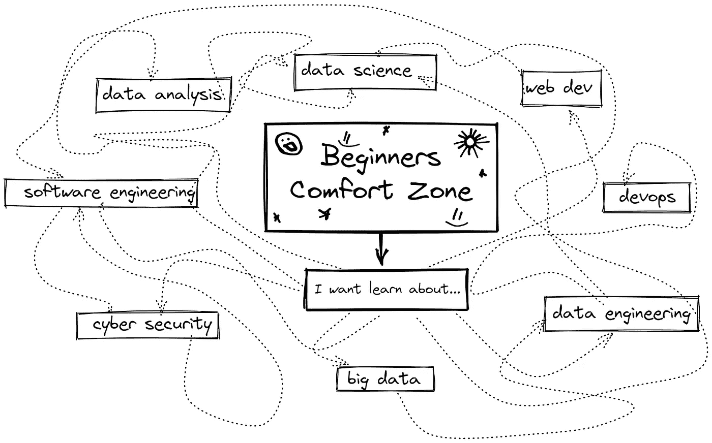
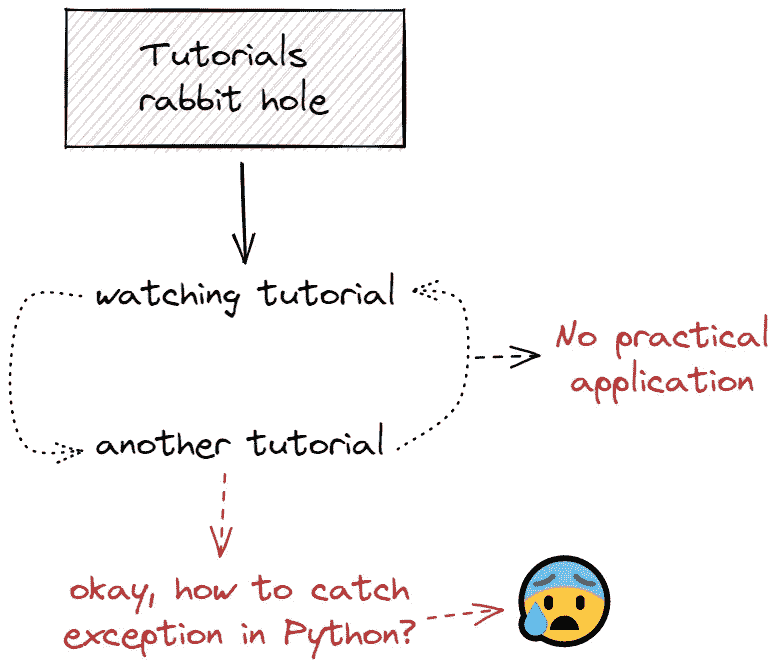
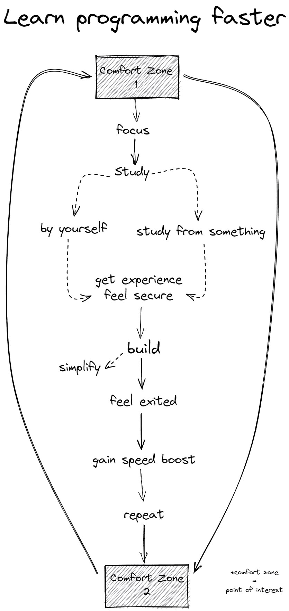

# 如何更快更高效地学习编程

> 原文：<https://medium.com/geekculture/how-to-learn-programming-faster-and-more-productive-fd2521bb1f97?source=collection_archive---------14----------------------->

# 介绍

有很多关于这个话题的帖子/视频。这篇博客纯粹是主观的，是在学习编程的过程中遇到某些障碍时，根据个人经验创作的，从不同的角度用可能适用于许多人的插图来展示它。

# 初级开发人员的常见问题

# 从学习中获得最大收益，而不会感到不知所措

# 关注编码教程的兔子洞

# 专注于一件特定的事情

正如你所理解的，要想更快地学习一些东西，你需要专注于具体的事情，而不是到处分散注意力。它只需要专注、时间和不断的练习。你已经知道了，但可能会忘记。

# 造些小东西

构建小应用程序和脚本将通过经历具体事情的整个过程而获得大量经验，而无需到处分散注意力。

例如，通过复制你可能喜欢的东西可以获得很多经验，无论是网站还是脚本。如果事情不顺利，你总是可以简化事情。

# 开始电子邮件/电报简讯或博客

另一件事可能是方便的，开始写你的电子邮件/电报简讯或类似的东西，可以每天、每周或每月做一次，你可以通过教别人来自学。

# 整理你的思绪

例如，如何着手弄清楚你是否喜欢数据分析？它的方法会因人而异，以此为例。

# 什么是舒适区？我应该在里面吗？

# 舒适区是好的。

对我来说，舒适区是我感到安全，不会被许多事情压倒的时候。这并不意味着在一个地方坐很长时间而不改变风景或其他东西，尽管我不认为这有什么错。对一些人来说，它适合，对一些人来说，它不适合。

# 从编程角度看舒适区

从编程的角度来看，它带来了一些东西，例如专注于特定事情而不是同时关注所有事情的能力，这可能导致事情之间的扭曲。它让我们通过只学习特定的东西来更快地获得经验(技能),这反过来会带来更快的反复试验和错误。

# 适用于一切的舒适区

所有这些东西不仅适用于编程。

如果你想开始弹钢琴，你需要专注于此，学习具体的东西，即音符、和弦、视奏、调号和音程(2 度、3 度、5 度……)，并定期练习，直到你觉得你可以转到不同的东西，即从音符到和弦。

# 下次会容易得多

所有这一切最有趣的是，在学习过程中获得的经验会转移到你想学习的下一项技能中。

如何浏览学习材料，何时停止观看教程并付诸实践，在哪里以及如何举例进行学习等将变得更加清晰。

在[Twitter](https://twitter.com/DimitryZub)|[Linkedin](https://www.linkedin.com/in/dmitriy-zub/)|[insta gram](https://www.instagram.com/dimitryzub/)上与我联系

在推特[、Linkedin](https://twitter.com/serp_api) | [、YouTube](https://www.youtube.com/channel/UCUgIHlYBOD3yA3yDIRhg_mg) 上与 SerpApi 联系

❤️