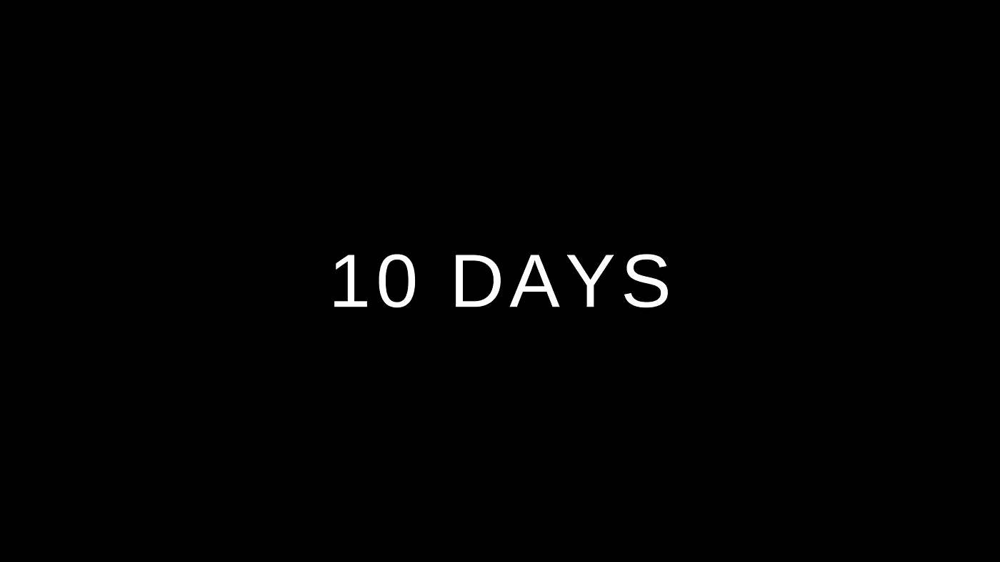

# 如何在短短 10 天内学会 python

> 原文：<https://medium.com/geekculture/how-to-learn-python-in-just-10-days-5745204724c?source=collection_archive---------16----------------------->

## 10 天掌握 python 基础知识

你们好，伙计们！我将在**just****10****days**为您带来 python 课程，因此如果您遵循该课程，您将能够在短短 10 天内学会 python。在本文中，我将向您展示如何在短短 10 天内学会 python。10 天后，你将能够理解**基础**和**中级** **python** 并准备好开始新项目的工作。

让我们开始吧

# 第一天

在第一天，您可以了解 python 应用程序以及它们的使用场合，并且可以设置一个 IDE 进行练习

## 我们将涉及的主题

*   python 简介
*   python 的工业应用
*   安装 ide

# 第二天

在第二天，我们将学习 python、运算符、数据类型和条件语句的一些基础知识

## 我们将涉及的主题

*   数据类型及其用途
*   条件语句
*   python 中的运算符

# 第三天

第三天，我们将了解字符串和变量

## 我们将涉及的主题

*   可变的
*   评论

## 第四天

第四天，我们将学习列表词典和元组

## 我们将涉及的主题

*   列表、字典和元组
*   设置
*   对它们进行操作

# 第五天

第五天，我们将学习循环

## 我们将涉及的主题

*   while 循环
*   对于循环

# 第六天

第 6 天，我们将学习函数、模块和文件处理

## 我们将涉及的主题

*   创建函数
*   调用函数
*   导入模块
*   使用流行模块

# 第七天

第 7 天，我们将学习文件处理

## 我们将涉及的主题

*   文件处理

# 第八天

第 8 天，我们将学习 oops 概念的基础知识

## 我们将涉及的主题

*   什么是哎呀
*   班级
*   目标
*   方法

# 第九天

在第 9 天，我们将学习更多关于 oops 的概念

## 我们将涉及的主题

*   遗产
*   多态性
*   包装

# 第 10 天

**我们将修改和练习从第 1 天到第 9 天的所有工作**

对你来说，有一些好消息:因为我每天都会发表文章，我会用代码和它们的概念来讨论上述所有概念，所以请确保你已经关注了我的简介。

# 结论

现在，在这篇文章中，我已经向您展示了如何在短短十天内学习 Python，但是您可以决定您想要学习它的速度，如果您有更多的时间，您可能会花掉它。