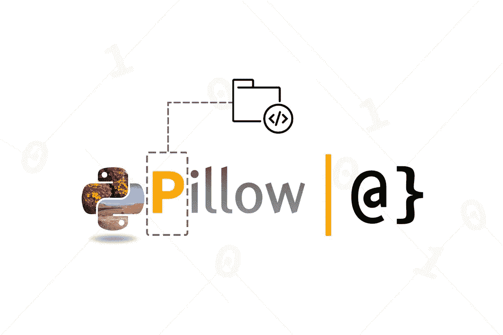

# 如何在 Python 中使用 Pillow 加载自定义字体

> 原文：<https://medium.com/geekculture/how-to-load-a-custom-font-using-pillow-in-python-74e7c4253adb?source=collection_archive---------32----------------------->

你曾经需要生成数以千计的带有文字的图片吗？也许你试图推出一个新的生成迷因的应用程序，却发现 JavaScript 并不能按照你想要的方式处理图像。Python 的 Pillow library 可能就是您一直在寻找的图像处理工具！

# **TL；DR** —在枕头中使用自定义字体