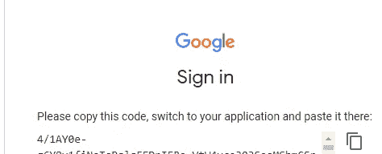
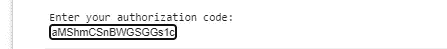
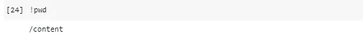
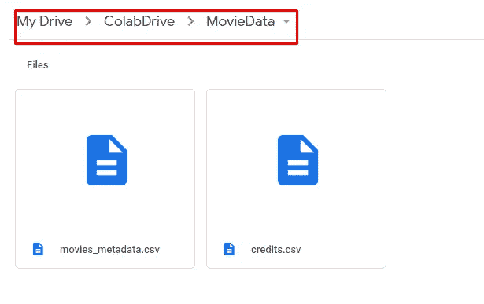

# 如何将数据集从 Google Drive 加载到 Google Colab

> 原文：<https://medium.com/geekculture/how-to-load-a-dataset-from-the-google-drive-to-google-colab-67d0478bc634?source=collection_archive---------3----------------------->

Photo by [Alex Gagareen](https://unsplash.com/@onepilot?utm_source=unsplash&utm_medium=referral&utm_content=creditCopyText) on [Unsplash](https://unsplash.com/s/photos/plug?utm_source=unsplash&utm_medium=referral&utm_content=creditCopyText)

当我们使用 google colab 编写数据分析代码时，显然我们需要从某个地方加载数据集。我们可以使用一个文件选择器，以下面的方式从 PC 上加载数据集，但是今天我要写的是，如何从我们的 google drive 上加载数据集。

Loading data from local disk (PC)

## 将数据集从 Google Drive 加载到 Google Colab

首先，你必须把 google drive 挂载到 colab。为了做到这一点，

打开一个 colab 表并编写以下代码，

然后它会给出如下输出

单击给定的链接。然后你会看到通常的谷歌账户认证步骤，两步之后你会看到你的谷歌硬盘的认证密钥。

authentication key for google drive

现在将它添加到早期出现的 shell 中，并按 enter 键。

add your token

现在你的 google drive 已经安装好了。

现在可以从 google drive 读取 _cvs 了。在此之前，确保使用命令检查您当前的工作目录，

`!pwd`

check current working directory

我当前的工作目录是`/content`，驱动器安装在`/content/drive.`，所以要访问数据集，必须从驱动器`/content/drive`开始。

我的文件位于一个名为 MovieData 的文件夹中，路径是`My Drive/ColabDrive/MovieData`

因此，要加载数据集，只需使用，

结束了。