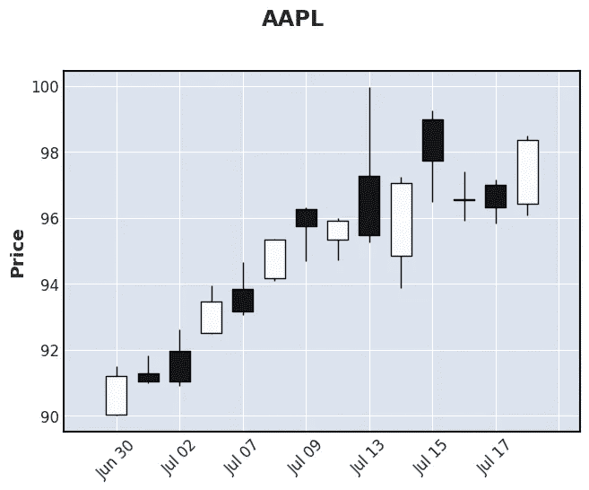
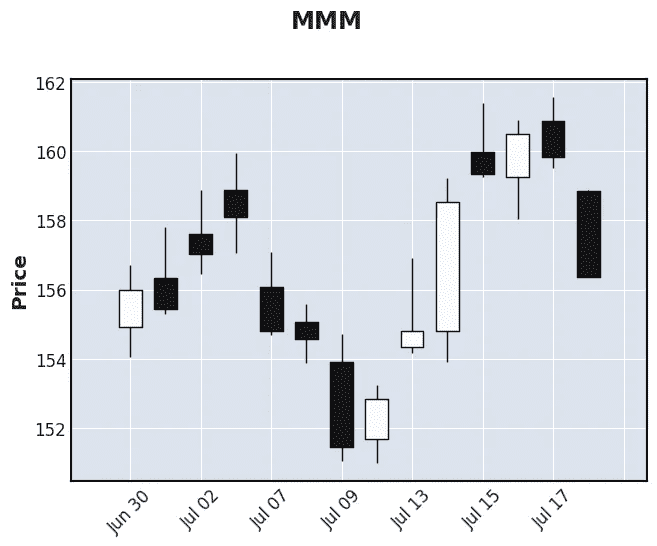

# 如何使用 Python 免费下载和可视化财务数据

> 原文：<https://medium.com/geekculture/how-to-load-and-visualize-financial-data-for-free-with-python-651beff31cb8?source=collection_archive---------24----------------------->



*喜欢这篇文章吗？通过订阅我的* [*时事通讯*](https://whynance.substack.com/) *，在您的收件箱中获得更多类似的文章。*

如果你刚刚开始股票交易(尤其是算法交易)，你可能正在寻找可靠的数据来测试你的策略。幸运的是，有大量的免费数据可用，您可以使用 [Githu](https://github.com/) b 上免费提供的工具来访问这些数据。本教程将帮助您开始使用 Python，并向您展示如何使用三个免费的 Python 包来免费下载和可视化财务数据: [pandas](https://github.com/pandas-dev/pandas) 、 [yfinance](https://github.com/ranaroussi/yfinance) 和 [mplfinance](https://github.com/matplotlib/mplfinance) 。

# 先决条件

我假设你对 Python 有所了解，并且你已经安装了 Jupyter T21。如果您的计算机上还没有设置 Python 环境，我建议您使用 [Anaconda](https://www.anaconda.com/products/individual) 安装一个，然后按照 [Jupyter 安装指南](https://jupyter.org/install)安装。

安装 Python 和 Jupyter 后，在终端中执行以下命令:

```
pip install yfinance mplfinance
```

它将安装本教程所需的三个包。现在您已经安装了 Jupyter，您可以启动一个笔记本并按照本教程进行交互。

# 用`yfinance`下载财务数据

这个`yfinance`包让我们从[雅虎财经](https://finance.yahoo.com/)下载免费数据。至少，你需要知道你想要下载的股票行情，你想要数据的时间范围，以及你感兴趣的数据的分辨率(或“时间间隔”)。

首先，让我们下载苹果(Apple)、通用电气(General Electric)和 3M 去年的每日价格数据。

```
import yfinance as yf # download some data from yahoo
data = yf.download(
        tickers = ['AAPL', 'GE', 'MMM'],
        period = '52wk',
        interval = '1d'
    )prices = data['Adj Close']print(f"Retrieved {len(prices)} data points from Yahoo Finance")
```

你可能会感到困惑，去年你下载了不到 365 个每日数据点——这是因为一年只有大约 252 个交易日(有趣的金融事实)。

我们可以用熊猫来查看我们下载的数据。先说熊猫内置的`describe()`功能。

```
data.describe()
```

您应该会看到一个统计表，描述了我们下载的数据，包括所有的列。这告诉我们，我们已经下载了我们想要的三只股票的 OHLCV 数据:苹果、通用电气和 3M。OHLCV 数据是指“开盘价、最高价、最低价、收盘价和成交量”。在后面的教程中，我会详细解释这意味着什么。但是现在请注意，我们已经下载了这些列:开盘价、最高价、最低价、收盘价和成交量(以及“调整收盘价”，我稍后会谈到)。

您会注意到，所有报价机的数据都堆叠在一起。为了绘制每个跑马灯，我们需要使用一些`pandas`魔法来区分每个跑马灯。为了将 AAPL 数据从其余数据中分离出来，我们可以:

```
appl_data = data.stack(level=0).AAPL.unstack(level=1)
```

这样我们就可以详细查看苹果的数据了:

```
appl_data.describe()
```

你可能已经注意到，除了 OHLCV 的数据，我们还下载了一个“Adj Close”栏，代表“调整后的收盘”。该数据修改了价格，以说明[股息](https://en.wikipedia.org/wiki/Dividend)和[股票分割](https://www.investopedia.com/terms/s/stocksplit.asp)。我们不会深入探讨这意味着什么，我们只是把调整后的收盘价作为每只股票的“每日价格”。因为那是我们将要使用的价格，我们也可以`describe()`只是价格数据。

```
prices.describe()
```

哪个更容易理解:我们可以很容易地看到我们三只股票在过去一年的平均价格和波动性(标准差)。

现在我们有了数据，我们终于可以绘制它了！

# 用`mplfinance`可视化财务数据

`mplfinance`图书馆将帮助我们制作精美的*烛台图表*。既然我们已经将我们的苹果数据分开，让我们绘制前两周的数据(通过使用`iloc[:14]`):

```
mpf.plot(appl_data.iloc[:14], type='candle', title='AAPL')
```


这张图表使用了我们下载的所有数据，让我们很好地了解了苹果的价格在这两周的走势。我们可以对其他的报价机做同样的事情。让我们绘制 3M:

```
mmm_data = data.stack(level=0).MMM.unstack(level=1)
mpf.plot(mmm_data.iloc[:14], type='candle', title='MMM')
```



# 结论

我们做到了！我们已经下载了多个 tickers 一整年的数据，并创造了一些奇特的情节来展示它。在未来的教程中，我们将讨论如何阅读我们绘制的图表，并更深入地研究数据。