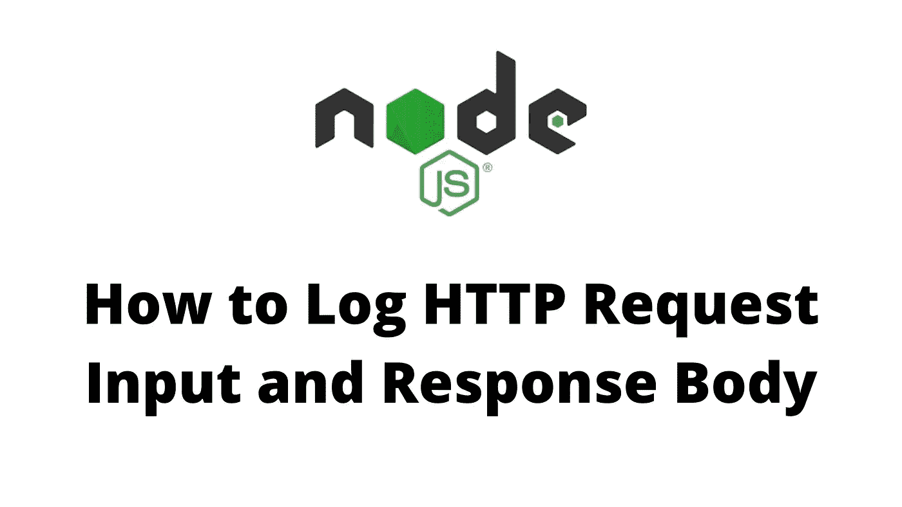

# 如何在 NodeJS 中记录 HTTP 请求输入和响应体

> 原文：<https://medium.com/geekculture/how-to-log-http-request-input-and-response-body-in-nodejs-1d5219155bf4?source=collection_archive---------3----------------------->



将 API 部署到生产环境时，出于调试、审计和优化等原因，能够记录所有传入服务器的请求和来自服务器的响应是至关重要的。对于 NodeJS，有许多流行的日志库，它们在为您设置基本配置方面做得非常好。然而，它们都没有提供默认的请求输入和响应主体日志记录。这里有一个简短的教程，告诉我们如何通过[摩根](https://github.com/expressjs/morgan)来实现这一点。

为了记录 morgan 默认配置之外的附加信息，我们需要创建自定义令牌。让我们从一个为扩展 morgan 而编写的定制中间件开始。

```
// /middlewares/morgan.tsimport { Request, Response } from "express";
import morgan from "morgan";// in my app, I extend express's Request interface to store a 
// `requester` prop. this holds the decoded jwt token data
morgan.token("requester", function getRequester(req: Request): string {
  return JSON.stringify(req.requester);
});morgan.token("input", function getInput(req: Request): string {
  let input: Record<string, any> = {};
  if (req.method === "GET") {
    input = req.query;
  } else {
    input = req.body;
  }

  // mask any input that should be secret
  input = { ...input };
  if (input.password) {
    input.password = "*";
  }

  return JSON.stringify(input);
});morgan.token("response-body", (req: Request, res: Response): string => {
  const body = { ...JSON.parse(res.responseBody) }; // mask any input that should be secret
  if (body?.data?.accessToken) {
    body.data.accessToken = "*";
  }
  if (body?.data?.refreshToken) {
    body.data.refreshToken = "*";
  }

  return JSON.stringify(body);
});export { morgan };
```

我们现在可以在`index.ts`中导入它，并用我们新定义的令牌定义一个定制格式，morgan 应该使用这个格式。

```
// index.tsimport express, { Express, Request, Response } from "express";
import { morgan } from "./middlewares/morgan";const PORT = process.env.PORT || 3000;
const app: Express = express();// override send to store response body for morgan token to retrieve
const originalSend = app.response.send;
app.response.send = function sendOverride(body) {
  this.responseBody = body;
  return originalSend.call(this, body);
};app.use(express.json());
app.use(cookieParser()); // I use this to retrieve jwt from cookies
app.use(
  morgan(
    ':requester :remote-addr [:date[clf]] ":method :url HTTP/:http-version" Input :input Response :response-body'
  )
);... // other middleware, route handlers, server setup
```

最后，我们还需要从 express 扩展请求和响应类型，以避免构建时错误。确保在包含或文件选项中的`tsconfig.json`中包含该文件。

```
// custom.d.tsdeclare namespace Express {
  export interface Request {
    requester: import("./models/Policy").Requester;
  }

  export interface Response {
    responseBody: any;
  }
}
```

现在，我们在每个请求日志中都存储了完整的请求输入和响应主体对象！