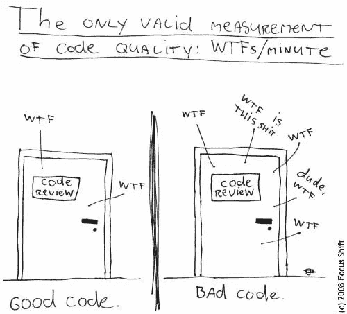
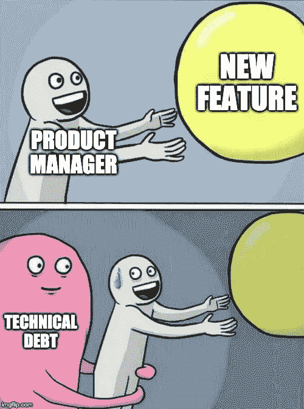

# 如何在快速发货的同时保证代码质量

> 原文：<https://medium.com/geekculture/how-to-maintain-a-healthy-codebase-while-shipping-fast-3b548baa10b2?source=collection_archive---------26----------------------->

我们习惯于认为你不能快速交付并维护一个健康的代码库。但这真的是一种交换吗？

我在构建 Stepsize 时最大的特权之一就是从数百个世界上最好的工程团队那里听到他们如何在保持健康代码库的同时发布软件。

没错，这些团队走得更快，因为他们恰当地管理了技术债务。我们如此习惯于质量与成本的权衡，以至于这种说法听起来像是谎言——你不可能既快又保持健康的代码库。

马丁·福勒在他的文章《T2》中很好地驳斥了这一观点，高质量的软件值这个价吗？’。剧透:

> ***高质量的软件实际上生产起来更便宜。***

我将在这篇文章中讲述的经验是从我采访的 300 多名软件工程师几个世纪的经验中总结出来的。

# 何必呢？

正如 Adam Tornhill 和我最近在我们的[网上研讨会](https://www.stepsize.com/blog/ask-me-anything-technical-debt)中讨论的那样，软件已经很好地、真正地吃掉了世界。听着，如果你在这里，这可能对你来说是老生常谈。在这种情况下，是因为这是真的。环顾四周，你能说出一个不需要某种形式的软件干预就能生产、购买或交付给你的物品吗？

软件公司的生死取决于其软件的质量和交付速度。

Stripe 发现“工程师花 33%的时间处理技术债务”。Gartner 发现，管理技术债务的公司比没有管理技术债务的公司多出货 50%。这些数据看起来有点枯燥，但我们凭直觉知道它们是真实的。有多少次我们估计一个特性会在一个 sprint 中交付，结果却用了两个？现在，花一点时间来推断和思考这将在一年、两年或整个生命周期内对你的公司产生的影响。

管理技术债得当的**公司简单赢了还不清楚吗？**

# 实现这些结果的简单框架

在谷歌上搜索“技术债务类型”,你会发现大量作者撰写的关于代码债务、设计债务、架构债务、流程债务、基础设施债务的文章——这种债务那种债务。

这些文章是有帮助的，因为它们可以训练你在遇到技术债务时识别它，但它们不会帮助你决定如何处理每一笔债务，更不用说如何作为一家公司管理技术债务了。

唯一重要的是你面对的是小额、中型还是大额债务。

# 小额债务的流程

这是一种技术债务，只要工程师在代码中发现它，就可以立即处理——快速重构或变量重命名。工程师不需要任何人的批准来做这件事，或者为它创建一个优先处理的标签。应用鲍勃叔叔创造的童子军规则只是他们工作的一部分:

> 总是让代码比你发现的更好。

这是我采访过的每家科技债务得到控制的软件公司的赌注表。它主要是由工程文化驱动的，在 PRs 或 linters 中得到执行，并且人们理解，当每个个体贡献者遇到小块债务时，处理它们是他们的责任。

# 中型债务的流程

我采访过的优秀员工强调持续解决技术债务的重要性，而不是在大项目中解决。

> 还清技术债是一个过程，不是一个项目。

您不希望每隔三到五年就需要停止所有特性开发来重写整个应用程序。

这就是为什么这些团队**将每个 sprint** 的 10-30%用于解决技术债务的维护工作。我把作为这一过程的一部分浮出水面并得到解决的科技债务称为中等规模债务。

要确定你的 sprint 分配给技术债务的比例，只需找到你要用特性工作修改的代码库部分和你最糟糕的技术债务所在的代码库部分之间的重叠部分。然后，您可以确定技术债务工作的范围，并相应地分配资源。一些团队甚至扩大了他们特色工作的范围，包括相关的[技术债务清理](https://www.stepsize.com/blog/how-to-stop-wasting-engineering-time-on-technical-debt)。

要做到这一点，个人贡献者需要随时跟踪中等规模的债务。然后，**团队领导的**的责任是优先处理这份技术债务清单，并在 sprint 规划之前与**产品经理**进行讨论，以便有效地分配工程资源。

# 大额债务的流程

偶尔，你的团队会意识到，他们遇到的一些中等规模的债务实际上是由于更大的债务。例如，他们可能意识到前端代码性能低下的原因是因为他们应该使用不同的框架来完成工作。

如果置之不理，这些巨额债务可能会引发巨大的问题，而且像所有的科技债务一样，随着时间的推移，情况会变得更糟。

我采访过的最好的公司都有每月或每季度的技术规划会议，所有的工程和产品领导都参加。根据公司的规模，**的员工工程师、首席工程师和/或工程经理**负责汇总技术提案，为每一笔大额债务列出问题、解决方案和商业案例。然后，工程和产品领导会对这些进行审核，优先考虑的项目会添加到路线图中。

# 如何实现这一点

为了能够运行这一过程，**你需要了解你的科技债务。**这些是工程团队管理技术债务最常用的工具:

*   **文档**

许多团队使用 wiki 页面、Trello 板或 [Excel 电子表格](https://stepsize.hubspotpagebuilder.com/free-spreadsheet-to-manage-technical-debt)来记录技术债务问题。这样的文档有助于跨团队带来技术债务的可见性。

*   **项目管理工具**

项目管理工具中的积压是所有组织中使用最多的工具，特别是吉拉、汉软和 Excel。

致力于技术债务问题是一种在你的代码库中编目和记录债务的方法。不幸的是，虽然聊胜于无，但这种积压可能很难维护，因为工程师会积累大量的重构数据，直到他们停止跟踪这些数据，因为他们注意到这些数据经常被淹没在噪音中或根本没有被优先考虑。

*   **静态分析仪**

SonarQube、SonarGraph、Klockwork 等工具用于分析源代码，寻找技术债务。这些工具使用定量数据来帮助开发人员识别代码库中可能存在技术债务的热点。它们的局限性之一是，它们不会帮助你识别跨越你的代码库的多个部分的中型到大型的债务，也不会为你提供真正理解每一个债务以及如何区分优先级并最终解决它所必需的背景。

*   **技术债务管理**

这是一种新的工具类别，专门用于填补上述其他工具没有解决的空白。我们已经建立了一个免费的 [Stepsize](https://www.stepsize.com/) 工具，帮助工程师可以直接从他们的工作流程(代码编辑器、拉请求、Slack)中跟踪债务，这样你就可以看到你的债务。

# 关键外卖

如果你是一个从事年轻代码库工作的小型工程师团队，你可以从小处着手。应用[男孩/女孩童子军规则](https://www.stepsize.com/blog/how-to-be-an-effective-boy-girl-scout-engineer)，采用适当的代码质量和测试覆盖工具，并定期清理产品路线图中特性的债务。

如果你是一个较大的组织，希望在快速交付的同时确保代码质量，那么使用技术管理工具将是你的正确选择。