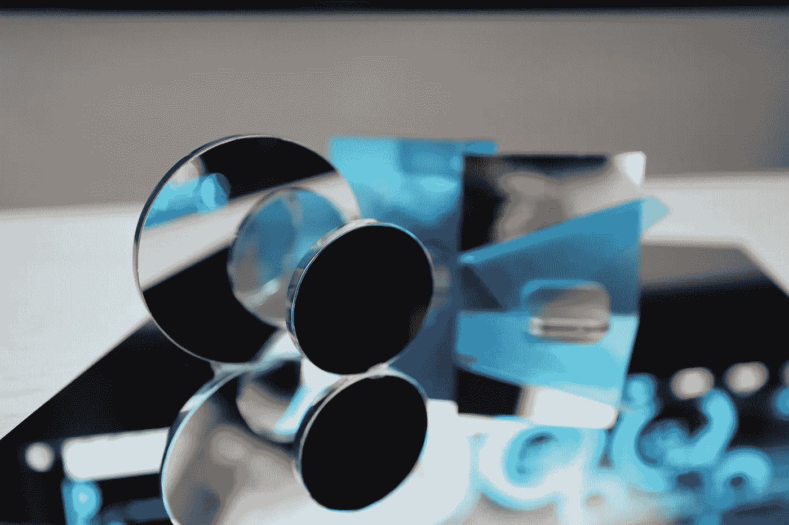
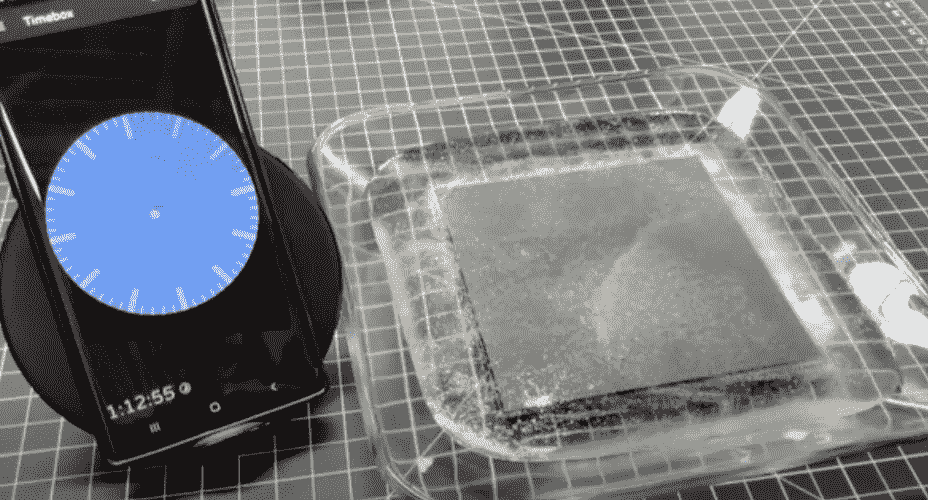
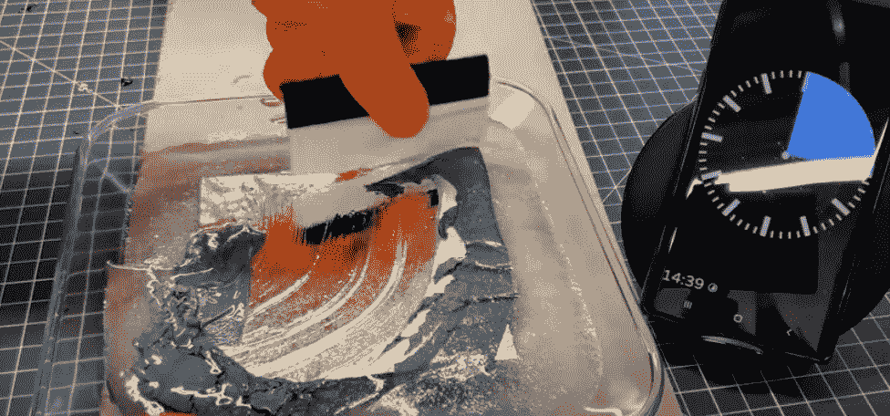
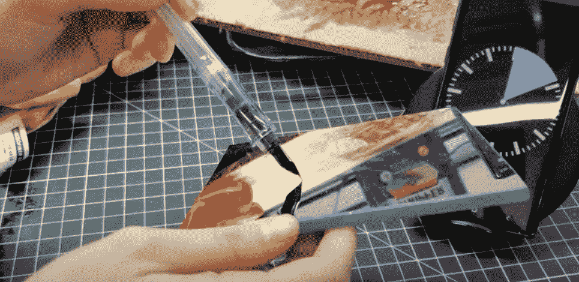

# 如何制作正面镜子(快速简单的技巧)

> 原文：<https://medium.com/geekculture/how-to-make-a-front-surface-mirror-quick-easy-techniques-c1ba3ecf6347?source=collection_archive---------6----------------------->

## 第一面镜子 DIY

## 什么是前表面镜？

“前”表面镜与“第一”表面镜完全相同。这两个术语可以互换使用。它是一面正面有光学涂层的镜子，而不是玻璃的背面。标准镜子上的涂层会产生双重反射。前表面反射镜在正面具有涂层，但在相反侧也具有标准反射镜。

非镜面涂层面类似于标准镜面。在这一边，你可以看到一个轻微的倒影。另一面是镜面涂层面——这就是你想要正面镜子的全部原因！正面的镜面涂层消除了双反射效应。从而产生在工程和科学应用中常见的精确反射。

## 怎么做正面镜？

有多种方法可以制作前表面反射镜。最常见的 DIY 方式就是改装一个标准的镜子！

修改标准镜子比听起来容易！以下是您需要的内容:

*   涂料稀释剂
*   橡胶手套
*   容器或箱子
*   标准镜子

标准镜子在镜子上有一个背衬，可以取下以显示镜子涂层。它是用油漆稀释剂清除的！

## 优势:

这种方法非常便宜，是一个很好的 DIY 项目。这也是一个快速的过程，所以速度是一个很高的优势，如果你需要一个前表面镜快！

## 缺点:

最终结果不是光学级。当你从标准镜上取下背衬时，涂层会氧化。因此，它不是长期项目或安装的理想选择。如果你需要高质量的正面镜子:firstsurfacemirrors.com 有。或者，出售前/第一表面镜的玻璃制造商。

## 你为什么想要一个前表面镜？

前表面镜子在镜子上有涂层，提供真实的反射！没有重影！这是一个光学反射镜，提供了卓越的工程精度。还进一步增强了对可见光的反射！这对摄影和投影来说非常好。

前表面镜在制造过程中有质量控制。这确保了无缺陷、无失真的反射。

## 前表面镜应用:

正面镜子有很多用途！拥有准确的反射对于科学应用、产品、摄影等是至关重要的！

例如:万花筒、条形码扫描仪、艺术装置、双筒镜支架、演讲提词器等等！

另一个优点是它比标准的普通镜子反射性更强。

一面普通的镜子有 85%的反射率。而前表面反射镜的反射率约为 94%或更高。

这些镜子正是 DSLR 照相机、复印机、扫描仪和其他类似设备中所见到的那种类型。

当你去杂货店看条形码扫描仪扫描时，这其实很有趣。睁大眼睛寻找第一面镜子！

*   飞行模拟器，潜望镜
*   广播，摄影，投影。
*   光学、天文学、物理学、激光
*   条形码扫描仪
*   好莱坞特效
*   高速摄影
*   万花筒
*   眼科眼睛测试，牙科镜
*   度量衡学
*   背投视频
*   军事训练模拟器，潜望镜
*   [产品摄影](https://www.twowaymirrors.com/first-surface-mirror-photography/)
*   [相机 Lucida](https://www.twowaymirrors.com/camera-lucida/)

如何制作正面镜子:

1.  将标准镜子背面朝上放在玻璃碗中。

2.然后，将疼痛稀释剂倒在上面，直到镜子完全被覆盖。

3.等一小时十五分钟。

4.然后，用橡胶滚轴工具移除背衬。

用不含氨的玻璃清洁剂抛光玻璃，你将拥有一面 DIY 的前表面镜子！也被称为第一表面镜！

