# 如何制作镜子电视

> 原文：<https://medium.com/geekculture/how-to-make-a-mirror-tv-d701adb498da?source=collection_archive---------0----------------------->

## 镜子电视为任何房间增添了奢华感。

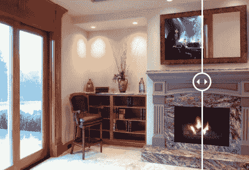

你有没有想过，如果你能创造一个镜子电视来增加 ***豪华*** 的感觉到你的家，而没有高昂的成本？

现在你可以了！制造一台隐藏的电视实际上比听起来容易。你只需要一个框架、玻璃、电视、壁挂支架和 Z 形条！

今天，我将向大家展示如何制作镜子电视(一步一步来)。

事实上，大多数镜像电视公司不希望我告诉你这些。

打造你自己的隐藏电视简直难以置信的简单*。*

## *触摸技术*

*很多人会问，“我该如何添加触摸技术”和“为什么不直接使用 shadowbox 框架？”这其实并不难，所以这里有一个简短的视频展示你如何做到这两点:*

## *视频教程*

*这里有一个完整的如何制作镜子电视的教程！*

## *工作原理:*

**

*打造一台镜面电视非常简单！你只需要三个组件:显示器、框架和电介质镜。*

*电介质镜是一种具有高透明效果的玻璃。你可以透过玻璃看到没有颜色失真。当您将电视放在玻璃后面时，您可以毫无问题地观看图像。*

*如果你想学习如何做木工，制作一台镜子电视是一个完美的 DIY 项目。最终，你会得到一件令人惊艳的高科技家居装饰品。*

*它是你家的中心装饰品，也是功能性艺术。摆脱那个塞满你客厅的笨重的电视黑洞！*

*与您的客人一起欣赏您最喜爱的节目和电影，没有色彩失真！*

## *零件和工具清单*

*   *[介质镜](https://www.twowaymirrors.com/tvmirror/)*
*   *框架棒*
*   *[平板电视](https://amzn.to/2Hr1j8l)*
*   *[红外中继器](https://amzn.to/2vYIAKA)*
*   *路由表*
*   *台式锯*
*   *剁锯*
*   *[#6 1/2″螺丝](https://amzn.to/2DWZVbe)*
*   *[橡胶垫片](https://amzn.to/2Hblw1D)*
*   *[Z 形杆吊架](https://amzn.to/2Yed8Ec)*
*   *[木胶](https://amzn.to/2PXrINj)*
*   *[异丙醇](https://amzn.to/2YkvGT9)*
*   *[长夹钳](https://amzn.to/2LyFw2w)*

## *专业建议 1:选择最好的电视*

*当你查看最新最棒的电视型号时，最重要的部分是电视的厚度。你应该选择一台薄的电视机，这样它就不会从墙上突出来。*

*三星最新的是 QLED 电视。它们超亮超薄，让整个过程更加简单！*

*例如，以下是本教程中使用的 Q90T 系列的电视尺寸:*

*   *43 寸三星 Q60T — 38.2 寸 x 22.2 寸 x **2.3 寸***
*   *49 寸三星 Q80T — 44.3 寸 x 25.6 寸 x **2.3 寸***
*   *55 寸三星 Q90T — 48.7 寸 x 28.1 寸 x **1.4 寸***
*   *58 寸三星 Q90T — 51.2 寸 x 29.8 寸 x **1.4 寸***
*   *65 寸三星 Q90T — 57.4 寸 x 33 寸 x **1.4 寸***
*   *75 寸三星 Q90T — 66.3 寸 x 38 寸 x **1.4 寸***

## *专业建议 2:选择合适的镜子*

*镜子是最重要的部分！你不能有任何一面标准的镜子，否则这个项目就不会成功。为了创造一个隐藏的电视，你需要一个电介质分光镜。*

*这面镜子给你一种消失的效果，所以当电视关闭时，它隐藏在玻璃后面，看起来就像墙上的一面标准镜子。电视打开后，可以直接看透，没有色彩失真！视觉效果非常清晰！*

*许多人犯了“便宜”的错误，试图用窗膜或双向镜来制造电视。*

*直到后来，他们才意识到实际上看电视几乎是不可能的。*

***我在这个项目中使用了** [**介质镜**](https://www.twowaymirrors.com/tvmirror/) **，因为它能给我最好的显示质量。***

*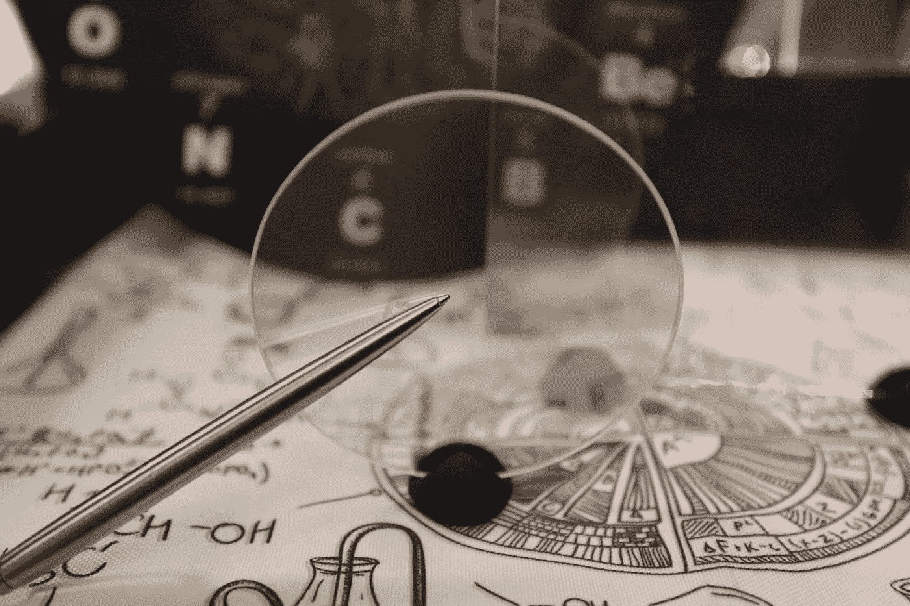*

## *推荐的镜子尺寸*

*按照本指南，您需要了解电视的整体尺寸。订购尺寸相同的镜子。例如，在 40 英寸的 Samsung UN40NU7100 系列上，电视尺寸为 36 英寸 x 20.9 英寸 x 2.3 英寸，因此在这种情况下，您将订购 36 英寸 x 20.9 英寸厚的 1/8 英寸电介质镜。*

## *专业建议 3:选择你的相框*

*按照本教程，您将需要使用宽度为 2.5 英寸或更大的框架模塑件，并具有足够的高度，以便您可以添加额外的槽口来创造隐藏电视挡板的空间。*

*以下是与本教程配合使用的框架成型轮廓的示例，以及它被布线后的外观。*

*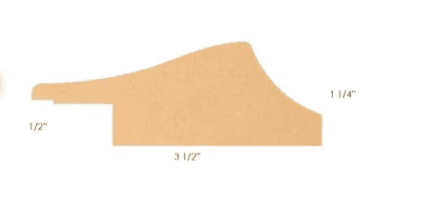*

## *步骤#1:创建框架的前面*

*第一步是切割您的框架造型，并将其布线，以便电视边框被框架覆盖，并且仍有放置玻璃的空间。*

*要做到这一点，您需要测量电视四个侧面的电视边框尺寸，以及完成后的整体尺寸。*

*不要担心！我有大量的图片、gif 和解释部分来帮助你开始。*

## *第 1.1 步:边框测量*

*测量电视的边框。创建如下图很有帮助，这样可以确保在切割框架材料和布线之前，你已经准备好了所有的材料。*

*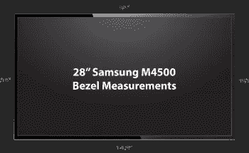*

*布线出框架将允许您使用介质镜。对于框架没有覆盖电视边框的较大镜子安装(或者如果您希望跳过这一步)，您将需要切换到玻璃智能镜子，以将边框完全隐藏在镜子后面。*

*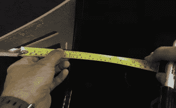*

## *第 1.2 步:整体电视尺寸测量*

*测量并切割框架棒，使其比带框镜子电视的整体尺寸大大约四英寸。*

*要在框架镜面电视建成之前找到它的整体尺寸，您可以使用 [Display Wars](http://www.displaywars.com/) 工具，或者简单地测量没有边框的屏幕。*

*取实际屏幕尺寸(27.5 英寸，此型号电视对角线尺寸)并将其插入。这样我就得到了 23.97 英寸 x 13.48 英寸。然后将框架宽度(乘以 2)加到两个尺寸上。*

*Yakisugi 框架的宽度为 2.5 英寸，因此框架的整体尺寸应为 28.97 英寸宽 x 18.48 英寸高*

***在我的例子中，我将框架棒切割成 32.97 英寸(数量 4)和 22.48 英寸(数量 4)。** 迷你专家提示:将框架材料剪成两倍，你将需要另外四片来制作背部。*

## *步骤#1.3:路由帧*

*切完框架木条后，抓住两根长木条和两根短木条，这就是你的框架镜电视的正面。*

*你需要在台锯上切割框架的内侧，以适合电视的边框。这就是电视边框测量派上用场的地方。我建议利用[步骤 1.1](https://www.twowaymirrors.com/smart-mirror-tv/#step11) 来测量所有四边。有些电视型号的边框厚度各不相同。*

*不要忘记在前面留出一点空间来放置玻璃杯。*

**

*你想隐藏电视的边框。您可以将帧发送到测量。*

*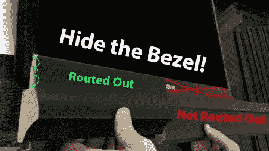*

## *步骤 1.4:切 45 度角*

*切割你的 45 度角，为组装框架做准备。*

*专家提示:用一把[细齿锯片](https://amzn.to/2HlpLb0) (100 齿，12″)来获得 45 度切割的最佳效果。*

## *步骤#1.5 粘合框架正面*

*首先把一根长棍子和一根短棍子粘在一起。胶水变干后，用长夹子将两根架杆夹在一起。*

*一旦你做好了两个角，把它们放在一起，用长夹子夹住。*

*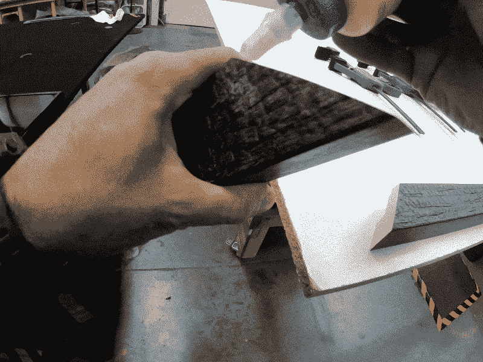*

## *步骤#2:框架重建*

*一旦框架的前面完成，是时候创建后面的构建。*

***这样您就可以从侧面完全隐藏电视。***

*如果你使用的是平板框架，你可以把它放在桌子上，或者用标准的电视壁挂支架把它挂在墙上。神奇的是，经过这一步，电视完全从侧面隐藏起来了！看一看。*

*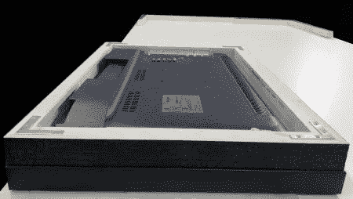*

**Framed Mirror TV with Back Build**

## *第 2.1 步:测量电视过剩*

*要为镜子电视打造背部造型，您需要将电视放在框架内。看看电视有多厚——伸出来多少？这会给你一个基础，你需要有多厚的背部来覆盖电视的侧面。*

*对于我的体型，你可以看到它从背部伸出大约 1-7/8 英寸，所以我让我的背部有 2 英寸厚。*

*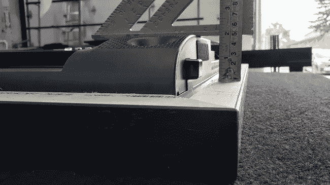*

**Measure the Back of the TV**

## *步骤#2.2:修整框架材料，用于背面构建*

*从这里开始，我有两个选择来设计背部造型。在本教程中，我选择面向框架的正面，这样你就可以看到框架侧面的烧焦的木头风格。*

*你也可以把相框叠起来，让它们背对背。这意味着烧过的木材面向背面，侧面与更多的木材饰面相匹配，而侧面的纹理较少。如果我这样做，框架高度是 1.5 英寸，所以我只需要修剪掉 1 英寸。*

*由于框架模制宽度为 2.5 英寸，我从槽口侧修剪掉 0.5 英寸，并保持平坦的一侧，因此最终我得到了我想要的 2 英寸厚的背部，框架的“前部”现在位于侧面，沿着框架的侧面看起来像木炭。*

*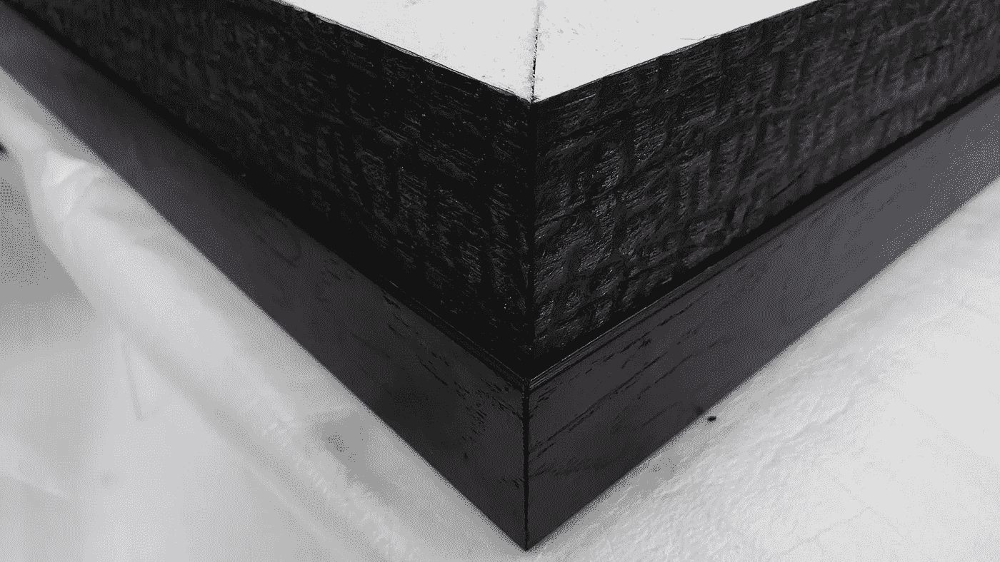*

*使用[步骤#1](https://www.twowaymirrors.com/smart-mirror-tv/#step1) 中相同的尺寸，再切 4 块相同长度的木条(你可能已经在步骤 1 中完成了)。然后把它们切成你想要的厚度&开始把它们粘到框架的背面。*

*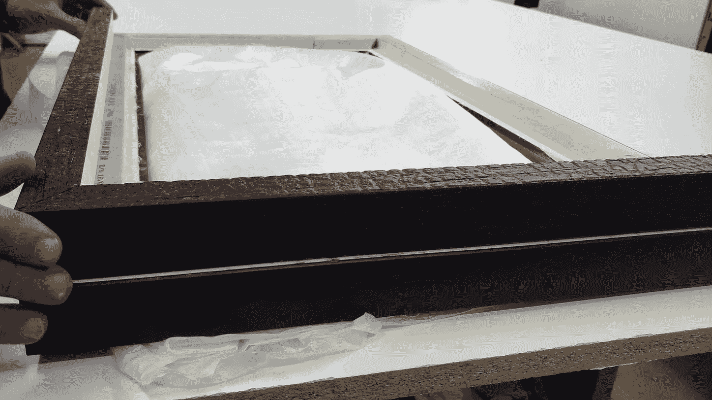*

**Take Your TV Out of the Frame Before Gluing the Back Build**

## *第 2.3 步:粘合背面构件*

*粘合背部构件。使用夹子将框架固定到位，以实现牢固的粘合。*

*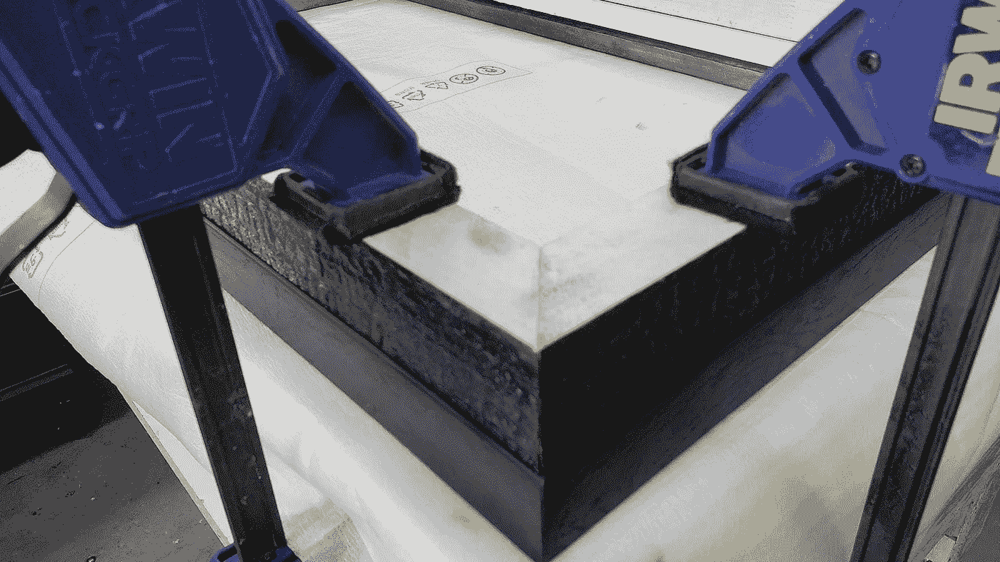*

## *第三步:连接电视*

*将电视放回框架中。为了固定电视，我使用了 Z 形挂钩。这很好，因为你不必切入电视，所以标准保修仍然是机智的。*

## *第 3.1 步:用铝 Z 形杆固定*

*我建议订购 Z 形杆，使其几乎与电视机四个侧面的长度一样长，以达到最佳效果。如果需要的话，你也可以在每边多使用一些小的。*

*在本教程中，我实际上使用了角撑代替 Z 形条，因为电视更厚。它因版本不同而不同。*

*您可以添加额外的角支撑来加强您的构建的完整性。如果你把下面所有推荐的项目都加入到这个列表中，你将永远不会失败！*

*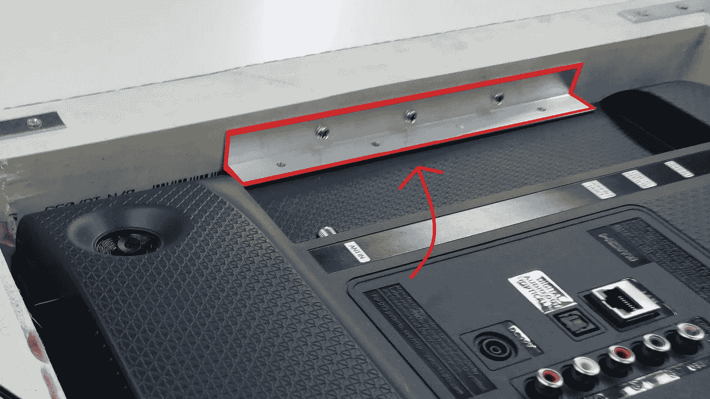*

## *第四步:红外系统*

*将红外系统连接到电视，安装好后将眼睛放在框架下方。这样，即使传感器被框架遮住，遥控器也能与电视配合工作。有关红外中继器的更多详细信息，请查看我们的[红外中继器指南](https://www.twowaymirrors.com/ir-repeater-guide/)。*

## *第五步:打开电视并调整设置*

*插上电源，打开电视看看效果如何！您可能需要对 Z 形挂钩进行一些微调，以确保电视在镜子后面居中。*

*在你打开电视检查你的工作后，你也可以进入并最大化你的设置。关闭“经济模式”,确保电视亮度和背光一直打开，以获得最佳效果。*

*-最大化亮度*

*-最大化背光*

*-关闭节能模式*

**

## *额外步骤:安装镜面电视*

*您可以使用标准电视壁挂支架安装电视。这可能是一个超平面安装，倾斜，铰接，无论你喜欢什么！为了获得最无缝的外观，我建议买一个薄的壁挂支架，这样它就不会从墙上伸出太多。*

*以下是我推荐使用的壁挂支架:*

*   *[适用于 10 寸至 24 寸电视机(平板)](https://amzn.to/2YxFRE2)*
*   *[适用于 40 寸至 80 寸电视机(超薄平板)](https://amzn.to/2JL0rwS)*
*   *[用于 32 寸至 50 寸电视机(倾斜)](https://amzn.to/2YxHB02)*
*   *[适用于 40 英寸至 70 英寸的电视机(倾斜)](https://amzn.to/2YylfvC)*

*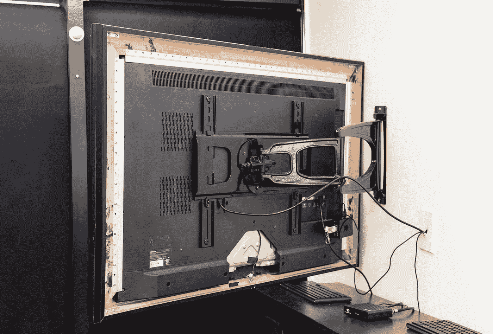*

**根据 Twowaymirrors.com 上的原始帖子修改。**