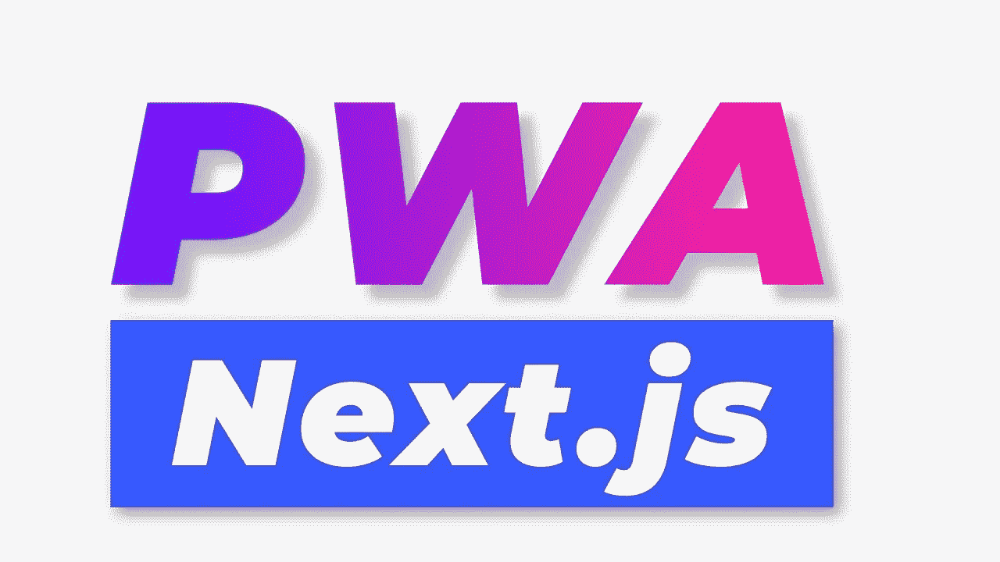
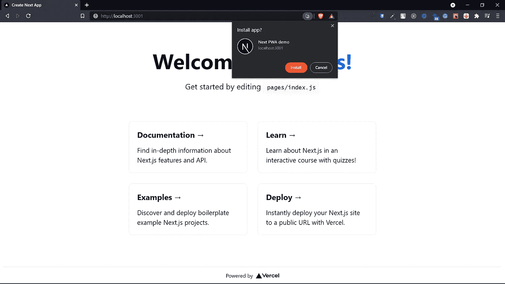

# 如何把一个 Next.js app 做成 PWA

> 原文：<https://medium.com/geekculture/how-to-make-a-next-js-app-a-pwa-a5e2b13da548?source=collection_archive---------1----------------------->

今天我们来看看如何让 Next.js 应用成为一个进步的网络应用



# 创建下一个应用程序

```
npx create-next-app next-pwa-demo
```

我要把默认的 Next.js 模板转换成 PWA，你可以转换自己的 web app。

## 安装所需的依赖项

```
npm i next-pwa # npm
yarn add next-pwa # yarn
```

## 获取应用程序的图标

我们需要一个 512x512 和一个 192x192 的图标。在公共目录中添加这两个图标。

## 创建清单

在公共目录中创建一个文件名 manifest.json。您可以使用清单创建器，但是我已经创建了我的清单，所以您也可以复制它。

## Creating _document.js 页面

我们现在将在 pages 文件夹中创建一个 _document.js 文件。

现在我们将把这段代码添加到文件中

## 在 next.config.js 中完成 PWA

我们现在将在目录的根目录下创建一个 next.config.js 文件。

这将创建我们的渐进式网络应用程序。

## 如何检查它是否是 PWA

在标签的左上角，您可以看到一个安装按钮。



现在，如果您点击“安装”,将会安装并弹出一个应用程序。

祝贺🥳！您已经成功创建了您的第一个渐进式网络应用程序(PWA) ✌

有用的链接-

[Github 库](https://github.com/avneesh0612/next-pwa-demo)

[NextJS docs](https://nextjs.org/docs)

[PWA 文档](https://developer.mozilla.org/en-US/docs/Web/Progressive_web_apps)

[所有社交](https://avneesh-links.vercel.app/)