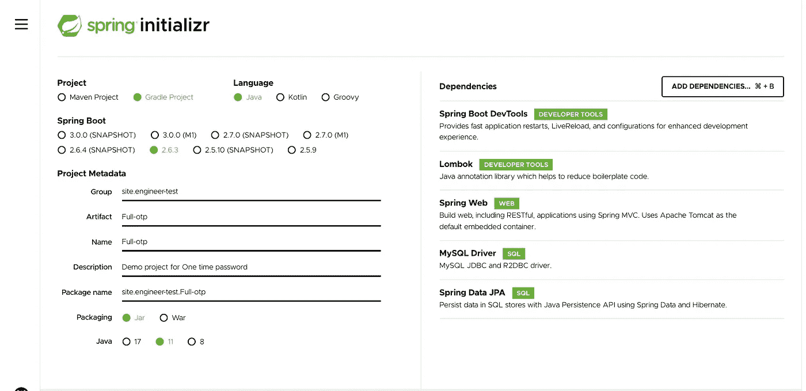
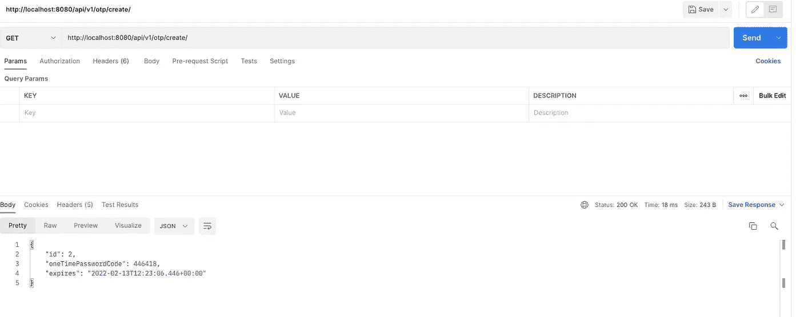

# 如何用 Spring Boot 和 MySQL 数据库制作一次性密码服务？

> 原文：<https://medium.com/geekculture/how-to-make-a-one-time-password-service-with-spring-boot-and-mysql-database-74ba8729e572?source=collection_archive---------3----------------------->


Photo by [Boitumelo Phetla](https://unsplash.com/photos/0DJHJcpwN9Q)

在[之前的文章](https://itnext.io/how-to-make-a-simple-one-time-password-service-with-spring-boot-ebe640a7be7b)中，你了解了 Spring Boot 的基本情况。如何设置项目、添加项目依赖项、启动第一个 REST API 服务，以及如何创建简单的静态一次性密码服务。

在本文中，我想举一个在 Spring Boot 上创建一个成熟的动态一次性密码服务的例子。

W **你将需要帽子。**

如上所述，我们将创建一个项目，使用 Spring Boot、Gradle 和 MySQL 数据库来模拟 OTP 服务的操作。因此，对于我们的项目，我们必须具备以下工具和技术:

*   Spring Boot 版本 2.6.3+
*   Java11+
*   Gradle 7.2+
*   MySQL 8 +
*   你选择的任何 IDE。(我更喜欢 IntelliJ IDEA)

使用 Spring Boot 创建任何项目都必须从以下几点开始:

[https://start . spring . io](https://start.spring.io/)**/**

这个网站是由 Spring Boot 开发人员创建的，旨在以创纪录的速度创建基于 Spring Boot 的项目。

我建议您在项目创建阶段添加几个依赖项:

*   Spring Boot 开发工具。Spring Boot 提供了一个叫做 Spring Boot 开发工具的模块。DevTools 代表开发者工具。该模块旨在尝试在使用 Spring Boot 应用程序的同时缩短开发时间。Spring Boot DevTools 获取更改并重启应用程序。
*   **弹簧网**。这个组包括 Web、Web-Servlet、Web-Struts 和 Web-Portlet。这些模块为创建 web 应用程序提供支持。
*   **MySQL 驱动。** MySQL JDBC 和 R2DBC 驱动程序。
*   **春季数据 JPA。**使用 Spring 数据和 Hibernate，通过 Java 持久性 API 将数据持久存储在 SQL 存储中。
*   **龙目岛**Project Lombok 是一个 java 库，它可以自动插入到您的编辑器中并构建工具，为您的 java 增添趣味。不要再编写另一个 getter 或 equals 方法，有了一个注释，你的类就有了一个全功能的构建器，自动记录变量，等等。
*   **Spring Boot 执行器。**支持内置(或自定义)端点，让您能够监控和管理您的应用——如应用健康、指标、会话等。



为了正确使用 Lombok 库和插件，您需要在 **build.gradle** 中添加四个依赖项，如果您使用的是 **Gradle** :

```
compileOnly **'org.projectlombok:lombok:1.18.16'** annotationProcessor **'org.projectlombok:lombok:1.18.16'** testCompileOnly **'org.projectlombok:lombok:1.18.16'** testAnnotationProcessor **'org.projectlombok:lombok:1.18.16'**
```

或者 **pom.xml** 如果你用的是 **Maven** :

```
<dependencies>
	<dependency>
		<groupId>org.projectlombok</groupId>
		<artifactId>lombok</artifactId>
		<version>1.18.16</version>
		<scope>provided</scope>
	</dependency>
</dependencies>
```

要设置 Lombok 插件，您需要:

在 Windows 上使用 IDE 内置插件系统:

**文件>设置>插件>浏览存储库……>搜索“Lombok”>安装插件**

在 MacOs 上使用 IDE 内置插件系统:

**首选项>设置>插件>浏览存储库……>搜索“lombok”>安装插件**

手动:

**下载最新发布的**[](https://github.com/mplushnikov/lombok-intellij-plugin/releases/latest)****并使用首选项>插件>从磁盘安装插件…并在需要重启 IDE 后手动安装。****

****警告！确保满足这两个要求:****

**在您的项目中:单击首选项->构建、执行、部署->编译器、注释处理器。单击启用批注处理**

**之后，您可能需要通过 Build -> Rebuild Project 对项目进行完整的重新构建。**

**实体。**

**JPA 中的实体只不过是表示可以持久存储在数据库中的数据的 POJOs。实体表示存储在数据库中的表。实体的每个实例代表表中的一行。**

**让我们创建一个新类 **OneTimePassword** 并填入以下代码:**

**在这个例子中，我使用 Lombok 注释。**

**您可以向任何字段添加 **@Getter** 和 **@Setter** 注释，以便 Lombok 自动生成获取和设置值的方法。
获取默认值的方法只是返回该字段的值，如果该字段的名称为 Foo，则该字段的名称为 get Foo(如果该字段属于逻辑类型，则为 isFoo)。如果字段的名称为 Foo，则设置新默认值的方法的名称为 setFoo，返回 void，并且有一个与字段本身类型相同的参数。此方法只是设置字段中的值。Lombok 是一个很棒的库，它允许你缩短你的代码，而不是写更多的**样板代码**。**

****@NoArgsConstructor** 将生成一个不带参数的构造函数。**

**@RequiredArgsConstructor 为每个需要特殊处理的字段生成一个带 1 个参数的构造函数。所有未初始化的 final 字段都有一个参数，标记为 **@NonNull** 的字段也是如此，它们在声明时没有初始化。对于那些标有 **@NonNull、**的字段，也会生成一个显式的空校验。**

**此外，打开 **application.properties** 并添加数据库属性:**

```
**spring.jpa.hibernate.ddl-auto**=**update
spring.datasource.url**=**jdbc:mysql://localhost:3306/OneTimePasswordService?createDatabaseIfNotExist=true
spring.datasource.username**= **spring.datasource.password**= **spring.datasource.platform**=**mysql
spring.datasource.initialization-mode**=**always**
```

****createDatabaseIfNotExist = true—**如果我们需要创建一个数据库，只要它没有被检测到，就使用这个参数。**

**现在，您可以运行项目并确保在数据库中自动创建该表。**

****

**居居**居。****

**储存库作为一个层直接执行所有数据库操作。现在让我们制作 OneTimePasswordRepository 接口，并填写以下代码:**

**帮助者。**

**最好将与生成新的一次性密码相关的所有方法放在一个单独的类中，即所谓的 helper:**

**服务。**

**该服务在连接数据库层和控制器的层上工作。现在，我们创建一次性密码服务接口，如下所示:**

**在变量**中 private final Long expire interval = 5L * 60 * 1000。**我们存储到期变量，默认为 5 分钟。**

**在我们用实体描述服务为我们的 **OneTimePassword** 创建了主类之后。**OneTimePasswordRepository**是 JPA 用来与实体交互的接口。 **OneTimePasswordService** 存储了我们服务的主要业务逻辑。我们可以创建一个新的类**控制器**并用 **getOneTimePassword** 方法调用我们的类。与此类似:**

****@ request mapping**—[@ request mapping](http://twitter.com/RequestMapping)注释旨在为控制器的方法设置地址，通过这些地址，这些方法将对客户端可用。在我们的例子中是“ **/api/v1/otp”。****

****@GetMapping** —该注释表示需要处理 get 请求。**

**在我们的例子中，指定您需要在**“create”处监听 get 请求。****

**因此，一次性密码生成服务的完整路径如下所示:**

****http://localhost:8080/API/v1/OTP/create/****

**我们得到的回应是:**

**如您所见，他们收到了一次性密码。它在创建后与日期标签一起被写入数据库。**

****

**每次创建新的端点访问权限时，我们的服务都会生成一个新的一次性密码并创建一个日期标签:**

****

**S弹簧致动器。**

**在开发了服务并将其部署到生产环境中之后，监控其性能是非常重要的。对于任务关键型应用程序来说尤其如此，例如银行系统，其中应用程序故障会直接影响业务。**

**在 Spring Actuator 之前，需要编写代码来检查服务的健康状况，但是使用 Spring Actuator 就不需要编写代码了。Spring Actuator 提供了几个现成的端点，可用于监控应用程序。**

**若要启用 Spring Boot 执行器终结点，请将以下行添加到 application.properties 文件中:**

```
**management.server.port**=**8081
management.endpoints.web.exposure.include**=***
management.endpoint.shutdown.enabled**=**true**
```

**在第一行中，我们指定了与执行器交互的端口。在第二行，我们指出需要包含所有端点。第三行负责禁用服务。**

*   **[http://localhost:8081/actuator](http://localhost:8081/actuator)**
*   **[http://localhost:8081/actuator/health](http://localhost:8081/actuator/health)**
*   **[http://localhost:8081/actuator/info](http://localhost:8081/actuator/info)**

# **[http://localhost:8081/actuator/health](http://localhost:8081/actuator/health)**

**`{"status":"UP"}`**

**C 结束语。**

**在本文中，我们已经学会了为想要使用我们的 Spring Boot 服务的人生成一次性密码。在下一部分中，我们将把一次性密码服务与登录表单集成到前端。我们将编写一个使用登录名、密码和一次性密码来授权新用户的页面。我们还将用自动化脚本覆盖我们的 API 服务，用 Cypress 自动化脚本覆盖前端 UI 表单。**

****

**[https://test-engineer.site/](https://test-engineer.site/)**

# **作者[安东·斯米尔诺夫](https://www.linkedin.com/in/vaskocuturilo/)**