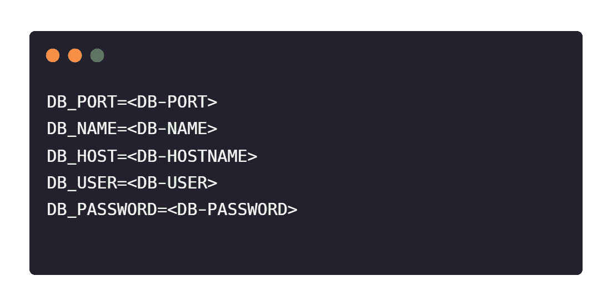
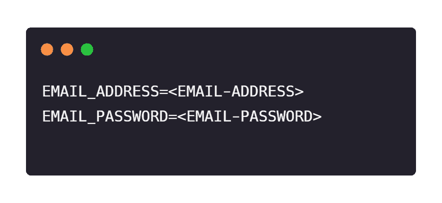
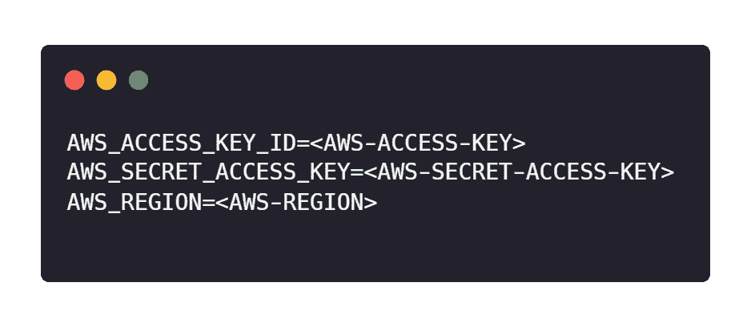
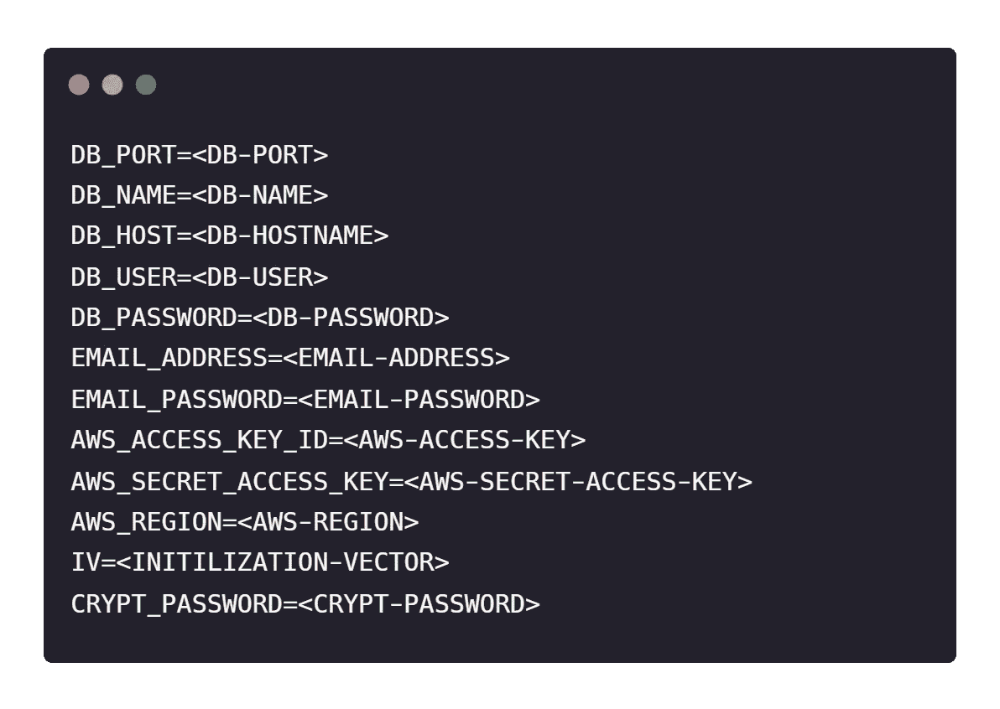
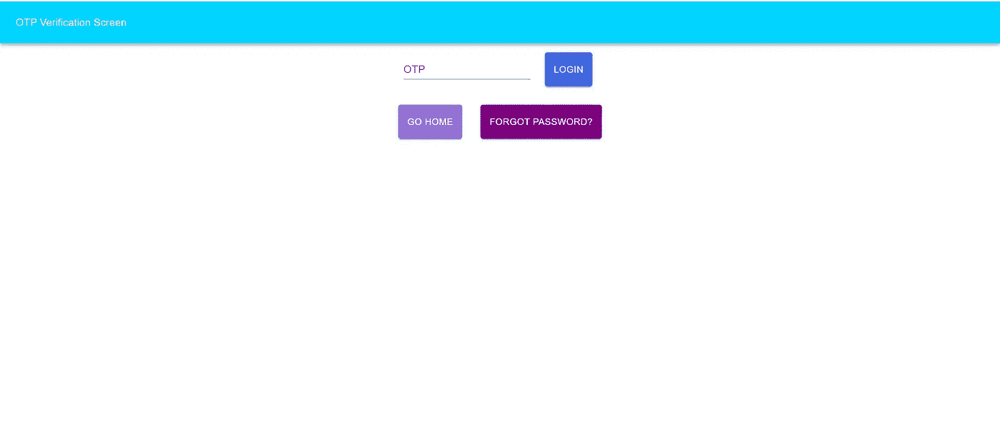

# 如何使用 NodeJs 创建可伸缩的 OTP 服务

> 原文：<https://medium.com/geekculture/how-to-make-a-scalable-otp-service-3df8300941ba?source=collection_archive---------0----------------------->

## 证明

## OTP 微服务


Photo by [NeONBRAND](https://unsplash.com/@neonbrand?utm_source=medium&utm_medium=referral) on [Unsplash](https://unsplash.com?utm_source=medium&utm_medium=referral)

## **关于 OTP**

一次性密码(OTP)系统提供了一种使用只能使用一次的唯一密码登录网络或服务的机制。

由于一次性密码仅对单次使用有效，因此它们不像静态密码那样易受攻击，并且不能被任何人(包括未经授权的人)再次使用，从而避免了 pin 码被盗的威胁。

## **传统 OTP 服务中的问题:**

在传统的 OTP 服务中，OTP 与使用它的电子邮件或电话号码一起存储在数据库中。现在，如果 OTP 服务的数据库受到攻击者的攻击，那么这种类型的 OTP 服务所服务的那些应用程序的安全性可能会受到威胁，因为攻击者可以很容易地针对数据库中的任何电子邮件或电话号码添加 OTP 条目。此外，他们可以很容易地访问许多用户的电子邮件和电话号码列表，从而使用户处于被攻击的风险中。

## **解决方案**

为了解决这个问题，OTP 可以存储在数据库中，而不需要电子邮件或电话号码。我们只需要存储 OTP、到期时间和布尔字段来标记 OTP 已验证或已使用。这样，我们可以通过在请求 OTP 时发送一个唯一的加密验证密钥来使验证成为无状态的，并将 OTP 直接发送给接收者。当我们需要验证 OTP 时，我们只需要在请求正文中包含 OTP 和验证密钥，验证密钥将被解密，如果它能够验证 OTP，则它将返回成功，否则，如果 OTP 或验证密钥被更改，则服务将在响应中返回错误。从而使服务安全且可扩展。

## 我们开始吧

让我们首先使用`npm init`初始化节点项目。

最终的文件夹结构将如下所示:

```
├───.env
├───.gitignore
├───app.js
├───package-lock.json
├───package.json
├───sequelize.js
├───middlewares
│    └───crypt.js
├───models
│    └───OTP.js
├───routes
│    ├───sendOTP_to_email.js
│    ├───sendOTP_to_phone.js
│    └───verifyOTP.js
└───templates
     ├───email
     │    ├───forget.js
     │    └───verification.js
     └───sms
          ├───forget.js
          └───verification.js
```

## 安装以下依赖项

```
npm i express cors dotenv morgan sequelize sequelize-cli pg helmet otp-generator nodemailer crypto aws-sdk nodemon
```

## package.json

package.json

让我们从创建`app.js`文件开始。

在`app.js`中，我们声明我们的 express 服务器，并声明不同功能的所有路由。

## App.js

# 模型

初始化节点应用程序后，让我们为应用程序创建模型。

**OTP 模型** 该模型将存储详细信息，如 OTP、OTP 的到期时间和一个布尔验证字段，以将 OTP 标记为已使用或已验证。

OTP Model

## 顺序连接文件

在这个文件中，我们将使用数据库凭证将数据库与我们的项目连接起来。

Sequelize Connection File

这些方言选项用于连接到托管在云上的数据库服务，因为它们要求 SSL 为真。

```
dialectOptions: {
   "ssl": {
      "require": true,
      "rejectUnauthorized": false
    }
}
```



Environment File for setting Database

# 路线

## 将 OTP 发送到电子邮件路由

在这个路径中，我们将从使用这个 OTP 服务的任何客户端获取服务请求的电子邮件和类型，并在响应中发送状态和加密的详细信息。

Send OTP to email Route

现在，让我们来理解这段代码。首先，我们使用`[otp-generator](https://www.npmjs.com/package/otp-generator)`包生成 OTP。然后将 OTP 的到期时间设置为当前时间之后的 10 分钟。然后，我们用数据库中的 OTP 模型中的 OTP 和到期时间创建 OTP 实例。

```
const otp = otpGenerator.generate(6, { alphabets: false, upperCase: false, specialChars: false });

const now = new Date();  
const expiration_time = AddMinutesToTime(now,10);    

const otp_instance = await OTP.create({    
    otp: otp,    
    expiration_time: expiration_time  
});
```

然后我们创建一个包含 OTP 细节及其`ID`的对象。然后用我们的编码器加密这个对象。这是此服务最重要的部分之一，因为我们将在解密后使用此加密对象来验证 OTP。因此，加密字符串的任何更改都会导致验证错误。

```
var details={ 
   "timestamp": now, 
   "check": email, 
   "success": true, 
   "message":"OTP sent to user", 
   "otp_id": otp_instance.id
  }const encoded= await encode(JSON.stringify(details))
```

加密令牌后，我们将检查请求的消息类型，并相应地选择模板。

```
if(type){    
  if(type=="VERIFICATION"){      
    const {message, subject_mail} = require('../Templates/Email/verification');    
    email_message=message(otp)      
    email_subject=subject_mail    
  }    
  else if(type=="FORGET"){      
    const {message, subject_mail} = require('../Templates/Email/forget');         
    email_message=message(otp)      
    email_subject=subject_mail    
  }    
  else{      
    const response={"Status":"Failure","Details":"Incorrect Type Provided"}      
    return res.status(400).send(response)     
  }  
}
```

然后，我们使用`nodemailer`将包含动态口令的电子邮件发送到所请求的电子邮件。如果邮件被发送，则响应被发送回发送请求的客户机。

你可以参考 freecodecamp 的这篇文章来了解我们是如何使用`nodemailer`的。

[](https://www.freecodecamp.org/news/use-nodemailer-to-send-emails-from-your-node-js-server/) [## 如何使用 Nodemailer 从 Node.js 服务器发送电子邮件

### Nodemailer 是一个 Node.js 模块，允许您轻松地从服务器发送电子邮件。不管你想不想…

www.freecodecamp.org](https://www.freecodecamp.org/news/use-nodemailer-to-send-emails-from-your-node-js-server/) 

Environment Settings for Nodemailer

## 将 OTP 发送到电话路由

在这个路由中，我们将从使用这个 OTP 服务的任何服务获取服务请求的电话号码和类型，并在响应中发送状态和加密的细节。

Send OTP to phone number Route

在这段代码中，我们遵循了与向电子邮件发送 OTP 相同的步骤。唯一的变化是在我们使用来自`aws-sdk`的 AWS SNS 向请求的电话号码发送 SMS 的部分。

你可以参考 AWS SDK 的文档来了解我们是如何使用 AWS SNS 的。

 [## 使用亚马逊社交网络发送短信

### AWS SDK for JavaScript version 3 (v3)是对 v2 的重写，具有一些很棒的新特性，包括模块化…

docs.aws.amazon.com](https://docs.aws.amazon.com/sdk-for-javascript/v2/developer-guide/sns-examples-sending-sms.html) 

您也可以使用任何其他短信服务，如 Twilio、Nexmo 等。



Environment Settings for AWS SNS

## 模板

在开始验证路由之前，让我们了解如何使用模板为不同类型的请求提供不同的消息。

为了将这项服务用作微服务，我为不同类型的请求创建了模板，如忘记密码、电子邮件或电话号码验证，我们可以为不同的功能添加更多模板。虽然我们可以制作不同的微服务发送电子邮件和短信，我们可以制作这些模板，但为了完成 OTP 服务的使用，我们将只在这里包括模板。

## 电子邮件模板

Email Template for Reset Password

Email Template for Email Verification

Email Template for 2FA

## 短信模板

SMS Template for Reset Password

SMS Template for Phone Number Verification

SMS Template for Login

在这些模板中，我们导出消息，并在客户端请求特定类型时使用它。

## 验证路线

在这个路径中，我们将在请求中获得三个值，即 OTP、验证密钥和一个包含电子邮件或数字的检查值。在此之后，如果 OTP 匹配了错误的请求，客户端将收到成功消息。

OTP Verification Route

现在，让我们来理解这段代码。首先，我们检查加密的对象是否被修改，如果被修改，那么客户端将收到一个错误的请求(`Error: 400`)作为响应。

```
try{    
  decoded = await decode(verification_key)  
}
catch(err) {    
  const response={"Status":"Failure", "Details":"Bad Request"}      
  return res.status(400).send(response)  
}
```

在此之后，我们检查正在验证的 OTP 是否只发送到该电子邮件或电话号码。

```
var obj= JSON.parse(decoded)  
const check_obj = obj.check    
if(check_obj!=check){    
  const response={"Status":"Failure", "Details": "OTP was not sent to this particular email or phone number"}    
  return res.status(400).send(response)   
}
```

在电子邮件或电话号码验证之后，我们检查数据库中是否有 OTP。如果它是可用的，那么我们就检查 OTP 是否已经被使用。如果没有使用，我们将验证 OTP 是否过期。如果 OTP 没有过期，我们将验证在给定的`ID`提供的 OTP 是否与数据库中的相匹配。如果所有条件都为真，则客户端会收到一个成功的响应，表明 OTP 与提供的 OTP 相匹配。如果任何条件失败，客户端将得到一个错误的请求(`Error: 400`)作为响应。

```
if(otp_instance!=null){    
  if(otp_instance.verified!=true){                  
    if (dates.compare(otp_instance.expiration_time, currentdate)==1{                                 
      if(otp===otp_instance.otp){                
        otp_instance.verified=true               
        otp_instance.save()                                
        const response={"Status":"Success", "Details":"OTP Matched", "Check": check}                
        return res.status(200).send(response)            
       }            
       else{                
         const response={"Status":"Failure","Details":"OTP NOT Matched"}                
         return res.status(400).send(response)             
       }           
     }        
     else{            
       const response={"Status":"Failure","Details":"OTP Expired"}              
       return res.status(400).send(response)         
      }    
    }    
    else{        
      const response={"Status":"Failure","Details":"OTP Already Used"}        
      return res.status(400).send(response)        
     }    
   }  
   else{      
     const response={"Status":"Failure","Details":"Bad Request"}       
     return res.status(400).send(response)  
 }
```

# 中间件

## 加密和解密中间件

现在，我们将了解编码和解码函数是如何加密和解密细节对象的。

Encryption and Decryption Middleware

在 encode 函数中，当字符串被传递时，首先，使用 password 和 salt 创建密钥(在我们的例子中是空字符串)。然后使用密钥和`IV`字符串(初始化向量)为`AES-256`算法初始化密码对象。然后，加密的部分被连接并转换为`base64`字符串，以使用`JSON`响应发送。

```
async function encode(string) {    
  var key = password_derive_bytes(password, '', 100, 32);    
  var cipher = crypto.createCipheriv('aes-256-cbc', key, ivstring);      
  var part1 = cipher.update(string, 'utf8');    
  var part2 = cipher.final();    
  const encrypted = Buffer.concat([part1, part2]).toString('base64');    
  return encrypted;
}
```

在 decode 函数中，当加密字符串被传递时，首先使用密码和 salt 创建密钥，就像 encode 函数一样。然后使用密钥和`IV`字符串为`AES-256`算法初始化解密对象(在`encode`和`decode`中应该相同)。然后，解密的部分被连接并转换成用于验证的对象。

```
async function decode(string) {    
  var key = password_derive_bytes(password, '', 100, 32);    
  var decipher = crypto.createDecipheriv('aes-256-cbc', key, ivstring);    
  var decrypted = decipher.update(string, 'base64', 'utf8');      
  decrypted += decipher.final();    
  return decrypted;
}
```



Final Environment File

除了使用定制的编码和解码函数，您还可以使用`CryptoJS`进行加密和解密，如 StackOverflow 上的解决方案所示。

[](https://stackoverflow.com/a/48689165) [## JSON 对象的 Javascript 加密

### 我有一个 JSON 对象，它是从 serializeArray 生成的，我想对它进行加密。我是应用程序…

stackoverflow.com](https://stackoverflow.com/a/48689165) 

我们现在可以轻松实现 OTP 微服务，无需将电子邮件或电话号码与 OTP 一起存储在数据库中，从而使其安全且可扩展，因为我们可以为任何类型的请求创建任意数量的模板。虽然它不是完全无状态的，但我们的州没有电子邮件或电话号码存储在我们的 OTP 服务的数据库中，这使得服务是可伸缩的和安全的。

## 你自己试试

现在，我们已经理解了代码的工作原理，我们将看到 API 的工作原理。

您可以阅读 API 端点的文档，并且可以将它们用于 postman 应用程序或任何其他项目。

> 注意:电话号码的 API 端点在此 API 中不起作用，因为未设置 AWS 凭据

 [## 节点-OTP-服务|文档

### node-OTP-Service | Documentation |它是一个以可伸缩方式实现 OTP 服务的 API。

node-otp-service.herokuapp.com](http://node-otp-service.herokuapp.com/docs) 

为了给出 OTP 服务的预览，我还为登录到我以前的应用程序添加了双因素身份验证，您可以在这里亲自尝试一下:

 [## 节点-js-Auth

### 管理用户登录活动的 Node-js-Auth 前端

node-js-auth.netlify.app](https://node-js-auth.netlify.app/) 

OTP Verification Screen in 2FA Application

## 链接

*   OTP 服务的 Github 存储库:[https://github.com/Divyansh12/node-otp-service](https://github.com/Divyansh12/node-otp-service)
*   2FA App 后台库:【https://github.com/Divyansh12/Node-js-Auth 
*   试用前端 App:【https://node-js-auth.netlify.app/ 
*   2FA 前端应用库:[https://github.com/Divyansh12/Node-js-Auth-Frontend](https://github.com/Divyansh12/Node-js-Auth-Frontend)

链接到我之前的博客，在那里我讨论了如何将管理登录活动功能添加到我们的应用程序中:

[](/swlh/how-to-manage-login-activity-using-jwt-in-nodejs-b810a89fd8c8) [## 如何在 NodeJs 中使用 JWT 管理登录活动

### 管理用户的登录活动

medium.com](/swlh/how-to-manage-login-activity-using-jwt-in-nodejs-b810a89fd8c8)