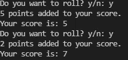

# 如何用 Python 制作一个简单的骰子游戏

> 原文：<https://medium.com/geekculture/how-to-make-a-simple-dice-game-in-python-df24a0f0ae52?source=collection_archive---------16----------------------->

*学习基本 Python 的简单方法。*

Photo by [Ian Gonzalez](https://unsplash.com/@ian_gonz?utm_source=unsplash&utm_medium=referral&utm_content=creditCopyText) on [Unsplash](https://unsplash.com/s/photos/dice?utm_source=unsplash&utm_medium=referral&utm_content=creditCopyText)

本教程是一个非常简单且广为人知的案例，有助于学习如何编写应用程序。它解决了从变量到循环的每一个基本概念，甚至为`random`函数导入了库。

*注意:我假设你已经安装了 Python 3，并且至少已经有了非常基本的编程知识。我还假设您知道如何运行 Python 文件。*

# 游戏

在我们编写小骰子游戏之前，我们需要知道它是如何工作的，以及我们需要构建什么。我们将采用最初的想法，并将其分成易于编程的小块。

这个游戏的基本思想是你掷出一个骰子，然后计算你的分数。如果骰子没有击中 1，你可以试着再掷一次，如果你愿意，可以把新的点数加到你的总数中，或者你可以选择保留你目前的点数。但是，如果您点击 1，您的所有点数都将丢失，您的游戏也将结束。

因此，将这些内容添加到一个小的组件列表中，我们将大致得到如下内容:

*   搓丝模
*   检查模具是否滚动 1
*   如果没有，把分数加到我们的总数里
*   询问用户是否想再次滚动(从步骤 1 开始)
*   如果它击中了 1，结束游戏

这是一个很小的列表，应该也很容易编程。尽管它触及了最基本的编程主题。

# 代码

既然我们知道了要编程什么，让我们试着做得相当好，这样我们就可以很容易地调整某些设置，并在以后的代码上构建更多。创建一个新的 Python 文件并打开您最喜欢的编辑器。

## 导入随机模块

一个基于机会的游戏需要一些随机性。这可以通过 Python 自带的[随机模块](https://www.w3schools.com/python/module_random.asp)中的`randint`函数轻松实现。您可以在文件的顶部导入它。

## 变量

我觉得我们需要做的第一件事是设置一些变量。我们可以为我们的骰子添加一个变量，我们的用户接收游戏结束的号码，以及我们可能需要的任何其他变量。

## 游戏循环

我们的游戏将在一个循环中运行，只要我们的`run`变量是`True`，这个循环就会运行。如果用户愿意，它将继续滚动骰子，当用户想停止时，它将停止。

## 该卷

我们需要一个函数(或者至少是循环中的一些代码)来滚动骰子，增加点数，如果我们滚动触发器，就会终止循环。这个函数将有几个嵌套的 if 语句，在这些语句中，我们需要检查数字是否与我们的触发器相同，或者用户是否希望通过检查我们可以进行的输入来再次滚动。

## 最终代码

将这些部分组合在一起，我们可以展示我们的最终代码。代码可能看起来很多，但我已经尝试为我所做的一切添加注释，所以如果你自己没有能力做，希望你可以从中学习。

The game in action

# 结论

这个非常简单的游戏只是尝试理解计算机科学和编程的另一种方式。就像 Hello World 示例一样，一个简单的骰子游戏是开始您的旅程的许多方式之一，我希望您也从这个游戏中学到了一些东西。

祝您有美好的一天，感谢您的阅读。