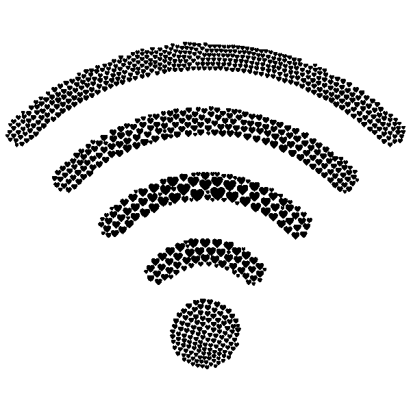

# 如何用 sklearn 制作稀疏编码信号

> 原文：<https://medium.com/geekculture/how-to-make-a-sparse-coded-signal-with-sklearn-f28bacb2fedf?source=collection_archive---------29----------------------->

当我浏览 sklearn 的数据集功能时，不可避免的是，当我张贴在更常规的数据集上时，如 blobs、circles、classifiers 和 regressors，我会冒险进入那些暴露较少的数据集的领域。我发现了一个数据集，sklearn 的 make_sparse_coded_ signal，它的曝光率如此之低，以至于互联网上几乎没有关于它的文章。什么是…